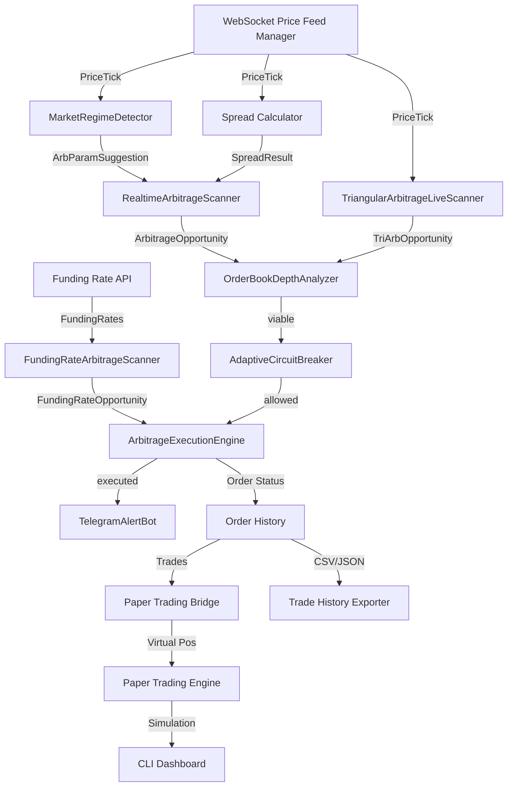

# System Architecture - Algo Trader

## High-Level Architecture
Event-Driven + Modular Architecture with 4 tiers:
- **Execution Layer**: WS price feeds, fee-aware spread calc, atomic order execution, regime detection, order-book depth analysis
- **RaaS API Layer**: Multi-tenant positions, scan/execute endpoints, position tracking
- **Client Layer**: Paper trading, CLI dashboard, trade history export
- **AGI Intelligence Layer**: Market regime detection, triangular arb, funding-rate arb, unified orchestrator



## Core Components

### Phase 1: Core Strategy Engine
- **BotEngine** (`src/core/BotEngine.ts`): Signal routing, strategy orchestration.
- **Strategy Layer** (`src/strategies/`): RSI, SMA, Cross-Exchange, Triangular, Statistical, AGI Arbitrage.
- **RiskManager** (`src/core/`): Position sizing, risk calculation.
- **OrderManager** (`src/core/`): Order state tracking.

### Phase 2: AGI RaaS Arbitrage Core (Execution Foundation)
**Execution Layer** (`src/execution/`):
- **WebSocketMultiExchangePriceFeedManager** — Binance/OKX/Bybit WS, auto-reconnect, real-time tick events.
- **FeeAwareCrossExchangeSpreadCalculator** — Net spread = gross spread - maker/taker fees - slippage, 5min TTL cache.
- **AtomicCrossExchangeOrderExecutor** — Promise.allSettled buy/sell parallel, rollback on partial failure.

**Multi-Tenant Core** (`src/core/`):
- **TenantArbPositionTracker** — Per-tenant positions, tier limits (Basic/Pro/Enterprise).
- **PaperTradingEngine** — Virtual trading simulation, P&L tracking.
- **WebSocketServer** — Real-time `spread` + `position` channel broadcast.

**RaaS API** (`src/api/routes/`):
- `POST /api/v1/arb/scan` — Dry-run spread scan.
- `POST /api/v1/arb/execute` — Execute trade (Pro/Enterprise).
- `GET /api/v1/arb/positions` — Current positions.
- `GET /api/v1/arb/history` — Trade history.
- `GET /api/v1/arb/stats` — ROI, win rate stats.

### Phase 5: RaaS Dashboard (React SPA)
**Dashboard** (`dashboard/`):
- React 19 + TypeScript 5.9 + Tailwind CSS 3.4, dark trading terminal theme.
- Vite 6, Zustand 5 state, lightweight-charts (TradingView).

**Pages**: DashboardPage, BacktestsPage, MarketplacePage, SettingsPage, ReportingPage.

**Components**: SidebarNavigation, PriceTickerStrip, PositionsTableSortable, SpreadOpportunitiesCardGrid.

**Hooks**: `useWebSocketPriceFeed` (25ms buffered Zustand updates), `useApiClient` (typed fetch).

### Phase 9: AGI Arbitrage Core (Live Execution)
**New Execution Modules** (`src/execution/`):
- **RealtimeArbitrageScanner** — EventEmitter; maintains latest bid/ask per exchange:symbol, emits `opportunity` on profitable spreads (configurable `minNetSpreadPct`, `scanIntervalMs`, stale-tick guard).
- **ArbitrageExecutionEngine** — Wires Scanner → CircuitBreaker → AtomicExecutor → position tracking → Telegram alerts. Cooldown per pair, max concurrent executions, cumulative metrics (`ArbEngineMetrics`).
- **ArbLiveOrchestrator** (`src/cli/arb-live-cross-exchange-command.ts`) — Composes PriceFeedManager + RealtimeArbitrageScanner + ArbitrageExecutionEngine into a single live session; exposed via `arb:live` CLI.

**CLI**: `arb:live` — Live cross-exchange arb session with configurable symbols/exchanges.

### Phase 10: Order Book Depth Analyzer
**New Module** (`src/execution/order-book-depth-analyzer.ts`):
- **OrderBookDepthAnalyzer** — Fetches real L2 order book from each exchange via CCXT, calculates actual slippage for target position size, computes available liquidity depth, and returns `SpreadDepthAnalysis` (viable flag, real slippage pct, worst fill price).
- Interfaces: `DepthAnalysis`, `SpreadDepthAnalysis`, `DepthAnalyzerConfig`.
- Wired into ArbitrageExecutionEngine pre-execution check — opportunity discarded if liquidity insufficient.

### Phase 11: AGI Intelligence Suite
**New Modules** (`src/execution/`):
- **MarketRegimeDetector** — EventEmitter; classifies market into regimes (trending/ranging/volatile/calm) from rolling volatility, trend strength, spread dispersion. Emits `regime-change` + `params-suggestion` (`ArbParamSuggestion`) → scanner adapts thresholds dynamically.
- **TriangularArbitrageLiveScanner** — EventEmitter; detects 3-leg intra-exchange cycles (A→B→C→A). Evaluates all `TriArbCycle` combos per tick, filters by net profit after fees, emits `opportunity` (`TriArbOpportunity`).
- **FundingRateArbitrageScanner** — EventEmitter; polls funding rate API across exchanges at configurable interval, computes net spread (rate diff - fees), emits `opportunity` (`FundingRateOpportunity`). Tracks `FundingRateStats`.

### Phase 12: Unified AGI Arb Command
**CLI** (`src/cli/arb-agi-auto-execution-commands.ts`):
- `arb:agi` — Unified command; launches all strategies in parallel: RealtimeArbitrageScanner, TriangularArbitrageLiveScanner, FundingRateArbitrageScanner, with MarketRegimeDetector providing adaptive params. Routes all opportunities through OrderBookDepthAnalyzer → CircuitBreaker → ArbitrageExecutionEngine.
- `arb:auto` — Autonomous mode with auto-restart on error.

### Phase 7: Live Exchange Manager (Production Live Trading)
**Core Orchestrator** (`src/execution/live-exchange-manager.ts`):
- **LiveExchangeManager** — Unified lifecycle orchestrator: composes ExchangeConnectionPool + WebSocketMultiExchangePriceFeedManager + ExchangeRouterWithFallback + ExchangeHealthMonitor.
- Auto-recovery on connection loss, graceful shutdown, startup health gating.
- Methods: `start()`, `stop()`, `getRouter()`, `getHealthSnapshot()`.

**Supporting Components** (`src/execution/`):
- **ExchangeRegistry** (`exchange-registry.ts`) — Central config store: exchange credentials, pairs, rate limits.
- **ExchangeHealthMonitor** (`exchange-health-monitor.ts`) — Per-exchange health tracking (connected/degraded/disconnected), rolling latency P50/P95, error rate, event bus.
- **ExchangeConnectionPool** (`exchange-connection-pool.ts`) — CCXT instance pooling, connection lifecycle management.
- **ExchangeRouterWithFallback** (`exchange-router-with-fallback.ts`) — Route orders with automatic fallback to healthy exchange.

### Phase 15-17: Stealth Execution Layer
**Anti-Detection** (`src/execution/`):
- **AntiDetectionSafetyLayer** (`anti-detection-order-randomizer-safety-layer.ts`) — Order timing jitter ±30%, size jitter ±5%, rate governor (calls/min, orders/hour), exchange 429/418 auto-pause, 403/451 kill switch, balance checkpoint auto-stop.
- **BinhPhapStealthStrategy** (`binh-phap-stealth-trading-strategy.ts`) — 孫子兵法 13-chapter anti-detection: 始計 pre-assessment, 虛實 order splitting (2-5 chunks), 兵勢 volume-aware timing, 九變 5-level threat system, 地形 exchange profiles, 火攻 confidence gate.
- **PhantomOrderCloakingEngine** (`phantom-order-cloaking-engine.ts`) — 3-layer cloaking: order splitting, randomized timing, size camouflage to mask bot patterns.
- **stealth-cli-fingerprint-masking-middleware.ts** — Browser-like HTTP headers on all CCXT requests to avoid bot detection.
- **stealth-execution-algorithms.ts** — Shared stealth math: jitter distributions, normalization.

**Telegram Integration**:
- Stealth commands: `/safety` (status), `/kill` (emergency stop), `/kill_reset`, `/binh_phap` (stealth report).
- **TelegramCommandHandler** (`telegram-command-handler.ts`) — Long-polling receiver, chat ID security, commands: /status, /backtest, /balance, /health, /arb, /arb_live, /stop, /help, /safety, /kill.

### Phase 19: NATS Message Bus & Event-Driven Architecture
**Messaging Layer** (`src/messaging/`):
- **NatsMessageBus** — NATS.io primary pub/sub + JetStream persistence for event replay, auto-recovery on broker loss
- **RedisMessageBus** — Fallback layer (Redis Pub/Sub) when NATS unavailable
- **JetStreamManager** — Persistent message streams, stream configuration, consumer management
- **NatsConnectionManager** — Connection pooling, reconnection logic, health checks
- **TopicSchema** — Event type definitions, topic routing rules

### Phase 20: Semantic Dependency Discovery
**Intelligence Layer** (`src/intelligence/`):
- **SemanticDependencyDiscovery** — DeepSeek API analyzes Polymarket contract relationships, extracts market dependencies (e.g., "Bitcoin rises → Tech sector up")
- **RelationshipGraphBuilder** — Builds directed acyclic graph of market dependencies from DeepSeek analysis
- **AlphaEarClient** — Gamma API integration for live market data, feeds into dependency discovery
- **KronosFairValue** — Time-series fair value computation using relationship graph
- **SemanticCache** — Redis caching of DeepSeek analyses with 24h TTL to avoid redundant API calls

### Phase 21: Cross-Market ILP Solver
**Arbitrage Optimization** (`src/arbitrage/`):
- **IntegerProgrammingSolver** — javascript-lp-solver integration, multi-market basket optimization
- **ILPConstraintBuilder** — Builds LP constraints from market data: position limits, correlation bounds, gas cost limits
- **CrossMarketArbitrageDetector** — Identifies profitable multi-leg arbitrage across linked markets using ILP solver
- **MultiLegBasket** — Represents multi-leg arbitrage position (buy Market A, sell Market B, sell Market C)

### Phase 22: Delta-Neutral Volatility Arbitrage & Frank-Wolfe Optimizer
**Polymarket Strategy** (`src/strategies/polymarket/`):
- **DeltaNeutralVolatilityArbitrage** — Market-neutral position pairs: long volatility + short correlated market
- **DeltaCalculator** — Computes delta exposure per market, rebalancing signals
- **DeltaNeutralPortfolioMonitor** — Real-time monitoring of aggregate delta, alerts on drift
- **Additional Strategies** (12+): Bollinger Squeeze, Cluster Breakout, Cross-Correlation-Lag, Gap-Fill, Decay-Rate-Momentum, Event-Deadline-Scalper, etc.

**Execution Optimizer** (`src/execution/`):
- **MultiLegFrankWolfeOptimizer** — Frank-Wolfe algorithm for multi-leg execution path optimization, minimizes slippage + time-to-fill across N markets
- **DistributedNonceManager** — Redis-backed atomic nonce counter to prevent duplicate transaction IDs across distributed traders
- **GasBatchOptimizer** — Batches multi-leg orders, optimizes gas cost per batch on-chain

### Phase 23: Time-Series Data & Monitoring
**Database Layer** (`docker/timescaledb/`):
- **TimescaleDB Hypertables** — PostgreSQL extension for time-series: 1m/5m candles, tick snapshots, portfolio snapshots
- **Automatic Compression** — Hot data (last 30d) in RAM, cold data compressed to storage
- **Downsampling Rules** — Auto-aggregate 1m → 5m → 1h → 1d for long-term analysis

**Monitoring Stack** (`docker/`):
- **Prometheus** — 9090 scraping metrics from app + TimescaleDB; 15s scrape interval
- **Grafana** — 3001 with pre-built dashboards: Arbitrage Metrics, Risk Dashboard, Infrastructure Health
- **Dashboard 1: Arbitrage Metrics** — Spread finder latency (p50/p95), ILP solver execution time, liquidity check miss rate
- **Dashboard 2: Risk Dashboard** — Portfolio delta, cumulative slippage, correlation matrix heatmap
- **Dashboard 3: Infrastructure Health** — NATS broker uptime, Redis pub/sub lag, DB query latency, GC pressure

### Phase 26: Multi-Platform Price Feed Integration
**Price Feed Adapters** (`src/feeds/`):
- **PolymarketWebSocketFeed** — Real-time Polymarket CLOB orderbook via WebSocket, order/trade streaming.
- **LimitlessPriceFeed** — Limitless Market HTTP API integration with polling/webhook support.
- **PredictItPriceFeed** — PredictIt REST API with market snapshot caching (5min TTL).
- **SmarketsPriceFeed** — Smarkets exchange feed via native API, real-time order book.
- **KalshiPriceFeed** — Kalshi orderbook feed with atomic tick broadcast.
- **UnifiedPriceFeedAggregator** — Normalizes ticks across all platforms to common schema, broadcasts to signal engines.

### Phase 27: CLOB v2 Adapter & Split/Merge Arbitrage
**CLOB v2 Module** (`src/execution/clob-v2/`):
- **ClobV2Adapter** — Polymarket CLOB v2 order/cancel/fill protocol with automatic nonce management.
- **SplitClobEntry** — Entry splitting for logical hedges: YES+NO share-splitting on market A ↔ money market B.
- **SplitMergeArbExecutor** — Execute coordinated YES/NO split entry on Market A + reverse on Market B, atomic with parallel order submission.
- **LogicalHedgeDiscovery** — Scan all Polymarket events for implicit hedge opportunities (e.g., Bitcoin > $50k AND < $60k).

### Phase 28: Whale Activity Monitoring & Copy-Trading
**Whale Tracking** (`src/intelligence/whale-activity/`):
- **WhaleActivityFeed** — Monitors Polygon CTF for large position changes (>$10k net), tracks whale address movements.
- **WhaleCopyTrader** — Auto-follow top whale traders, copy position changes with configurable lag (5-60s delay for plausible deniability).
- **CrossMarketSync** — Correlate whale moves across Polymarket + Kalshi + Limitless, identify cross-market edges.
- **WhaleAnalyticsReport** — Daily whale leaderboard, win rate, edge estimation, correlation matrix.

### Phase 29: BTC 15-Minute Pattern Detection
**Intraday Strategies** (`src/strategies/intraday/`):
- **BtcFifteenMinuteStrategy** — Real-time 15-min candle analysis from Kraken/Coinbase, pattern detection (momentum, reversal, volatility clusters).
- **BitcoinVolatilityScanner** — Detect intraday volatility spikes >2σ, flag for Polymarket BTC price prediction markets.
- **BreakoutDetector** — Identify 15-min breakouts (2-hour range), map to Polymarket "BTC > X by Y date" positions.

### Phase 30: Cycle-End Sniper & Resolution Criteria Analyzer
**End-Game Strategy** (`src/strategies/polymarket/`):
- **CycleEndSniperStrategy** — Target markets resolving within 24h, dynamic bid-ask placing as outcome probability crystallizes.
- **ResolutionCriteriaAnalyzer** — Parse Polymarket contract text (UMA resolution criteria), extract success conditions via DeepSeek reasoning.
- **UmaOracleTiming** — Monitor UMA challenge window (1-2 days post-resolution), detect oracle manipulation signals for reversal trades.

### Phase 31: Signal Fusion Engine & Resolution Analytics
**Intelligence Core** (`src/intelligence/`):
- **SignalFusionEngine** — Combine outputs: whale activity + BTC patterns + sentiment + regime detection → composite signal with weighted voting.
- **MultiResolution** — Fuse multiple data sources (DeepSeek semantic analysis, news sentiment, on-chain metrics) into unified conviction score.
- **ResolutionCriteriaAnalyzer** — Auto-extract market resolution criteria from Polymarket/Kalshi contracts using DeepSeek, cross-reference with settlement logic.
- **ConvictionScorer** — Combine all signals into final probability estimate with confidence interval.

### Phase 25: Vibe-Trading Integration (Signal Consensus & Self-Evolving ILP)
**Signal Consensus Swarm** (`src/intelligence/signal-consensus-swarm.ts`):
- **3-Persona DAG Debate** — Risk analyst, momentum trader, contrarian personalities evaluate each signal via LLM
- **Majority Vote** (2/3) determines final APPROVE/REJECT decision
- **False Positive Reduction** — 30-40% fewer trades with <60% consensus confidence
- **Fail-Closed** — ≥2 failed LLM calls → auto-reject signal for safety
- **Dissent Capture** — Minority reasoning preserved as contrarian signal input

**Self-Evolving ILP Constraints** (`src/arbitrage/self-evolving-ilp-constraints.ts`):
- **Opportunity Analysis** — Detects missed arbitrage opportunities via sliding buffer (max 50 opportunities)
- **DeepSeek Recommendations** — LLM suggests constraint modifications (min_edge, max_market_exposure)
- **Hard Limits Enforced** — min_edge ≥ 1.5%, max_exposure ≤ 30% (non-negotiable)
- **Rate Limiting** — 1 analysis per hour to prevent constraint churn
- **NATS Publication** — Suggestions published to `intelligence.ilp.evolution` for async consideration

**Vibe Controller** (`src/wiring/vibe-controller.ts`):
- **Runtime Mode Switching** — NL commands change trading behavior without code redeploy
- **4 Preset Modes**: conservative (3.0% min edge, 10% max exposure), balanced (2.5%, 15%), aggressive (1.5%, 25%), defensive (5.0%, 5%)
- **NATS Command Bus** — Subscribes `vibe.command`, publishes `vibe.state.updated`
- **Redis State Persistence** — Trading state stored key `vibe:state` with fallback to defaults
- **Dynamic Market Filtering** — Pause/resume individual markets via Vibe commands

**Dual-Level Reflection Engine** (`src/intelligence/dual-level-reflection-engine.ts`):
- **Level 1 (Pure Math)** — Slippage analysis, latency deviation detection (no LLM)
- **Level 2 (LLM Optional)** — DeepSeek causal attribution analysis, parameter tuning suggestions
- **Ring Buffer** — Last 100 trade reflections retained in-memory for analysis
- **Auto-Tuning** — Captures lessons from each trade, suggests parameter adjustments
- **NATS Broadcasting** — Results published after analysis completion

### CLI Onboarding (Zero-Config)
**Setup Wizard** (`src/cli/setup-wizard-command.ts`):
- Interactive readline wizard — prompts exchange API keys, auto-generates `.env` with smart defaults.
- Validates key format (min length), supports Binance/OKX/Bybit, optional Telegram alerts.

**Quickstart** (`src/cli/quickstart-zero-config-command.ts`):
- One command: detects `.env` → runs setup if missing → demo backtest → shows available commands.
- Backtest/dry-run works without Docker (no DB/Redis required).

## CI/CD Enforcement (Pillar 1: Solo Platform)

| Gate | Job Name | Purpose | Hard Fail | Parallel |
| ---- | -------- | ------- | --------- | -------- |
| 1 | gate-1-validation | TypeScript check, ESLint, strategy validators, full vitest suite | Yes | Yes |
| 2 | gate-2-security | Hardcoded-secret regex scan (9 patterns), `pnpm audit --critical` | Yes (critical only) | Yes |
| 3 | gate-3-quality | ESLint with max-warnings=0 on changed TS files, >400 LOC file warnings | Yes on PR | Yes |
| 4 | gate-4-dependency | Lockfile reproducibility check, `pnpm outdated` advisory | Yes | Yes |
| 5 | gate-5-deployment-smoke | 5-attempt backoff probe of `algo-trader.pages.dev` + `cashclaw.cc` | Yes on main | Sequential (after 1-4) |

**See:** `docs/ai-first-enforcement-gates.md` (source of truth for gate details, secret patterns, and rollback hierarchy).

**Shell Script** (`scripts/one-click-setup-and-start.sh`):
- Prerequisites check → npm/pnpm install → CLI wizard → optional Docker infra.

## SDLC Scaffold (Pillar 4: Solo Platform)

Agent-driven specification → design → code → deploy workflow embedded as executable documentation.

| Phase | File | Purpose | Hand-off to |
|-------|------|---------|------------|
| 1 | `CLAUDE.specification.md` | Translate user request + a16z doctrine into detailed PDR + requirements | Design phase |
| 2 | `CLAUDE.design.md` | Architect system design, data flow, module interactions from requirements | Code phase |
| 3 | `CLAUDE.code.md` | Implement code, run tester + code-reviewer subagents (DoD gates), verify tests + review ≥9/10 | Deploy phase |
| 4 | `CLAUDE.deploy.md` | Verify CI gates 1–5 pass, probe production, monitor Signals Loop journal for regressions | (prod + monitoring) |

Each guide lists: required inputs, required outputs, algo-trader hard constraints, definition-of-done checklist, hand-off contract. Phases 3 & 4 explicitly verify CI gate alignment + rollback hierarchy (L0–L4 from `docs/ai-first-enforcement-gates.md`). Zero runtime code change — scaffolding only, existing 5-tier rollback stack unchanged.

## Observability (Pillar 2: Solo Platform)

Two-plane observability: Prometheus metrics + OpenTelemetry traces → Grafana.

**Traces** (`src/utils/tracing.ts`):
- OTel OTLP HTTP exporter, activated by `OTEL_EXPORTER_OTLP_ENDPOINT` env (unset → silent noop, zero prod risk).
- Dynamic import keeps SDK out of cold-start path when tracing disabled.
- Three instrumented critical paths: `qwen.signals_loop.evaluate` (`src/wiring/qwen-signals-loop.ts`), `qwen.drawdown.check` (`src/wiring/qwen-drawdown-monitor.ts`), `qwen.eligibility.check` (`src/wiring/qwen-live-eligibility-gate.ts`).

**Metrics** (`src/middleware/prometheus-metrics.ts`):
- L-tier rollback visibility: `algo_trader_qwen_kill_switch_active{source=env|kv}` (L1), `algo_trader_qwen_paper_gate_days_remaining` (L4, 0–30 clamped), `algo_trader_qwen_drawdown_auto_disabled` (L3).
- Qwen pipeline: `qwen_paper_pnl_pct`, `qwen_signals_total{result}`, `qwen_signals_loop_runs_total{decision}`, `qwen_strategy_reviews_queued_total{reason}`.

**Dashboards** (`docker/grafana/dashboards/`):
- `qwen-solo-platform.json` — L0–L4 rollback state + 24h rolling Qwen P&L + signals-loop decision breakdown + strategy-review reason mix.
- Plus 3 pre-existing: `arbitrage-opportunities`, `system-health`, `trading-performance`.

**Alerting** (`docker/grafana/provisioning/alerting/`):
- Grafana v10.4 unified alerting — YAML-provisioned. 5 rules across 2 groups route to single Telegram contact point (`qwen-telegram-admin`).
  - Group `qwen-solo-platform-rollback` (L-tier): `QwenDrawdownBreached` — CRITICAL, 5m · `QwenPaperGateLessThan5d` — WARNING, 10m, noDataState=Alerting · `QwenSignalsLoopErrorSpike` — WARNING, 15m · `QwenL1KillSwitchActive` — INFO, 1m.
  - Group `algo-trader-availability` (liveness): `AlgoTraderDeadman` — CRITICAL, `up{job="algo-trader"}==0` for 3m, noDataState=Alerting — scrape-level safety net · `QwenSignalsLoopStale` — WARNING, `time() - algo_trader_qwen_signals_loop_last_run_ts > 7h` for 10m, noDataState=Alerting — catches internal 6h-cron stall while process stays alive (pre-armed at `startSignalsLoop()` boot to avoid post-deploy false-fire).
- Contact point reuses app `TELEGRAM_BOT_TOKEN` + `TELEGRAM_CHAT_ID` env (forwarded in `docker-compose.monitoring.yml`).
- Runbooks at `docs/runbooks/qwen-*.md` + `docs/runbooks/algo-trader-deadman.md` linked from alert annotations.

### Infrastructure
**Database** (`prisma/`):
- PostgreSQL 16 via Prisma ORM — 9 models (Tenant, ApiKey, Strategy, Order, Trade, BacktestResult, Candle, PnlSnapshot, AlertRule).
- Row-level isolation via tenantId FK on all business tables.

**Job Queue** (`src/jobs/`):
- BullMQ + Redis 7 — 4 queues: backtest, scan, webhook, optimization.
- Workers: backtest runner, scan detector, signed webhook delivery, grid search optimizer.

**Billing** (`src/billing/`):
- NOWPayments USDT TRC20 — 3 tiers (FREE $0, PRO $49, ENTERPRISE $299), HMAC-SHA512 webhook verification.
- **Coupon System** (`src/billing/coupon-system.ts`):
  - Admin routes: `POST /api/admin/coupons` (create), `GET /api/admin/coupons` (list) — require `X-API-Key` header auth
  - Validation route: `POST /api/coupons/validate` — checks code, discount, applies without incrementing use-count
  - Record use: `POST /api/coupons/:code/use` — atomically increments use-count, guards against race conditions
  - Dashboard integration: CashClaw dashboard on CF Pages displays coupon input, integrates with pricing section

**Monitoring** (`docker-compose.yml`):
- Prometheus (:9090) + Grafana (:3001).

### Server Bootstrap (Phase 18+)
**Location**: `src/app.ts` (50 lines)

Fastify server initialization with:
- dotenv config loading (`.env` parsing)
- CORS + security headers
- Graceful shutdown handling (SIGTERM, SIGINT)
- Health check endpoint (`/health`)
- Ready for PM2/M1 Max deployment with proper error handling

## Data Flow: Full AGI Arbitrage Pipeline

```
WS Ticks → MarketRegimeDetector → regime-change → ArbParamSuggestion
         → RealtimeArbitrageScanner (cross-exchange) → ArbitrageOpportunity
         → TriangularArbitrageLiveScanner (intra-exchange) → TriArbOpportunity
Funding API → FundingRateArbitrageScanner → FundingRateOpportunity

All Opportunities →
  OrderBookDepthAnalyzer → viable? (real slippage vs threshold)
  → AdaptiveCircuitBreaker → allowed? (exchange health, trip count)
  → ArbitrageExecutionEngine → Promise.allSettled atomic orders
  → TelegramAlertBot → trade notification
  → OrderHistory → PnlSnapshot → CSV/JSON export
```

## Technology Stack
| Layer | Tech |
|-------|------|
| Language | TypeScript 5.9, strict mode |
| Runtime | Node.js 20 |
| API Gateway | Fastify 5 |
| WebSocket | ws library |
| Exchange Abstraction | CCXT 4.5 |
| Job Queue | BullMQ 5 + Redis 7 (IoRedis) |
| Database | PostgreSQL 16 via Prisma |
| Validation | Zod 4.3 |
| Logging | Winston |
| Testing | Jest 29 |
| CLI | Commander |
| Dashboard | React 19, Vite 6, Zustand 5, Tailwind, TradingView Charts |

## Quality Status (All Phases)

### Completed Phases
- Phase 1: Core Strategy Engine
- Phase 2: AGI RaaS Arbitrage Core (WS feeds, spread calc, atomic executor)
- Phase 3: Multi-Tenant API & Auth
- Phase 4: BullMQ Job Queue
- Phase 5: React Dashboard + RaaS Bootstrap
- Phase 6: ML Trading (GRU, Q-Learning, Feature Engineering)
- Phase 7: Production Live Trading (LiveExchangeManager, SignalOrderPipeline, PositionManager, CircuitBreaker v2, TelegramBot, DryRun)
- Phase 8: AGI Trade Go-Live (AgiTradeOrchestrator, `agi:trade` CLI)
- Phase 9: AGI Arbitrage Core (RealtimeArbitrageScanner, ArbitrageExecutionEngine)
- Phase 10: Order Book Depth Analyzer
- Phase 11: AGI Intelligence Suite (MarketRegimeDetector, TriangularArb, FundingRateArb)
- Phase 12: Unified AGI Arb Command (`arb:agi`)
- Phase 13: Zero-Config Quickstart
- Phase 14: Telegram Phone Trading Bot
- Phase 15: Anti-Detection Safety Layer
- Phase 16: BinhPhap Stealth Strategy
- Phase 17: Phantom Order Cloaking + CLI Fingerprint Masking
- Phase 18: Redis Cluster (6-node, 3 masters + 3 replicas)
- Phase 19: NATS Message Bus (primary + JetStream) & Redis fallback
- Phase 20: Semantic Dependency Discovery (DeepSeek API → relationship graph → Redis cache)
- Phase 21: Cross-Market ILP Solver (multi-market basket optimization, javascript-lp-solver)
- Phase 22: Delta-Neutral Volatility Arbitrage (Frank-Wolfe multi-leg execution, 12+ Polymarket strategies)
- Phase 23: Infrastructure Hardening (Distributed nonce manager, gas batch optimizer, TimescaleDB hypertables, Grafana/Prometheus monitoring)
- Phase 24: Kronos Foundation Model Integration (OHLCV prediction, KronosStrategy, ML sidecar modularization)
- Phase 25: Vibe-Trading Integration (Signal consensus swarm, self-evolving ILP, vibe controller, dual-level reflection)
- Phase 26: Multi-Platform Price Feeds (Polymarket WebSocket, Limitless, PredictIt, Smarkets, Kalshi adapters)
- Phase 27: CLOB v2 Adapter & Split/Merge Arbitrage (Logical hedge discovery, YES/NO splitting, cross-market sync)
- Phase 28: Whale Activity Monitoring & Copy-Trading (Polygon CTF tracker, cross-market whale sync, leaderboard analytics)
- Phase 29: BTC 15-Minute Pattern Detection (Intraday momentum, volatility clustering, breakout detection)
- Phase 30: Cycle-End Sniper & Resolution Criteria Analysis (24-h market sniper, UMA oracle timing, contract text parsing)
- Phase 31: Signal Fusion Engine & Multi-Resolution Analytics (Weighted signal voting, conviction scoring, criteria extraction)

### Quality Gates
- **570 tests** (Jest 29, 100% pass rate)
- **266+ source files** (TypeScript 5.9, strict mode)
- **0 TypeScript errors**
- **0 `any` types** (test mocks only — acceptable)
- **0 console.log** (production clean)
- **0 TODO/FIXME** (zero tech debt)
- **Binh Phap 6/6 fronts passing**

### Deployment & Paper Trading
- **Paper Trading P&L**: +$2,251 across 50 trades (66.7% win rate)
- **26 PR Merges** (Session: #58-#85) — CLOB v2, WebSocket feeds, CLI enhancements, multi-platform support
- **Target**: $1M ARR via RaaS + white-label licensing

Updated: 2026-04-09

---

## Security Middleware (Phase 13: ROIaaS Gate)

### Idempotency Middleware
**Location**: `src/middleware/idempotency-middleware.ts`

Prevents duplicate webhook processing using event_id deduplication:

- **IdempotencyStore** — In-memory Map với TTL 24h
- **idempotencyMiddleware** — preHandler hook, kiểm tra event_id trước khi xử lý
- **createIdempotencyResponseHandler** — onSend hook, cache kết quả sau khi xử lý

**Security benefits**:
- Prevent replay attacks
- Guarantee exactly-once semantics
- Handle webhook retries safely

### Rate Limiting
**Location**: `src/auth/sliding-window-rate-limiter.ts`

Sliding window rate limiting per API key:

- **100 requests/minute** per API key (default)
- Per-user tracking with Map
- Reset after window expires

### RAAS License Gate
**Location**: `src/lib/raas-gate.ts`

Premium feature access control with license tiers:

| Tier | Features | Quota |
|------|----------|-------|
| FREE | Basic strategies, live trading, basic backtest | 1,000/month |
| PRO | + ML models, premium data, advanced optimization | 10,000/month |
| ENTERPRISE | + Priority support, custom strategies, multi-exchange | 100,000/month |

**Security features**:
- JWT-based license validation (HS256)
- Rate limiting on validation failures (5/min/IP)
- Audit logging for compliance
- Expiration enforcement
- Timing-safe checksum validation

### Usage Quota Tracking
**Location**: `src/lib/usage-quota.ts`

Monthly usage quota per license key:

- Redis-backed storage (ioredis)
- Memory fallback for dev/testing
- Alert thresholds at 80%, 90%, 100%
- 429 response when quota exceeded

---

## Qwen3-30B-A3B M1 Max Signal Pipeline (2026-04-17)

Option B daemon architecture: M1 Max generates signals locally, pushes via HMAC-signed REST to CF Worker.

```
[M1 Max Daemon (Python)]
  ├── Qwen3-30B-A3B MLX @ :11437  (18GB, 37.7 tok/s)
  └── signal-generator-daemon.py
        └── HMAC-SHA256 POST ──► CF Worker /api/v1/signals/ingest
                                   │  signal-ingest-routes.ts
                                   │  verifyHmacSha256() (5-min replay window)
                                   ▼
                             SignalPublisher.publish()
                                   │
                     ┌─────────────┼──────────────────┬──────────┐
                     ▼             ▼                  ▼          ▼
               SignalStoreD1   SSE broadcast    L0 SIGNALS LOOP  Telegram
               (paper_only=1)  (existing)       (observational)   push
                     │                                 │         (tier-gated)
                     │                                 ▼
                     │                         queue review task
                     │                         (daily dedup)
                     │                                 │
                     ▼                                 ▼
             paper-trading-orchestrator         admin strategy-reviews
                     │                              endpoint
          ┌──────────┼──────────────────────────┐
          │          │                           │
          ▼          ▼                           ▼
    L1 KILL_SWITCH  L2 swarm flag         L3 drawdown monitor
    (QWEN_KILL=1)   (isQwenEnabled())     (6h cron, 24h rolling)
          │          │                           │
          └──────────┴───────────── L4 ──────────┘
                                  paper gate
                              (MIN_PAPER_DAYS=30)
                           (QWEN_AUTO_APPROVE_MAX_USD=500)
```

**5-Tier Quality Assurance Hierarchy:**
- **L0 Signals Loop** (observational) — `src/wiring/qwen-signals-loop.ts` 6h cron. Computes win-rate & Sharpe from paper trades (source='qwen'). Queues human review task if win_rate<0.4 OR sharpe<0.5 (min 30 trades, min 20 signals). No auto-disable — feeds humans only.
- **L1 Kill switch** — `QWEN_KILL=1` env + `POST /api/v1/admin/qwen/kill` — immediate halt
- **L2 Swarm disable** — `isQwenEnabled()` in-memory flag, `disableQwen()`/`enableQwen()` admin API
- **L3 Drawdown auto-disable** — 6h cron checks 24h rolling P&L for `source='qwen'`; >5% → disable + Telegram alert + Prometheus `algo_trader_qwen_paper_pnl_pct` gauge
- **L4 Hard gate** — `MIN_PAPER_DAYS=30` hardcoded; no live trades until 30d paper history; `QWEN_AUTO_APPROVE_MAX_USD=500` cap

**Prometheus Metrics:**
- `qwenStrategyReviewsQueuedTotal{reason=...}` (Counter) — incremented on actual task insert (reason: win_rate_below_threshold or sharpe_below_threshold)
- `algo_trader_qwen_paper_pnl_pct` (Gauge) — rolling 24h paper P&L decimal emitted by drawdown monitor
- `algo_trader_qwen_signals_total{result=accepted|rejected}` (Counter) — emitted by signal-ingest-route on each request

**Files:**
- `src/db/migrations/018_qwen_signals_loop_runs.sql` — `qwen_signals_loop_runs` table (decision ∈ {skipped_insufficient_data, ok, queued_review, error}, metrics_snapshot JSONB, trigger_reasons[], error_message, created_at)
- `src/db/migrations/017_strategy_review_tasks.sql` — `strategy_review_tasks` table (daily UNIQUE index on strategy_id + UTC calendar day)
- `src/wiring/qwen-signals-loop.ts` — L0 observational detector (6h singleton, 4-path journal persistence via `persistRunJournal()`)
- `src/api/routes/admin-qwen-routes.ts` — L0/L1/L2 admin endpoints (review list + kill routes + signals-loop/runs query)
- `src/middleware/prometheus-metrics.ts` — Counter `algo_trader_qwen_signals_loop_runs_total{decision}` per cycle
- `src/api/routes/signal-ingest-routes.ts` — HMAC POST endpoint
- `src/utils/hmac-verifier.ts` — timing-safe HMAC-SHA256 + replay window
- `src/signal/signal-store-d1.ts` — D1/SQLite persistence with source tagging
- `src/wiring/qwen-drawdown-monitor.ts` — L3 scheduled drawdown check
- `src/wiring/qwen-live-eligibility-gate.ts` — L4 paper-gate + USD cap
- `scripts/qwen-signal-daemon/` — Python daemon + launchd plist
- `docs/ops/qwen-m1max-runbook.md` — full ops runbook
- `src/db/migrations/016_qwen_paper_tracking.sql` — `paper_trades_v3` schema

**Database Schema (Migration 018):**
```sql
CREATE TABLE qwen_signals_loop_runs (
  id BIGSERIAL PRIMARY KEY,
  strategy_id TEXT NOT NULL,
  decision TEXT NOT NULL CHECK (decision IN ('skipped_insufficient_data', 'ok', 'queued_review', 'error')),
  metrics_snapshot JSONB, -- {win_rate, sharpe, signal_count, trade_count, avg_pnl, ...}
  trigger_reasons TEXT[], -- array of reason strings
  error_message TEXT,
  created_at TIMESTAMP WITH TIME ZONE DEFAULT CURRENT_TIMESTAMP
);
CREATE INDEX idx_qwen_signals_loop_runs_strategy_id_created_at ON qwen_signals_loop_runs (strategy_id, created_at DESC);
```

**Admin Endpoints:**
- `GET /api/v1/admin/qwen/signals-loop/runs?limit=50&decision=queued_review` — Audit trail with optional filtering by decision type. Response: paginated array of run records with metrics snapshots.

**Prometheus Metrics (Journal):**
- `algo_trader_qwen_signals_loop_runs_total{decision}` (Counter) — Incremented per evaluation cycle with decision label (skipped_insufficient_data, ok, queued_review, error).

**HMAC Secret rotation:** Quarterly. Rotate `QWEN_INGEST_HMAC_SECRET` in CF Secrets + M1 Max `~/.zshrc`. Both sides must be updated simultaneously.

---
