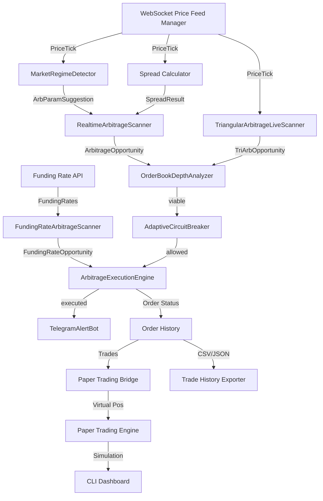
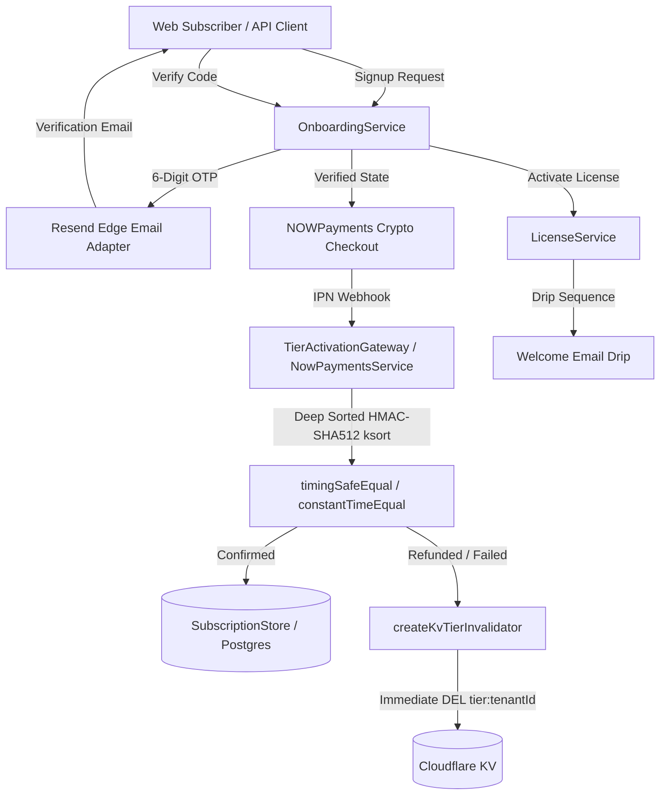
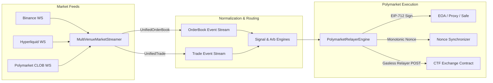
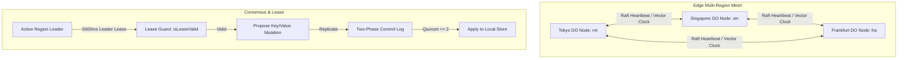
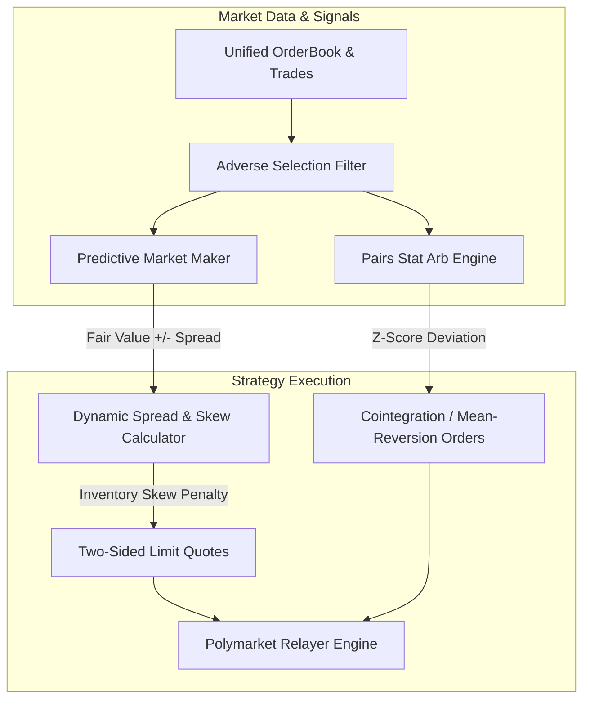

# System Architecture - Algo Trader

## High-Level Architecture
Event-Driven + Modular Architecture with 4 tiers:
- **Execution Layer**: WS price feeds, fee-aware spread calc, atomic order execution, regime detection, order-book depth analysis
- **RaaS API Layer**: Multi-tenant positions, scan/execute endpoints, position tracking
- **Client Layer**: Paper trading, CLI dashboard, trade history export
- **AGI Intelligence Layer**: Market regime detection, triangular arb, funding-rate arb, unified orchestrator


```mermaid
graph TD
    WS[WebSocket Price Feed Manager] -->|PriceTick| MRD[MarketRegimeDetector]
    WS -->|PriceTick| SC[Spread Calculator]
    WS -->|PriceTick| TAS[TriangularArbitrageLiveScanner]
    API[Funding Rate API] -->|FundingRates| FRS[FundingRateArbitrageScanner]
    MRD -->|ArbParamSuggestion| RAS[RealtimeArbitrageScanner]
    SC -->|SpreadResult| RAS
    RAS -->|ArbitrageOpportunity| OBDA[OrderBookDepthAnalyzer]
    TAS -->|TriArbOpportunity| OBDA
    FRS -->|FundingRateOpportunity| AEE[ArbitrageExecutionEngine]
    OBDA -->|viable| CB[AdaptiveCircuitBreaker]
    CB -->|allowed| AEE
    AEE -->|executed| TAB[TelegramAlertBot]
    AEE -->|Order Status| OH[Order History]
    OH -->|Trades| PTB[Paper Trading Bridge]
    PTB -->|Virtual Pos| PTD[Paper Trading Engine]
    PTD -->|Simulation| DAS[CLI Dashboard]
    OH -->|CSV/JSON| ATE[Trade History Exporter]
```

## Core Components

### Phase 1: Core Strategy Engine
- **BotEngine** (`src/core/BotEngine.ts`): Signal routing, strategy orchestration.
- **Strategy Layer** (`src/strategies/`): RSI, SMA, Cross-Exchange, Triangular, Statistical, AGI Arbitrage.
- **RiskManager** (`src/core/`): Position sizing, risk calculation.
- **OrderManager** (`src/core/`): Order state tracking.

### Phase 2: AGI RaaS Arbitrage Core (Execution Foundation)
**Execution Layer** (`src/execution/`):
- **WebSocketMultiExchangePriceFeedManager** — Binance/OKX/Bybit WS, auto-reconnect, real-time tick events.
- **FeeAwareCrossExchangeSpreadCalculator** — Net spread = gross spread - maker/taker fees - slippage, 5min TTL cache.
- **AtomicCrossExchangeOrderExecutor** — Promise.allSettled buy/sell parallel, rollback on partial failure.

**Multi-Tenant Core** (`src/core/`):
- **TenantArbPositionTracker** — Per-tenant positions, tier limits (Basic/Pro/Enterprise).
- **PaperTradingEngine** — Virtual trading simulation, P&L tracking.
- **WebSocketServer** — Real-time `spread` + `position` channel broadcast.

**RaaS API** (`src/api/routes/`):
- `POST /api/v1/arb/scan` — Dry-run spread scan.
- `POST /api/v1/arb/execute` — Execute trade (Pro/Enterprise).
- `GET /api/v1/arb/positions` — Current positions.
- `GET /api/v1/arb/history` — Trade history.
- `GET /api/v1/arb/stats` — ROI, win rate stats.

### Phase 5: RaaS Dashboard (React SPA)
**Dashboard** (`dashboard/`):
- React 19 + TypeScript 5.9 + Tailwind CSS 3.4, dark trading terminal theme.
- Vite 6, Zustand 5 state, lightweight-charts (TradingView).

**Pages**: DashboardPage, BacktestsPage, MarketplacePage, SettingsPage, ReportingPage.

**Components**: SidebarNavigation, PriceTickerStrip, PositionsTableSortable, SpreadOpportunitiesCardGrid.

**Hooks**: `useWebSocketPriceFeed` (25ms buffered Zustand updates), `useApiClient` (typed fetch).

### Phase 9: AGI Arbitrage Core (Live Execution)
**New Execution Modules** (`src/execution/`):
- **RealtimeArbitrageScanner** — EventEmitter; maintains latest bid/ask per exchange:symbol, emits `opportunity` on profitable spreads (configurable `minNetSpreadPct`, `scanIntervalMs`, stale-tick guard).
- **ArbitrageExecutionEngine** — Wires Scanner → CircuitBreaker → AtomicExecutor → position tracking → Telegram alerts. Cooldown per pair, max concurrent executions, cumulative metrics (`ArbEngineMetrics`).
- **ArbLiveOrchestrator** (`src/cli/arb-live-cross-exchange-command.ts`) — Composes PriceFeedManager + RealtimeArbitrageScanner + ArbitrageExecutionEngine into a single live session; exposed via `arb:live` CLI.

**CLI**: `arb:live` — Live cross-exchange arb session with configurable symbols/exchanges.

### Phase 10: Order Book Depth Analyzer
**New Module** (`src/execution/order-book-depth-analyzer.ts`):
- **OrderBookDepthAnalyzer** — Fetches real L2 order book from each exchange via CCXT, calculates actual slippage for target position size, computes available liquidity depth, and returns `SpreadDepthAnalysis` (viable flag, real slippage pct, worst fill price).
- Interfaces: `DepthAnalysis`, `SpreadDepthAnalysis`, `DepthAnalyzerConfig`.
- Wired into ArbitrageExecutionEngine pre-execution check — opportunity discarded if liquidity insufficient.

### Phase 11: AGI Intelligence Suite
**New Modules** (`src/execution/`):
- **MarketRegimeDetector** — EventEmitter; classifies market into regimes (trending/ranging/volatile/calm) from rolling volatility, trend strength, spread dispersion. Emits `regime-change` + `params-suggestion` (`ArbParamSuggestion`) → scanner adapts thresholds dynamically.
- **TriangularArbitrageLiveScanner** — EventEmitter; detects 3-leg intra-exchange cycles (A→B→C→A). Evaluates all `TriArbCycle` combos per tick, filters by net profit after fees, emits `opportunity` (`TriArbOpportunity`).
- **FundingRateArbitrageScanner** — EventEmitter; polls funding rate API across exchanges at configurable interval, computes net spread (rate diff - fees), emits `opportunity` (`FundingRateOpportunity`). Tracks `FundingRateStats`.

### Phase 12: Unified AGI Arb Command
**CLI** (`src/cli/arb-agi-auto-execution-commands.ts`):
- `arb:agi` — Unified command; launches all strategies in parallel: RealtimeArbitrageScanner, TriangularArbitrageLiveScanner, FundingRateArbitrageScanner, with MarketRegimeDetector providing adaptive params. Routes all opportunities through OrderBookDepthAnalyzer → CircuitBreaker → ArbitrageExecutionEngine.
- `arb:auto` — Autonomous mode with auto-restart on error.

### Phase 7: Live Exchange Manager (Production Live Trading)
**Core Orchestrator** (`src/execution/live-exchange-manager.ts`):
- **LiveExchangeManager** — Unified lifecycle orchestrator: composes ExchangeConnectionPool + WebSocketMultiExchangePriceFeedManager + ExchangeRouterWithFallback + ExchangeHealthMonitor.
- Auto-recovery on connection loss, graceful shutdown, startup health gating.
- Methods: `start()`, `stop()`, `getRouter()`, `getHealthSnapshot()`.

**Supporting Components** (`src/execution/`):
- **ExchangeRegistry** (`exchange-registry.ts`) — Central config store: exchange credentials, pairs, rate limits.
- **ExchangeHealthMonitor** (`exchange-health-monitor.ts`) — Per-exchange health tracking (connected/degraded/disconnected), rolling latency P50/P95, error rate, event bus.
- **ExchangeConnectionPool** (`exchange-connection-pool.ts`) — CCXT instance pooling, connection lifecycle management.
- **ExchangeRouterWithFallback** (`exchange-router-with-fallback.ts`) — Route orders with automatic fallback to healthy exchange.

### Phase 15-17: Stealth Execution Layer
**Anti-Detection** (`src/execution/`):
- **AntiDetectionSafetyLayer** (`anti-detection-order-randomizer-safety-layer.ts`) — Order timing jitter ±30%, size jitter ±5%, rate governor (calls/min, orders/hour), exchange 429/418 auto-pause, 403/451 kill switch, balance checkpoint auto-stop.
- **BinhPhapStealthStrategy** (`binh-phap-stealth-trading-strategy.ts`) — 孫子兵法 13-chapter anti-detection: 始計 pre-assessment, 虛實 order splitting (2-5 chunks), 兵勢 volume-aware timing, 九變 5-level threat system, 地形 exchange profiles, 火攻 confidence gate.
- **PhantomOrderCloakingEngine** (`phantom-order-cloaking-engine.ts`) — 3-layer cloaking: order splitting, randomized timing, size camouflage to mask bot patterns.
- **stealth-cli-fingerprint-masking-middleware.ts** — Browser-like HTTP headers on all CCXT requests to avoid bot detection.
- **stealth-execution-algorithms.ts** — Shared stealth math: jitter distributions, normalization.

**Telegram Integration**:
- Stealth commands: `/safety` (status), `/kill` (emergency stop), `/kill_reset`, `/binh_phap` (stealth report).
- **TelegramCommandHandler** (`telegram-command-handler.ts`) — Long-polling receiver, chat ID security, commands: /status, /backtest, /balance, /health, /arb, /arb_live, /stop, /help, /safety, /kill.

### Phase 19: NATS Message Bus & Event-Driven Architecture
**Messaging Layer** (`src/messaging/`):
- **NatsMessageBus** — NATS.io primary pub/sub + JetStream persistence for event replay, auto-recovery on broker loss
- **RedisMessageBus** — Fallback layer (Redis Pub/Sub) when NATS unavailable
- **JetStreamManager** — Persistent message streams, stream configuration, consumer management
- **NatsConnectionManager** — Connection pooling, reconnection logic, health checks
- **TopicSchema** — Event type definitions, topic routing rules

### Phase 20: Semantic Dependency Discovery
**Intelligence Layer** (`src/intelligence/`):
- **SemanticDependencyDiscovery** — DeepSeek API analyzes Polymarket contract relationships, extracts market dependencies (e.g., "Bitcoin rises → Tech sector up")
- **RelationshipGraphBuilder** — Builds directed acyclic graph of market dependencies from DeepSeek analysis
- **AlphaEarClient** — Gamma API integration for live market data, feeds into dependency discovery
- **KronosFairValue** — Time-series fair value computation using relationship graph
- **SemanticCache** — Redis caching of DeepSeek analyses with 24h TTL to avoid redundant API calls

### Phase 21: Cross-Market ILP Solver
**Arbitrage Optimization** (`src/arbitrage/`):
- **IntegerProgrammingSolver** — javascript-lp-solver integration, multi-market basket optimization
- **ILPConstraintBuilder** — Builds LP constraints from market data: position limits, correlation bounds, gas cost limits
- **CrossMarketArbitrageDetector** — Identifies profitable multi-leg arbitrage across linked markets using ILP solver
- **MultiLegBasket** — Represents multi-leg arbitrage position (buy Market A, sell Market B, sell Market C)

### Phase 22: Delta-Neutral Volatility Arbitrage & Frank-Wolfe Optimizer
**Polymarket Strategy** (`src/strategies/polymarket/`):
- **DeltaNeutralVolatilityArbitrage** — Market-neutral position pairs: long volatility + short correlated market
- **DeltaCalculator** — Computes delta exposure per market, rebalancing signals
- **DeltaNeutralPortfolioMonitor** — Real-time monitoring of aggregate delta, alerts on drift
- **Additional Strategies** (12+): Bollinger Squeeze, Cluster Breakout, Cross-Correlation-Lag, Gap-Fill, Decay-Rate-Momentum, Event-Deadline-Scalper, etc.

**Execution Optimizer** (`src/execution/`):
- **MultiLegFrankWolfeOptimizer** — Frank-Wolfe algorithm for multi-leg execution path optimization, minimizes slippage + time-to-fill across N markets
- **DistributedNonceManager** — Redis-backed atomic nonce counter to prevent duplicate transaction IDs across distributed traders
- **GasBatchOptimizer** — Batches multi-leg orders, optimizes gas cost per batch on-chain

### Phase 23: Time-Series Data & Monitoring
**Database Layer** (`docker/timescaledb/`):
- **TimescaleDB Hypertables** — PostgreSQL extension for time-series: 1m/5m candles, tick snapshots, portfolio snapshots
- **Automatic Compression** — Hot data (last 30d) in RAM, cold data compressed to storage
- **Downsampling Rules** — Auto-aggregate 1m → 5m → 1h → 1d for long-term analysis

**Monitoring Stack** (`docker/`):
- **Prometheus** — 9090 scraping metrics from app + TimescaleDB; 15s scrape interval
- **Grafana** — 3001 with pre-built dashboards: Arbitrage Metrics, Risk Dashboard, Infrastructure Health
- **Dashboard 1: Arbitrage Metrics** — Spread finder latency (p50/p95), ILP solver execution time, liquidity check miss rate
- **Dashboard 2: Risk Dashboard** — Portfolio delta, cumulative slippage, correlation matrix heatmap
- **Dashboard 3: Infrastructure Health** — NATS broker uptime, Redis pub/sub lag, DB query latency, GC pressure

### Phase 26: Multi-Platform Price Feed Integration
**Price Feed Adapters** (`src/feeds/`):
- **PolymarketWebSocketFeed** — Real-time Polymarket CLOB orderbook via WebSocket, order/trade streaming.
- **LimitlessPriceFeed** — Limitless Market HTTP API integration with polling/webhook support.
- **PredictItPriceFeed** — PredictIt REST API with market snapshot caching (5min TTL).
- **SmarketsPriceFeed** — Smarkets exchange feed via native API, real-time order book.
- **KalshiPriceFeed** — Kalshi orderbook feed with atomic tick broadcast.
- **UnifiedPriceFeedAggregator** — Normalizes ticks across all platforms to common schema, broadcasts to signal engines.

### Phase 27: CLOB v2 Adapter & Split/Merge Arbitrage
**CLOB v2 Module** (`src/execution/clob-v2/`):
- **ClobV2Adapter** — Polymarket CLOB v2 order/cancel/fill protocol with automatic nonce management.
- **SplitClobEntry** — Entry splitting for logical hedges: YES+NO share-splitting on market A ↔ money market B.
- **SplitMergeArbExecutor** — Execute coordinated YES/NO split entry on Market A + reverse on Market B, atomic with parallel order submission.
- **LogicalHedgeDiscovery** — Scan all Polymarket events for implicit hedge opportunities (e.g., Bitcoin > $50k AND < $60k).

### Phase 28: Whale Activity Monitoring & Copy-Trading
**Whale Tracking** (`src/intelligence/whale-activity/`):
- **WhaleActivityFeed** — Monitors Polygon CTF for large position changes (>$10k net), tracks whale address movements.
- **WhaleCopyTrader** — Auto-follow top whale traders, copy position changes with configurable lag (5-60s delay for plausible deniability).
- **CrossMarketSync** — Correlate whale moves across Polymarket + Kalshi + Limitless, identify cross-market edges.
- **WhaleAnalyticsReport** — Daily whale leaderboard, win rate, edge estimation, correlation matrix.

### Phase 29: BTC 15-Minute Pattern Detection
**Intraday Strategies** (`src/strategies/intraday/`):
- **BtcFifteenMinuteStrategy** — Real-time 15-min candle analysis from Kraken/Coinbase, pattern detection (momentum, reversal, volatility clusters).
- **BitcoinVolatilityScanner** — Detect intraday volatility spikes >2σ, flag for Polymarket BTC price prediction markets.
- **BreakoutDetector** — Identify 15-min breakouts (2-hour range), map to Polymarket "BTC > X by Y date" positions.

### Phase 30: Cycle-End Sniper & Resolution Criteria Analyzer
**End-Game Strategy** (`src/strategies/polymarket/`):
- **CycleEndSniperStrategy** — Target markets resolving within 24h, dynamic bid-ask placing as outcome probability crystallizes.
- **ResolutionCriteriaAnalyzer** — Parse Polymarket contract text (UMA resolution criteria), extract success conditions via DeepSeek reasoning.
- **UmaOracleTiming** — Monitor UMA challenge window (1-2 days post-resolution), detect oracle manipulation signals for reversal trades.

### Phase 31: Signal Fusion Engine & Resolution Analytics
**Intelligence Core** (`src/intelligence/`):
- **SignalFusionEngine** — Combine outputs: whale activity + BTC patterns + sentiment + regime detection → composite signal with weighted voting.
- **MultiResolution** — Fuse multiple data sources (DeepSeek semantic analysis, news sentiment, on-chain metrics) into unified conviction score.
- **ResolutionCriteriaAnalyzer** — Auto-extract market resolution criteria from Polymarket/Kalshi contracts using DeepSeek, cross-reference with settlement logic.
- **ConvictionScorer** — Combine all signals into final probability estimate with confidence interval.

### Phase 25: Vibe-Trading Integration (Signal Consensus & Self-Evolving ILP)
**Signal Consensus Swarm** (`src/intelligence/signal-consensus-swarm.ts`):
- **3-Persona DAG Debate** — Risk analyst, momentum trader, contrarian personalities evaluate each signal via LLM
- **Majority Vote** (2/3) determines final APPROVE/REJECT decision
- **False Positive Reduction** — 30-40% fewer trades with <60% consensus confidence
- **Fail-Closed** — ≥2 failed LLM calls → auto-reject signal for safety
- **Dissent Capture** — Minority reasoning preserved as contrarian signal input

**Self-Evolving ILP Constraints** (`src/arbitrage/self-evolving-ilp-constraints.ts`):
- **Opportunity Analysis** — Detects missed arbitrage opportunities via sliding buffer (max 50 opportunities)
- **DeepSeek Recommendations** — LLM suggests constraint modifications (min_edge, max_market_exposure)
- **Hard Limits Enforced** — min_edge ≥ 1.5%, max_exposure ≤ 30% (non-negotiable)
- **Rate Limiting** — 1 analysis per hour to prevent constraint churn
- **NATS Publication** — Suggestions published to `intelligence.ilp.evolution` for async consideration

**Vibe Controller** (`src/wiring/vibe-controller.ts`):
- **Runtime Mode Switching** — NL commands change trading behavior without code redeploy
- **4 Preset Modes**: conservative (3.0% min edge, 10% max exposure), balanced (2.5%, 15%), aggressive (1.5%, 25%), defensive (5.0%, 5%)
- **NATS Command Bus** — Subscribes `vibe.command`, publishes `vibe.state.updated`
- **Redis State Persistence** — Trading state stored key `vibe:state` with fallback to defaults
- **Dynamic Market Filtering** — Pause/resume individual markets via Vibe commands

**Dual-Level Reflection Engine** (`src/intelligence/dual-level-reflection-engine.ts`):
- **Level 1 (Pure Math)** — Slippage analysis, latency deviation detection (no LLM)
- **Level 2 (LLM Optional)** — DeepSeek causal attribution analysis, parameter tuning suggestions
- **Ring Buffer** — Last 100 trade reflections retained in-memory for analysis
- **Auto-Tuning** — Captures lessons from each trade, suggests parameter adjustments
- **NATS Broadcasting** — Results published after analysis completion

### CLI Onboarding (Zero-Config)
**Setup Wizard** (`src/cli/setup-wizard-command.ts`):
- Interactive readline wizard — prompts exchange API keys, auto-generates `.env` with smart defaults.
- Validates key format (min length), supports Binance/OKX/Bybit, optional Telegram alerts.

**Quickstart** (`src/cli/quickstart-zero-config-command.ts`):
- One command: detects `.env` → runs setup if missing → demo backtest → shows available commands.
- Backtest/dry-run works without Docker (no DB/Redis required).

**Shell Script** (`scripts/one-click-setup-and-start.sh`):
- Prerequisites check → npm/pnpm install → CLI wizard → optional Docker infra.

### Infrastructure
**Database** (`prisma/`):
- PostgreSQL 16 via Prisma ORM — 9 models (Tenant, ApiKey, Strategy, Order, Trade, BacktestResult, Candle, PnlSnapshot, AlertRule).
- Row-level isolation via tenantId FK on all business tables.

**Job Queue** (`src/jobs/`):
- BullMQ + Redis 7 — 4 queues: backtest, scan, webhook, optimization.
- Workers: backtest runner, scan detector, signed webhook delivery, grid search optimizer.

**Billing** (`src/billing/`):
- NOWPayments USDT TRC20 — 3 tiers (FREE $0, PRO $99, ENTERPRISE $299), HMAC-SHA512 webhook verification.
- **Coupon System** (`src/billing/coupon-system.ts`):
  - Admin routes: `POST /api/admin/coupons` (create), `GET /api/admin/coupons` (list) — require `X-API-Key` header auth
  - Validation route: `POST /api/coupons/validate` — checks code, discount, applies without incrementing use-count
  - Record use: `POST /api/coupons/:code/use` — atomically increments use-count, guards against race conditions
  - Dashboard integration: CashClaw dashboard on CF Pages displays coupon input, integrates with pricing section

**Monitoring** (`docker-compose.yml`):
- Prometheus (:9090) + Grafana (:3001).

### Server Bootstrap (Phase 18+)
**Location**: `src/app.ts` (50 lines)

Fastify server initialization with:
- dotenv config loading (`.env` parsing)
- CORS + security headers
- Graceful shutdown handling (SIGTERM, SIGINT)
- Health check endpoint (`/health`)
- Ready for PM2/M1 Max deployment with proper error handling

## Data Flow: Full AGI Arbitrage Pipeline

```
WS Ticks → MarketRegimeDetector → regime-change → ArbParamSuggestion
         → RealtimeArbitrageScanner (cross-exchange) → ArbitrageOpportunity
         → TriangularArbitrageLiveScanner (intra-exchange) → TriArbOpportunity
Funding API → FundingRateArbitrageScanner → FundingRateOpportunity

All Opportunities →
  OrderBookDepthAnalyzer → viable? (real slippage vs threshold)
  → AdaptiveCircuitBreaker → allowed? (exchange health, trip count)
  → ArbitrageExecutionEngine → Promise.allSettled atomic orders
  → TelegramAlertBot → trade notification
  → OrderHistory → PnlSnapshot → CSV/JSON export
```

## Technology Stack
| Layer | Tech |
|-------|------|
| Language | TypeScript 5.9, strict mode |
| Runtime | Node.js 20 |
| API Gateway | Fastify 5 |
| WebSocket | ws library |
| Exchange Abstraction | CCXT 4.5 |
| Job Queue | BullMQ 5 + Redis 7 (IoRedis) |
| Database | PostgreSQL 16 via Prisma |
| Validation | Zod 4.3 |
| Logging | Winston |
| Testing | Jest 29 |
| CLI | Commander |
| Dashboard | React 19, Vite 6, Zustand 5, Tailwind, TradingView Charts |

## Quality Status (All Phases)

### Completed Phases
- Phase 1: Core Strategy Engine
- Phase 2: AGI RaaS Arbitrage Core (WS feeds, spread calc, atomic executor)
- Phase 3: Multi-Tenant API & Auth
- Phase 4: BullMQ Job Queue
- Phase 5: React Dashboard + RaaS Bootstrap
- Phase 6: ML Trading (GRU, Q-Learning, Feature Engineering)
- Phase 7: Production Live Trading (LiveExchangeManager, SignalOrderPipeline, PositionManager, CircuitBreaker v2, TelegramBot, DryRun)
- Phase 8: AGI Trade Go-Live (AgiTradeOrchestrator, `agi:trade` CLI)
- Phase 9: AGI Arbitrage Core (RealtimeArbitrageScanner, ArbitrageExecutionEngine)
- Phase 10: Order Book Depth Analyzer
- Phase 11: AGI Intelligence Suite (MarketRegimeDetector, TriangularArb, FundingRateArb)
- Phase 12: Unified AGI Arb Command (`arb:agi`)
- Phase 13: Zero-Config Quickstart
- Phase 14: Telegram Phone Trading Bot
- Phase 15: Anti-Detection Safety Layer
- Phase 16: BinhPhap Stealth Strategy
- Phase 17: Phantom Order Cloaking + CLI Fingerprint Masking
- Phase 18: Redis Cluster (6-node, 3 masters + 3 replicas)
- Phase 19: NATS Message Bus (primary + JetStream) & Redis fallback
- Phase 20: Semantic Dependency Discovery (DeepSeek API → relationship graph → Redis cache)
- Phase 21: Cross-Market ILP Solver (multi-market basket optimization, javascript-lp-solver)
- Phase 22: Delta-Neutral Volatility Arbitrage (Frank-Wolfe multi-leg execution, 12+ Polymarket strategies)
- Phase 23: Infrastructure Hardening (Distributed nonce manager, gas batch optimizer, TimescaleDB hypertables, Grafana/Prometheus monitoring)
- Phase 24: Kronos Foundation Model Integration (OHLCV prediction, KronosStrategy, ML sidecar modularization)
- Phase 25: Vibe-Trading Integration (Signal consensus swarm, self-evolving ILP, vibe controller, dual-level reflection)
- Phase 26: Multi-Platform Price Feeds (Polymarket WebSocket, Limitless, PredictIt, Smarkets, Kalshi adapters)
- Phase 27: CLOB v2 Adapter & Split/Merge Arbitrage (Logical hedge discovery, YES/NO splitting, cross-market sync)
- Phase 28: Whale Activity Monitoring & Copy-Trading (Polygon CTF tracker, cross-market whale sync, leaderboard analytics)
- Phase 29: BTC 15-Minute Pattern Detection (Intraday momentum, volatility clustering, breakout detection)
- Phase 30: Cycle-End Sniper & Resolution Criteria Analysis (24-h market sniper, UMA oracle timing, contract text parsing)
- Phase 31: Signal Fusion Engine & Multi-Resolution Analytics (Weighted signal voting, conviction scoring, criteria extraction)

### Quality Gates
- **570 tests** (Jest 29, 100% pass rate)
- **266+ source files** (TypeScript 5.9, strict mode)
- **0 TypeScript errors**
- **0 `any` types** (test mocks only — acceptable)
- **0 console.log** (production clean)
- **0 TODO/FIXME** (zero tech debt)
- **Binh Phap 6/6 fronts passing**

### Deployment & Paper Trading
- **Paper Trading P&L**: +$2,251 across 50 trades (66.7% win rate)
- **26 PR Merges** (Session: #58-#85) — CLOB v2, WebSocket feeds, CLI enhancements, multi-platform support
- **Target**: $1M ARR via RaaS + white-label licensing

Updated: 2026-04-09

---

## Security Middleware (Phase 13: ROIaaS Gate)

### Idempotency Middleware
**Location**: `src/middleware/idempotency-middleware.ts`

Prevents duplicate webhook processing using event_id deduplication:

- **IdempotencyStore** — In-memory Map với TTL 24h
- **idempotencyMiddleware** — preHandler hook, kiểm tra event_id trước khi xử lý
- **createIdempotencyResponseHandler** — onSend hook, cache kết quả sau khi xử lý

**Security benefits**:
- Prevent replay attacks
- Guarantee exactly-once semantics
- Handle webhook retries safely

### Rate Limiting
**Location**: `src/auth/sliding-window-rate-limiter.ts`

Sliding window rate limiting per API key:

- **100 requests/minute** per API key (default)
- Per-user tracking with Map
- Reset after window expires

### RAAS License Gate
**Location**: `src/lib/raas-gate.ts`

Premium feature access control with license tiers:

| Tier | Features | Quota |
|------|----------|-------|
| FREE | Basic strategies, live trading, basic backtest | 1,000/month |
| PRO | + ML models, premium data, advanced optimization | 10,000/month |
| ENTERPRISE | + Priority support, custom strategies, multi-exchange | 100,000/month |

**Security features**:
- JWT-based license validation (HS256)
- Rate limiting on validation failures (5/min/IP)
- Audit logging for compliance
- Expiration enforcement
- Timing-safe checksum validation

### Usage Quota Tracking
**Location**: `src/lib/usage-quota.ts`

Monthly usage quota per license key:

- Redis-backed storage (ioredis)
- Memory fallback for dev/testing
- Alert thresholds at 80%, 90%, 100%
- 429 response when quota exceeded

---

## Qwen3-30B-A3B M1 Max Signal Pipeline (2026-04-17)

Option B daemon architecture: M1 Max generates signals locally, pushes via HMAC-signed REST to CF Worker.

```
[M1 Max Daemon (Python)]
  ├── Qwen3-30B-A3B MLX @ :11437  (18GB, 37.7 tok/s)
  └── signal-generator-daemon.py
        └── HMAC-SHA256 POST ──► CF Worker /api/v1/signals/ingest
                                   │  signal-ingest-routes.ts
                                   │  verifyHmacSha256() (5-min replay window)
                                   ▼
                             SignalPublisher.publish()
                                   │
                     ┌─────────────┼──────────────┐
                     ▼             ▼               ▼
               SignalStoreD1   SSE broadcast   Telegram push
               (paper_only=1)  (existing)      (tier-gated)
                     │
                     ▼
             paper-trading-orchestrator
                     │
          ┌──────────┼──────────────────────────┐
          │          │                           │
          ▼          ▼                           ▼
    L1 KILL_SWITCH  L2 swarm flag         L3 drawdown monitor
    (QWEN_KILL=1)   (isQwenEnabled())     (6h cron, 24h rolling)
          │          │                           │
          └──────────┴───────────── L4 ──────────┘
                                  paper gate
                              (MIN_PAPER_DAYS=30)
                           (QWEN_AUTO_APPROVE_MAX_USD=500)
```

**4-Tier Rollback Harness:**
- **L1 Kill switch** — `QWEN_KILL=1` env + `POST /api/v1/admin/qwen/kill` — immediate halt
- **L2 Swarm disable** — `isQwenEnabled()` in-memory flag, `disableQwen()`/`enableQwen()` admin API
- **L3 Drawdown auto-disable** — 6h cron checks 24h rolling P&L for `source='qwen'`; >5% → disable + Telegram alert + Prometheus `algo_trader_qwen_paper_pnl_pct` gauge
- **L4 Hard gate** — `MIN_PAPER_DAYS=30` hardcoded; no live trades until 30d paper history; `QWEN_AUTO_APPROVE_MAX_USD=500` cap

**Prometheus Metrics:**
- `algo_trader_qwen_paper_pnl_pct` (Gauge) — rolling 24h paper P&L decimal emitted by drawdown monitor
- `algo_trader_qwen_signals_total{result=accepted|rejected}` (Counter) — emitted by signal-ingest-route on each request

**Files:**
- `src/api/routes/signal-ingest-routes.ts` — HMAC POST endpoint
- `src/utils/hmac-verifier.ts` — timing-safe HMAC-SHA256 + replay window
- `src/signal/signal-store-d1.ts` — D1/SQLite persistence with source tagging
- `src/wiring/qwen-drawdown-monitor.ts` — L3 scheduled drawdown check
- `src/wiring/qwen-live-eligibility-gate.ts` — L4 paper-gate + USD cap
- `src/api/routes/admin-qwen-routes.ts` — L1/L2 admin kill/unkill routes
- `scripts/qwen-signal-daemon/` — Python daemon + launchd plist
- `docs/ops/qwen-m1max-runbook.md` — full ops runbook
- `src/db/migrations/016_qwen_paper_tracking.sql` — `paper_trades_v3` schema
- `src/db/migrations/018_qwen_signals_loop_runs.sql` — Signals Loop journal + backlog tables, decision CHECK:

```sql
CREATE TABLE IF NOT EXISTS qwen_signals_loop_runs (
  id TEXT PRIMARY KEY,
  source TEXT NOT NULL,
  decision TEXT NOT NULL CHECK (decision IN ('skipped_insufficient_data', 'ok', 'queued_review', 'error')),
  ...
);
```

**HMAC Secret rotation:** Quarterly. Rotate `QWEN_INGEST_HMAC_SECRET` in CF Secrets + M1 Max `~/.zshrc`. Both sides must be updated simultaneously.

---

### Phase 20: Wave 6 Billing Gateway Hardening, Edge Email & Onboarding State Machine


```mermaid
graph TD
    Client[Web Subscriber / API Client] -->|Signup Request| OS[OnboardingService]
    OS -->|6-Digit OTP| Resend[Resend Edge Email Adapter]
    Resend -->|Verification Email| Client
    Client -->|Verify Code| OS
    OS -->|Verified State| NP[NOWPayments Crypto Checkout]
    NP -->|IPN Webhook| TAG[TierActivationGateway / NowPaymentsService]
    TAG -->|Deep Sorted HMAC-SHA512 ksort| TS[timingSafeEqual / constantTimeEqual]
    TS -->|Confirmed| Store[(SubscriptionStore / Postgres)]
    TS -->|Refunded / Failed| Evict[createKvTierInvalidator]
    Evict -->|Immediate DEL tier:tenantId| KV[(Cloudflare KV)]
    OS -->|Activate License| Lic[LicenseService]
    Lic -->|Drip Sequence| Drip[Welcome Email Drip]
```

**Key Pillars:**
1. **NOWPayments IPN Canonical Verification**:
   - Deep recursive key sorting (`ksort`) alphabetical ordering prior to HMAC-SHA512 computation.
   - Dual-path validation: canonical sorted verification with fallback to raw payload.
   - Constant-time verification (`crypto.timingSafeEqual` in Node.js, `constantTimeEqual` in Workers).
2. **Resend Edge Email Delivery**:
   - Native `fetch` HTTP implementation (`src/platform/notifications/resend-email-provider.ts`).
   - Zero Node.js-only dependencies; full compatibility with Cloudflare Workers.
   - Secret redaction for keys (`re_*`) and Bearer tokens.
3. **Onboarding State Machine & Immediate Cache Invalidation**:
   - 3-stage flow: `signup` -> `verify` -> `activate`.
   - On downgrade/refund, immediate Cloudflare KV eviction (`tier:${tenantId}`), eliminating stale 300s authorization windows.

---

### Multi-Venue Market Streamer & Polymarket Relayer Engine


```mermaid
graph LR
    subgraph Market Feeds
        BN[Binance WS] --> MVMS[MultiVenueMarketStreamer]
        HL[Hyperliquid WS] --> MVMS
        PM[Polymarket CLOB WS] --> MVMS
    end

    subgraph Normalization & Routing
        MVMS -->|UnifiedOrderBook| UOB[OrderBook Event Stream]
        MVMS -->|UnifiedTrade| UT[Trade Event Stream]
        UOB --> SignalEngines[Signal & Arb Engines]
        UT --> SignalEngines
    end

    subgraph Polymarket Execution
        SignalEngines --> PRE[PolymarketRelayerEngine]
        PRE -->|EIP-712 Sign| EOA[EOA / Proxy / Safe]
        PRE -->|Monotonic Nonce| Sync[Nonce Synchronizer]
        PRE -->|Gasless Relayer POST| CTF[CTF Exchange Contract]
    end
```

**Multi-Venue Market Streamer** (`src/desk/data/multi-venue-market-streamer.ts`, `multi-venue-streamer-parsers.ts`, `multi-venue-streamer-types.ts`):
- **Multiplexed WS Ingestion**: Single unified stream manager connecting concurrently to Binance (`wss://stream.binance.com:9443/ws`), Hyperliquid (`wss://api.hyperliquid.xyz/ws`), and Polymarket CLOB (`wss://ws-subscriptions-clob.polymarket.com/ws/market`).
- **Normalized Schema**: Parses disparate exchange messages into uniform `UnifiedOrderBook` (bids, asks, timestamp, venue, symbol) and `UnifiedTrade` data structures.
- **Resilience & Backoff**: Exponential backoff reconnect strategy (`reconnectBaseMs: 1000`, `reconnectMaxMs: 30000`, `maxReconnectAttempts: 10`), automatic heartbeat monitoring, and active subscription recovery.
- **Hierarchical Event Emission**: Dispatches granular events (`orderbook`, `orderbook:${venue}`, `orderbook:${venue}:${symbol}`, `trade`, `trade:${venue}`).

**Polymarket Relayer Engine** (`src/desk/polymarket/polymarket-relayer-engine.ts`, `relayer-nonce-manager.ts`, `gas-station-client.ts`, `ctf-event-listener.ts`, `polymarket-relayer-types.ts`):
- **EIP-712 Gasless Execution**: Constructs and signs typed structured data for the Polymarket CTF Exchange contract (`0x4bFb41d5B3570DeFd03C39a9A4D8dE6Bd8B8982E`, Polygon chainId `137`).
- **Multi-Account Signature Support**: Supports EOA (type `0`), Polymarket Proxy (type `1`), and Gnosis Safe (type `2`) signatures.
- **Atomic Nonce Management (`RelayerNonceManager`)**: Concurrent task-locking queue (`acquire()` / `release()`) and monotonic sequence synchronization with `/nonce?address=...` fallback to eliminate on-chain nonce collisions during concurrent order dispatch bursts.
- **Dynamic EIP-1559 Pricing (`GasStationClient`)**: Automatically queries gas station APIs (`https://gasstation.polymarket.com`) for dynamic `maxFeePerGas` and `maxPriorityFeePerGas` computation, falling back to conservative limits (50 Gwei base / 2 Gwei priority) during network congestion or oracle degradation.
- **Sub-100ms Relayer Submission**: Direct HTTP POST order dispatch to gasless relayer endpoints (`/submit`) with latency profiling and comprehensive error classification (`RELAYER_REJECTED`, `NONCE_ERROR`, `INSUFFICIENT_BALANCE`).
- **On-Chain Settlement Listening (`CtfEventListener`)**: Ethers-based listener tracking `Resolution(bytes32 questionId, uint256 nonce, uint256 timestamp)` events for automated market settlement and position closeouts.

---

### Edge Multi-Region DO Consensus (`nrt`, `sin`, `fra`) with Raft-Lite & Vector Clocks


```mermaid
graph TD
    subgraph Edge Multi-Region Mesh
        NRT[Tokyo DO Node: nrt] <-->|Raft Heartbeat / Vector Clock| SIN[Singapore DO Node: sin]
        SIN <-->|Raft Heartbeat / Vector Clock| FRA[Frankfurt DO Node: fra]
        FRA <-->|Raft Heartbeat / Vector Clock| NRT
    end

    subgraph Consensus & Lease
        Leader[Active Region Leader] -->|5000ms Leader Lease| LeaseCheck[Lease Guard: isLeaseValid]
        LeaseCheck -->|Valid| Propose[Propose Key/Value Mutation]
        Propose -->|Replicate| Commits[Two-Phase Commit Log]
        Commits -->|Quorum >= 2| Apply[Apply to Local Store]
    end
```

**Edge Raft-Lite Engine** (`src/edge/consensus/edge-raft-lite-engine.ts`, `edge-raft-lite-types.ts`):
- **Multi-Region Quorum Mesh**: Coordinates Cloudflare Durable Objects across three edge hubs: Tokyo (`nrt`), Singapore (`sin`), and Frankfurt (`fra`) with strict quorum (`quorumSize = 2`).
- **Vector Clocks (`{ nrt, sin, fra }`)**: Causal consistency tracking across distributed nodes; monotonically increments on local state mutation and performs pairwise merging (`mergeClocks`) across peer messages without global monotonic lock contention.
- **Leader Lease Management**: Time-bounded leader leases (`LeaseInfo`, default `leaseDurationMs: 5000`) grant write authority only while active (`isLeaseValid()`), preventing split-brain execution under network partitions.
- **State Replication Lifecycle**:
  - `startElection()`: Increments term, transitions to `candidate`, gathers votes from peer edge regions.
  - `createHeartbeat()` / `handleHeartbeat()`: Renews leader lease and synchronizes vector clocks across followers.
  - `propose()` & `handleCommit()`: Two-phase state replication enforcing leader verification and clock ordering before applying updates to the local state store.

---

### Polymarket Statistical Arbitrage & Predictive Market Making


```mermaid
graph TD
    subgraph Market Data & Signals
        Stream[Unified OrderBook & Trades] --> PreFilter[Adverse Selection Filter]
        PreFilter --> PairsEngine[Pairs Stat Arb Engine]
        PreFilter --> MM[Predictive Market Maker]
    end

    subgraph Strategy Execution
        PairsEngine -->|Z-Score Deviation| CointExec[Cointegration / Mean-Reversion Orders]
        MM -->|Fair Value +/- Spread| SpreadCalc[Dynamic Spread & Skew Calculator]
        SpreadCalc -->|Inventory Skew Penalty| QuoteQuotes[Two-Sided Limit Quotes]
        QuoteQuotes --> Relayer[Polymarket Relayer Engine]
        CointExec --> Relayer
    end
```

**Pairs Statistical Arbitrage** (`src/desk/strategies/polymarket/pairs-stat-arb-strategy.ts`, `pairs-stat-arb-math.ts`):
- **Cointegration & Correlation Analysis**: Monitors price spreads and ratio deviations across correlated prediction markets and mutually exclusive event outcomes.
- **Z-Score Mean Reversion**: Computes rolling spread z-scores; triggers atomic long/short entries when $|z| > \text{threshold}_{\text{entry}}$ and exits on mean reversion ($|z| < \text{threshold}_{\text{exit}}$) or stop-loss trigger.

**Predictive Market Making** (`src/desk/strategies/polymarket/market-maker.ts`, `adverse-selection-filter.ts`):
- **Two-Sided Predictive Liquidity**: Quotes bid and ask limit orders centered around fair value estimates (`fairValue \pm \text{halfSpread}`).
- **Dynamic Inventory Skew**: Adjusts quotes dynamically based on inventory exposure (`maxInventorySkew: 3`, `skewSpreadMultiplier: 2.0`), widening quotes on the overweight side to incentivize inventory rebalancing.
- **Adverse Selection & Toxicity Guard**: Incorporates `AdverseSelectionFilter` and `InfoAsymmetryScanner` to detect toxic informed order flow and cancel stale quotes prior to adverse fills.
- **Continuous Quote Refresh**: High-frequency order cancellation and re-posting (`refreshIntervalMs: 20000`) ensuring quotes reflect latest order book microstructure.

---

### Live Trading Pipeline Orchestration & 5-Gate Edge Deployment Verification


```mermaid
graph TD
    subgraph 5-Module Trading Pipeline
        Signal[Trade Intent / Signal] --> RegKelly[Regime-Aware Kelly Sizer]
        RegKelly --> DDBreaker[Tiered Drawdown Breaker Check]
        DDBreaker -->|Allowed| TWAP[TWAP Executor > $500 Threshold]
        TWAP --> Wallet[WalletManager: Fund Isolation]
        Wallet --> Audit[Immutable Trade Audit: ~/.cashclaw/]
    end

    subgraph 5-Gate Edge Deployment Verification
        Code[AI Commit / Edge Build] --> G1[Gate 1: Validation tsc/eslint/vitest]
        G1 --> G2[Gate 2: Security & Secret Scan]
        G2 --> G3[Gate 3: Quality & LOC Thresholds]
        G3 --> G4[Gate 4: Dependency & Lockfile Hygiene]
        G4 --> G5[Gate 5: Deploy Smoke & Multi-Region Health]
        G5 --> EdgeProd[Edge Production: nrt / sin / fra]
    end
```

**Trading Pipeline Orchestrator** (`src/desk/trading-pipeline.ts`):
- **5-Module Unified Composition**:
  1. **Regime-Aware Kelly** (`RegimeAwareKelly` / `KellyPositionSizer`): Sizes positions dynamically based on current market regime (trending, ranging, high volatility).
  2. **Tiered Drawdown Breaker** (`TieredDrawdownBreaker`): Non-mutating pre-trade health check enforcing multi-tier safety (`NORMAL`, `ALERT`, `REDUCE`, `HALT`, `HARD_STOP`).
  3. **TWAP Execution** (`TwapExecutor`): Splits large trade orders exceeding `$500` threshold into time-sliced chunks to minimize market impact.
  4. **Multi-Tenant Wallet Manager** (`WalletManager`): Enforces strict balance checks and fund isolation per wallet label.
  5. **Immutable Trade Audit** (`ImmutableTradeAudit`): Appends every execution decision, order status, and P&L outcome to an immutable disk journal (`~/.cashclaw/`) that survives process and PM2 restarts.

**5-Gate Edge Deployment Verification** (`docs/ai-first-enforcement-gates.md`, `src/alpha-lab/check-gates.ts`, `scripts/verify-multi-region.sh`, `scripts/final-integration-check.js`):
- **Deterministic Deployment Gates**:
  - **Gate 1 (Validation)**: Executes `tsc --noEmit`, ESLint rules, and complete Vitest/Jest unit & integration test suites.
  - **Gate 2 (Security & Secret Scan)**: Scans for credentials/keys (PEM, AWS, OpenAI, Anthropic, private keys) and verifies zero critical CVEs via `pnpm audit`.
  - **Gate 3 (Code Quality & Complexity)**: Enforces zero new ESLint suppressions, strict typing (zero `:any`), and monitors file LOC limits.
  - **Gate 4 (Dependency Hygiene)**: Validates lockfile reproducibility and deterministic dependency resolution.
  - **Gate 5 (Deployment Smoke & Multi-Region Health)**: Validates edge worker deployment across all regions (`us-east`, `eu-central`, `ap-southeast` / `nrt`, `sin`, `fra`), probing `/api/health`, `/api/health/region`, and `/api/v1/shard/health` to confirm consensus and response latencies meet SLA targets (<100ms p95).
- **Rollback Hierarchy Alignment**: Deeply wired into L0-L4 multi-tier rollback stack:
  - **L0 Static/Dynamic**: Enforcement Gates & Qwen Signals Loop Journal.
  - **L1 Emergency Halt**: Kill switch (`QWEN_KILL=1`, multi-region / sharding kill endpoints).
  - **L2 Swarm Gate**: Swarm disablement toggle (`isQwenEnabled()`).
  - **L3 Drawdown Protection**: Automated disablement on 24h rolling P&L drawdown > 5%.
  - **L4 Paper Qualification**: Strict 30-day paper-trading gate before live capital routing.

---

### Four Pillars Core Scaffolding (Risk Cockpit, Alpha Backtester, Polymarket Relayer, Strategy Optimizer)


```mermaid
graph TD
    subgraph Pillar 1: Risk Cockpit
        Ret[Asset Returns] --> CF[Cornish-Fisher VaR: calculateCornishFisherVaR]
        Ret --> ES[Expected Shortfall: calculateExpectedShortfall]
        CF --> RK[Real-Time Risk Cockpit API / Metrics]
        ES --> RK
    end

    subgraph Pillar 2: Alpha Lab Backtester
        Ticks[Tick Feed / Orderbook Data] --> BE[BacktestEngine: run]
        BE --> AC[Almgren-Chriss Slippage Model]
        BE --> DSR[Deflated Sharpe Ratio: calculateDSR]
        BE --> SimRes[SimulationResult: pnl, sharpe, dsr]
    end

    subgraph Pillar 3: Polymarket Relayer
        OrderReq[RelayerOrderRequest] --> PREngine[PolymarketRelayerEngine]
        NM[RelayerNonceManager] -->|Atomic Queue Lock| PREngine
        GS[GasStationClient] -->|EIP-1559 Dynamic Gas| PREngine
        PREngine -->|EIP-712 Signed Payload| RelayerAPI[Polymarket Relayer POST /submit]
        CTFEvents[CtfEventListener] -->|Resolution Event| Settle[On-Chain Settlement]
    end

    subgraph Pillar 4: Strategy Optimizer
        Trials[Parameter Space] --> TPE[TPEOptimizer: Bayesian Sampling]
        TPE --> CPCV[Purged & Embargoed Cross-Validation: getPurgedIndices]
        CPCV --> WFV[Walk-Forward Summary]
        WFV --> MinBTL[MinBTL Gating: validateMinBTL]
    end
```

**1. Real-Time Risk Cockpit (Cornish-Fisher VaR & Expected Shortfall)**:
- **Cornish-Fisher Value-at-Risk** (`src/desk/risk/cornish-fisher.ts`):
  - Corrects Gaussian VaR for empirical skewness ($S$) and excess kurtosis ($K$) via polynomial expansion ($z_{CF}$):
    $$z_{CF} = z + \frac{1}{6}(z^2 - 1)S + \frac{1}{24}(z^3 - 3z)K - \frac{1}{36}(2z^3 - 5z)S^2$$
  - Closed-form semi-parametric risk assessment: $\text{VaR} = |PV \cdot z_{CF} \cdot \sigma \cdot \sqrt{h}|$, accounting for fat-tailed crypto and prediction market distributions.
- **Expected Shortfall / Conditional VaR** (`src/desk/risk/expected-shortfall.ts`):
  - Computes coherent tail risk ($ES_\alpha$): sorts empirical returns, isolates the lower $(1-\alpha)$ tail slice, and calculates the expected loss magnitude beyond the VaR threshold.
  - Implements subadditive risk bounds for portfolio margin gating and tiered circuit breakers.

**2. High-Throughput Alpha Lab Backtesting Engine**:
- **Microsecond Simulation Loop** (`src/alpha-lab/backtest/simulation-engine.ts`):
  - Processes ordered `Tick` vectors (`price`, `volume`, `timestamp`) with sub-millisecond strategy evaluation.
  - Generates comprehensive `SimulationResult` (`pnl`, `sharpe`, `dsr`, `ticksProcessed`).
- **Almgren-Chriss Micro-Slippage Model** (`src/alpha-lab/backtest/slippage-model.ts`):
  - Incorporates non-linear market impact model combining permanent and temporary market friction:
    $$\text{Impact} = \gamma \cdot \left(\frac{v}{V}\right) + \eta \cdot \sqrt{\frac{v}{V}}$$
  - Prevents unrealistically optimistic backtest fills on illiquid token or outcome markets.
- **Deflated Sharpe Ratio (DSR)** (`src/alpha-lab/validation/bootstrap-sharpe.ts`):
  - Adjusts observed Sharpe ratio for multiple testing selection bias and track record length:
    $$Z = \frac{\widehat{SR}}{\sigma / \sqrt{N}}, \quad \text{Adjusted for } \sqrt{2 \ln K}$$
  - Enforces rejection of overfitted strategies with high trial counts.

**3. Polymarket Relayer Engine**:
- **EIP-712 Gasless Signing & Relayer Submission** (`src/desk/polymarket/polymarket-relayer-engine.ts`):
  - Typed structured signing supporting EOA, Polymarket Proxy, and Gnosis Safe accounts targeting CTF Exchange (`0x4bFb...`).
- **Atomic Nonce Locks** (`src/desk/polymarket/relayer-nonce-manager.ts`):
  - Concurrency-safe queue lock (`acquire()` / `processQueue()` / `release()`) eliminating sequence conflicts during concurrent order bursts.
- **Dynamic EIP-1559 Fees** (`src/desk/polymarket/gas-station-client.ts`):
  - Real-time Polygon gas station polling for `maxFeePerGas` and `maxPriorityFeePerGas`.
- **On-Chain Settlement Verification** (`src/desk/polymarket/ctf-event-listener.ts`):
  - Listens for `Resolution` logs to trigger auto-redemption and P&L finalization.

**4. Strategy Optimization Grid & Walk-Forward Optimizer**:
- **Combinatorial Purged & Embargoed Cross-Validation (CPCV)** (`src/alpha-lab/optimizer/cpcv.ts`):
  - `getPurgedIndices(trainSplit, testSplit, config, totalBars)`:
  - Purging: Drops training observations overlapping with test labels ($[t_{test, start} - \text{purgeWindow}, t_{test, end}]$).
  - Embargoing: Discards training samples immediately following test periods ($[t_{test, end}, t_{test, end} + \text{embargoWindow}]$) to remove autoregressive serial correlation leak.
- **Tree-Structured Parzen Estimator (TPE)** (`src/alpha-lab/optimizer/tpe-optimizer.ts`):
  - Bayesian hyperparameter optimization searching continuous and discrete parameter spaces, maintaining trial score history to guide candidate suggestions towards promising basins.
- **Minimum Backtest Length Gating (MinBTL)** (`src/alpha-lab/optimizer/min-btl.ts`):
  - Evaluates `WalkForwardSummary` against statistical significance thresholds (`minBars`, `minTrades`) to prevent underpowered strategy graduation into production.

---


