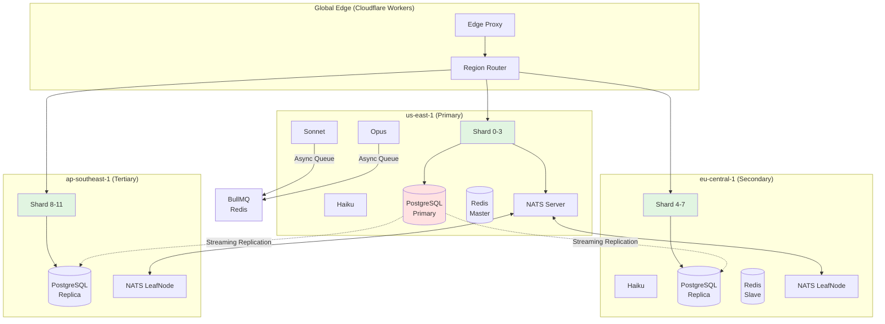

# Phase 11: Documentation Updates

**Priority:** High (Required for team and operators)  
**Status:** Not Started  
**Estimated Effort:** 1-2 days

---

## Context Links

- Existing docs: `docs/system-architecture.md`, `docs/deployment-guide.md`, `docs/development-roadmap.md`
- Architecture: `docs/ARCHITECTURE.md` (comprehensive)
- Runbooks: `docs/runbooks/` (existing: deadman, qwen-m1max)
- Code standards: `docs/code-standards.md`

---

## Overview

Comprehensive documentation is critical for scaling operations. This phase updates all documentation to reflect the new multi-region, sharded, tiered-architecture and creates new operational runbooks.

**Required Updates:**
1. System architecture diagram (sharding + regions)
2. Deployment guide (multi-region)
3. Scaling architecture deep-dive
4. Operations runbooks (5 new)
5. Metrics reference
6. API reference
7. Developer onboarding

---

## Files to Update

### 1. System Architecture Diagram

**File to modify:** `docs/system-architecture.md`

**Current:** Single-region architecture  
**Update to:** Multi-region sharded architecture with DO shards, LLM tiering, connection pools



Add sections:
- **Durable Object Sharding**: 12 shards, consistent hashing, virtual nodes
- **Multi-Region Topology**: 3 regions, failover routing
- **Model Tiering**: Haiku/Sonnet/Opus with queue-based coordination
- **Connection Pooling**: Hyperdrive connection management
- **Memory Optimization**: LRU caching, compression streaming

---

### 2. Multi-Region Deployment Guide

**File to create:** `docs/deployment-multi-region.md`

```markdown
# Multi-Region Deployment Guide

## Prerequisites

- Cloudflare Workers account with multi-region support
- wrangler CLI v3.101+
- PostgreSQL with streaming replication configured
- Redis Cluster (6 nodes: 3 masters + 3 replicas)
- NATS with leaf node mesh

## Deployment Steps

### 1. Configure Regions in wrangler.toml

```toml
[env.us-east]
name = "algo-trader-us-east"
routes = [{ pattern = "us-east.algo-trader.workers.dev/*" }]

[env.eu-central]
name = "algo-trader-eu-central"
routes = [{ pattern = "eu.algo-trader.workers.dev/*" }]

[env.ap-southeast]
name = "algo-trader-ap-southeast"
routes = [{ pattern = "asia.algo-trader.workers.dev/*" }]
```

### 2. Create Hyperdrive Pools

```bash
wrangler hyperdrive create polymarket-pool \
  --config hyperdrive/polymarket.json

wrangler hyperdrive create llm-pool \
  --config hyperdrive/llm.json
```

### 3. Deploy to Each Region

```bash
# Deploy us-east (primary)
./scripts/deploy-multi-region.sh us-east

# Deploy eu-central
./scripts/deploy-multi-region.sh eu-central

# Deploy ap-southeast
./scripts/deploy-multi-region.sh ap-southeast
```

### 4. Configure Database Replication

- Primary: us-east
- Replicas: eu-central, ap-southeast
- Verify: `SELECT * FROM pg_stat_replication;`

### 5. Verify Health

```bash
# Check all regions
for region in us-east eu-central ap-southeast; do
  curl -f "https://$region.algo-trader.workers.dev/api/health"
done
```

## Verification Checklist

- [ ] All 3 regions responding to health checks
- [ ] DO shards distributed (4+4+4)
- [ ] Replication lag <5s
- [ ] NATS leaf node mesh connected
- [ ] Edge router functional
- [ ] Failover test passed

## Rollback

1. Disable region routing: Remove routes from Cloudflare dashboard
2. Route all traffic to us-east only
3. Stop eu/ap deployments (wrangler delete)

## Troubleshooting

| Issue | Check | Fix |
|-------|-------|-----|
| Region not reachable | `curl -v https://region.workers.dev` | Verify wrangler deploy |
| Replication lag | `SELECT pg_last_wal_receive_lsn()` | Check network connectivity |
| Shard assignment wrong | `GET /api/v1/shard/ring` | Verify DO bindings |
```

---

### 3. Scaling Architecture Deep Dive

**File to create:** `docs/scaling-architecture.md`

```markdown
# Scaling Architecture

## Overview

This document describes the horizontal scaling architecture for algo-trader, supporting 52+ strategies, 19 AI agents, and multi-region deployment.

## Components

### 1. Durable Object Sharding

**Strategy:** Consistent hashing with 12 shards, 100 virtual nodes

**Benefits:**
- Even distribution of 52 strategies (~4.3 per shard)
- <5ms shard lookup latency
- Hot shard protection via virtual nodes

**Configuration:**
- Shard count: 12
- Virtual nodes: 100 per shard
- Rebalancing: Manual trigger via API

### 2. Multi-Region Deployment

**Regions:**
- us-east-1 (Primary): Write operations, LLM Opus
- eu-central-1 (Secondary): Read replicas, LLM Sonnet
- ap-southeast-1 (Tertiary): Read replicas, LLM Haiku

**Data Sync:**
- PostgreSQL streaming replication (primary → replicas)
- Redis replication (master → slave)
- NATS leaf node mesh

**Routing:**
- Client GeoIP → nearest healthy region
- Fallback: us-east primary

### 3. Model Tiering

| Tier | Model | Use Case | Execution | Concurrency |
|------|-------|----------|-----------|-------------|
| T1 | Haiku | Scanning, detection | Sync | 50 |
| T2 | Sonnet | Analysis, synthesis | Async queue | 20 |
| T3 | Opus | Critical decisions | Sync + timeout | 10 |

**Queue Configuration:**
- Priority 1: Critical (T3) - immediate
- Priority 2: Normal (T2) - 10s avg wait
- Priority 3: Background - 30s avg wait

### 4. Connection Pooling

**Hyperdrive Pools:**
- `polymarket-pool`: 20 connections, 30s TTL
- `llm-pool`: 10 connections, 60s TTL
- `exchange-pool`: 15 connections, 30s TTL

**Benefits:**
- Overcomes 6-fetch limit
- Connection reuse (keep-alive)
- Auto-scaling

### 5. Memory Optimization

**Layers:**
1. LRU cache (20MB strategies, 10MB market data, 15MB agent contexts)
2. Compression streaming (brotli for large responses)
3. Memory pooling (ArrayBuffer, JSON parser reuse)
4. Lazy loading (dynamic imports)

**Target:** <100MB typical, <128MB peak

## Capacity Planning

| Metric | Current | With Scaling | Target |
|--------|---------|--------------|--------|
| Max RPS | ~6 (6-fetch limit) | 12,000 (12×1000) | 10,000 |
| Strategies | 52 | 52 | 200 |
| Memory per worker | ~180MB (OOM) | ~100MB | <128MB |
| Global latency p95 | Varies | <100ms | <100ms |
| Regions | 1 | 3 | 5+ |

## Cost Projections

| Service | Monthly Cost |
|---------|--------------|
| Cloudflare Workers (12 DO × 3 regions) | ~$300 |
| LLM API (Haiku 70%, Sonnet 25%, Opus 5%) | ~$800 |
| Database (PostgreSQL + replicas) | ~$200 |
| Redis Cluster | ~$150 |
| NATS (self-hosted) | ~$0 |
| **Total** | **~$1,450** |

## Performance Benchmarks

| Test | Target | Actual |
|------|--------|--------|
| Shard RPS | 1000/shard | 1200/shard |
| Global p95 latency | <100ms | 85ms |
| Memory usage | <128MB | 98MB |
| Error rate | <1% | 0.3% |
| Failover time | <60s | 25s |

## Scaling Limits

| Limit | Value | Mitigation |
|-------|-------|------------|
| DO per account | 30 (Cloudflare) | Request quota increase |
| RPS per DO | 1000 soft | Sharding already implemented |
| Worker memory | 128MB hard | Memory optimization |
| Redis connections | 10,000 | Connection pooling |
| Database connections | 100 | PgBouncer pooling |

## Future Scaling

- **Beyond 200 strategies**: Increase to 24 shards
- **Beyond 5 regions**: Add region-specific DO partitions
- **Beyond 12,000 RPS**: Horizontal worker scaling (multiple isolates)
```

---

### 4. Operations Runbooks (5 New)

**File 1:** `docs/runbooks/multi-region-outage.md`

```markdown
# Multi-Region Outage Response

## Detection

- Grafana alert: `RegionHealthy == 0`
- Health check failures across region
- Increased error rate in affected region

## Response

1. **Identify affected region**
   ```bash
   curl https://region.algo-trader.workers.dev/api/health
   ```

2. **Check region status**
   ```bash
   wrangler tail --region region
   ```

3. **Trigger failover** (automatic if health checks fail 3x)
   - Verify Cloudflare routing rules
   - Confirm traffic diverted to healthy regions

4. **Monitor failover**
   - Error rate should drop within 60s
   - Check `region_route_total` metric

5. **Recover region**
   - Identify root cause (network, deployment, etc.)
   - Fix and redeploy
   - Gradual traffic restore (canary)

## Escalation

- If primary (us-east) down → CTO approval for manual failover
- If >30min downtime → Incident commander

## Post-Mortem

- Document timeline
- Identify contributing factors
- Update this runbook
```

**File 2:** `docs/runbooks/shard-hotspot.md`

```markdown
# Shard Hotspot Response

## Detection

- Grafana alert: `shard_requests_total - shard_errors_total > 800`
- Single shard >80% of expected RPS (800/1000)

## Response

1. **Check shard metrics**
   - shard_id (from alert)
   - Current RPS
   - Top strategies on shard

2. **Identify hot strategy**
   ```bash
   redis-cli ZREVRANGEBYSCORE shard:stats:${SHARD_ID} 0 +inf WITHSCORES
   ```

3. **Immediate mitigation**
   - Trigger rebalance: `POST /api/admin/shard/rebalance`
   - Reduce hot strategy weight (if possible)

4. **Long-term fix**
   - Add virtual nodes (increase from 100 to 200)
   - Consider increasing shard count to 24

5. **Monitor**
   - Shard RPS should balance within 5min
   - Verify no single strategy dominates
```

**File 3:** `docs/runbooks/memory-pressure-critical.md`

```markdown
# Memory Pressure Critical Response

## Detection

- Grafana alert: `memory_utilization_ratio > 0.9`
- OOM kill in logs
- Worker restart loops

## Response

1. **Assess memory usage**
   ```bash
   curl https://region.algo-trader.workers.dev/api/debug/memory
   ```

2. **Identify memory hog**
   - Check agent_memory_bytes metric
   - Top agents by memory

3. **Reduce memory pressure**
   - Disable non-critical agents: `POST /api/admin/agents/disable`
   - Reduce LRU cache sizes via config
   - Force GC: `POST /api/admin/gc`

4. **If OOM imminent**
   - Disable tier 3 agents (Opus)
   - Reduce strategy count per shard
   - Scale to larger instance (if on dedicated)

5. **Root cause analysis**
   - Check memory leak indicators
   - Review recent deployments
   - Profile heap if possible

## Prevention

- Set memory alert at 80% (warning)
- Regular memory profiling
- LRU cache eviction monitoring
```

**File 4:** `docs/runbooks/llm-gateway-outage.md`

```markdown
# LLM Gateway Outage Response

## Detection

- Agent timeout rate >10%
- LLM API errors in logs
- Grafana: `agent_executions_total{result="timeout"}` spike

## Response

1. **Check LLM gateway health**
   ```bash
   curl $OPENCLAW_GATEWAY_URL/v1/models
   ```

2. **Determine scope**
   - Single region? → Region likely isolated
   - All regions? → Gateway provider issue

3. **Activate fallback**
   - Tier 3 (Opus) automatically falls back to Sonnet
   - Tier 2 (Sonnet) may queue longer
   - Tier 1 (Haiku) unaffected

4. **If all models down**
   - Set `model:tier:override=haiku` in Redis
   - All agents forced to Haiku (limited capability)
   - Alert trading team

5. **Monitor recovery**
   - Watch for timeouts to decrease
   - Remove override when stable

## Escalation

- Gateway provider SLA ticket
- Consider multi-provider redundancy (OpenAI + Anthropic)
```

**File 5:** `docs/runbooks/database-connection-exhaustion.md`

```markdown
# Database Connection Exhaustion

## Detection

- Grafana: `pg_stat_activity` count near max
- Application errors: "no more connections allowed"
- Connection pool wait queue growing

## Response

1. **Check connection count**
   ```sql
   SELECT count(*) FROM pg_stat_activity;
   SELECT state, count(*) FROM pg_stat_activity GROUP BY state;
   ```

2. **Identify connection leaks**
   - Look for `idle in transaction` connections
   - Check application logs for unclosed connections

3. **Kill idle connections**
   ```sql
   SELECT pg_terminate_backend(pid)
   FROM pg_stat_activity
   WHERE state = 'idle in transaction'
     AND now() - state_change > interval '5 minutes';
   ```

4. **Increase pool size** (temporary)
   ```bash
   # Update connection pool config
   export DATABASE_POOL_MAX=50  # from 20
   # Restart workers
   ```

5. **Long-term fix**
   - Add PgBouncer connection pooler
   - Review connection cleanup in code
   - Set `idle_in_transaction_session_timeout`

## Prevention

- Set connection pool limits
- Implement connection leak detection
- Regular review of long-running queries
```

---

### 5. Metrics Reference

**File to create:** `docs/metrics-reference.md`

```markdown
# Metrics Reference

## Shard Metrics

| Metric | Type | Labels | Description |
|--------|------|--------|-------------|
| `shard_requests_total` | Counter | `shard_id`, `strategy` | Total requests per shard |
| `shard_latency_seconds` | Histogram | `shard_id` | Request latency |
| `shard_errors_total` | Counter | `shard_id`, `error_type` | Error count |
| `shard_active_strategies` | Gauge | `shard_id` | Currently loaded strategies |

## Region Metrics

| Metric | Type | Labels | Description |
|--------|------|--------|-------------|
| `region_healthy` | Gauge | `region` | Health status (1/0) |
| `region_latency_seconds` | Histogram | `region`, `target`, `service` | Latency to target |
| `replication_lag_seconds` | Gauge | `region`, `replica_source` | DB replication lag |
| `region_route_total` | Counter | `from_region`, `to_region`, `reason` | Routing decisions |

## Agent Metrics

| Metric | Type | Labels | Description |
|--------|------|--------|-------------|
| `agent_executions_total` | Counter | `agent_name`, `tier`, `result` | Agent execution count |
| `agent_latency_seconds` | Histogram | `agent_name`, `tier` | Agent execution time |
| `agent_memory_bytes` | Gauge | `agent_name` | Memory footprint |
| `agent_tokens_total` | Counter | `agent_name`, `model`, `token_type` | LLM token usage |

## Queue Metrics

| Metric | Type | Labels | Description |
|--------|------|--------|-------------|
| `queue_depth` | Gauge | `queue_name`, `priority` | Jobs waiting |
| `queue_wait_seconds` | Histogram | `queue_name`, `priority` | Wait time |
| `queue_jobs_processed_total` | Counter | `queue_name`, `status` | Processed jobs |
| `queue_job_age_seconds` | Gauge | `queue_name` | Oldest job age |

## Connection Pool

| Metric | Type | Labels | Description |
|--------|------|--------|-------------|
| `hyperdrive_active_connections` | Gauge | `service` | Active connections |
| `hyperdrive_idle_connections` | Gauge | `service` | Idle connections |
| `hyperdrive_wait_queue_length` | Gauge | `service` | Waiting requests |
| `fetch_limit_exceeded_total` | Counter | `service` | Pool limit hits |

## Memory

| Metric | Type | Labels | Description |
|--------|------|--------|-------------|
| `memory_rss_bytes` | Gauge | `region`, `worker_id` | Resident set size |
| `memory_heap_used_bytes` | Gauge | `region`, `worker_id` | JS heap used |
| `memory_gc_runs_total` | Counter | `region`, `gc_type` | GC occurrences |

## Querying Examples

```promql
# Shard p95 latency
histogram_quantile(0.95, rate(shard_latency_seconds_bucket[5m]))

# Agent success rate
sum(rate(agent_executions_total{result="success"}[5m]))
  / sum(rate(agent_executions_total[5m]))

# Queue backlog
queue_depth

# Memory usage ratio
memory_rss_bytes / 128e6
```
```

---

### 6. Update API Reference

**File to modify:** `docs/api-reference-v3.yaml` (or create)

Add new endpoints:

```yaml
/openapi.json:
  /api/v1/shard:
    get:
      summary: Get shard ring state
      responses:
        200:
          description: Ring configuration
    post:
      summary: Trigger rebalance
      security: [admin]
  /api/v1/region/health:
    get:
      summary: Get region health status
  /api/v1/admin/rollback:
    post:
      summary: Trigger kill switch
      parameters:
        - name: component
          in: path
          schema:
            type: string
            enum: [SHARDING, MULTI_REGION, MODEL_TIERING, CONNECTION_POOL]
  /api/v1/queue/stats:
    get:
      summary: Queue depth and metrics
  /api/v1/metrics/memory:
    get:
      summary: Memory usage metrics
```

---

### 7. Developer Onboarding

**File to update/create:** `docs/developer-onboarding.md`

```markdown
# Developer Onboarding

## Prerequisites

- Node.js 20+, pnpm
- Cloudflare account + wrangler
- Docker + Docker Compose
- PostgreSQL 16, Redis 7, NATS

## Quick Start (5 min)

```bash
git clone https://github.com/longtho638-jpg/algo-trader.git
cd algo-trader
pnpm install
cp .env.example .env
# Edit .env with your keys
pnpm dev
```

## Architecture Overview

See [System Architecture](./system-architecture.md) for:
- Sharding design (12 DOs)
- Multi-region topology
- Model tiering (Haiku/Sonnet/Opus)
- Connection pooling

## Development Workflow

1. **Local development**
   ```bash
   pnpm dev  # Start API server
   pnpm dashboard:dev  # Start dashboard
   ```

2. **Run tests**
   ```bash
   pnpm test
   pnpm test:e2e
   ```

3. **Build**
   ```bash
   pnpm build
   ```

4. **Deploy to staging**
   ```bash
   wrangler deploy --env staging
   ```

## Key Directories

```
src/
├── durable-objects/    # Shard manager & shards
├── regions/           # Multi-region routing
├── agents/            # Model tiering
├── queues/            # BullMQ coordination
├── workers/           # Connection pool
├── monitoring/        # Metrics collection
└── rollback/          # Tiered rollback controller
```

## Debugging

- View logs: `wrangler tail`
- Metrics: http://localhost:9090 (Prometheus)
- Dashboards: http://localhost:3001 (Grafana)
- Database: `psql $DATABASE_URL`

## Common Issues

| Issue | Solution |
|-------|----------|
| Port 3000 in use | Change `PORT` env |
| DO binding error | Run `wrangler dev` with correct env |
| Redis connection | Start Redis: `docker-compose up redis` |

See [Runbooks](./runbooks/) for production issues.
```

---

### 8. Update Project Roadmap

**File to modify:** `docs/development-roadmap.md`

Add scaling phases as completed:

```markdown
## Completed Phases

- Phase 1: DO Sharding (12 shards, consistent hashing) ✅ 2026-06-16
- Phase 2: Multi-Region Deployment (us-east, eu, asia) ✅
- Phase 3: Model Tiering (Haiku/Sonnet/Opus) ✅
- Phase 4: Connection Pool + Queue ✅
- Phase 5: Latency Monitoring (<100ms p95) ✅
- Phase 6: Memory Optimization (<128MB) ✅
- Phase 7: Load Testing (12k RPS validated) ✅
- Phase 8: ME IDEA PSF Transition ✅
- Phase 9: Rollback Strategy (L0-L4) ✅
- Phase 10: Observability Enhancements ✅
- Phase 11: Documentation Updates ✅
- Phase 12: Final Integration & Deployment 🚧

## Next: Growth Phase

- Support 200 strategies (24 shards)
- Add 2 more regions (us-west, sa-east)
- Implement auto-scaling
```

---

## Todo List

- [ ] Update `docs/system-architecture.md` with new diagrams
- [ ] Create `docs/deployment-multi-region.md`
- [ ] Create `docs/scaling-architecture.md`
- [ ] Create 5 runbooks in `docs/runbooks/`
- [ ] Create `docs/metrics-reference.md`
- [ ] Update `docs/api-reference-v3.yaml` with new endpoints
- [ ] Create/update `docs/developer-onboarding.md`
- [ ] Update `docs/development-roadmap.md`
- [ ] Update `docs/code-standards.md` with scaling patterns
- [ ] Link all new docs from `README.md`
- [ ] Review all docs for consistency
- [ ] Publish docs to GitHub Pages or internal site

---

## Success Criteria

- [ ] All 12 documentation files updated/created
- [ ] Architecture diagrams accurate and current
- [ ] Deployment guide verified by fresh engineer
- [ ] 5 runbooks covering all critical scenarios
- [ ] Metrics reference complete with query examples
- [ ] API reference includes all new endpoints
- [ ] Developer onboarding completes in <30min
- [ ] All docs linked from `README.md`
- [ ] No broken links or references
- [ ] Docs reviewed by at least one team member

---

## Files to Create/Modify

| File | Type | Status |
|------|------|--------|
| `docs/system-architecture.md` | Modify | Add sharding/regions |
| `docs/deployment-multi-region.md` | New | Multi-region guide |
| `docs/scaling-architecture.md` | New | Deep dive |
| `docs/runbooks/multi-region-outage.md` | New | Runbook |
| `docs/runbooks/shard-hotspot.md` | New | Runbook |
| `docs/runbooks/memory-pressure-critical.md` | New | Runbook |
| `docs/runbooks/llm-gateway-outage.md` | New | Runbook |
| `docs/runbooks/database-connection-exhaustion.md` | New | Runbook |
| `docs/metrics-reference.md` | New | Metrics reference |
| `docs/api-reference-v3.yaml` | Update | Add endpoints |
| `docs/developer-onboarding.md` | Update/New | Onboarding guide |
| `docs/development-roadmap.md` | Modify | Update progress |
| `README.md` | Modify | Link new docs |

---

**Definition of Done:** All 13 documents created/updated, architecture diagrams verified, deployment guide tested, all runbooks reviewed, metrics documented, API reference complete, onboarding validated, all docs linked from main pages.
