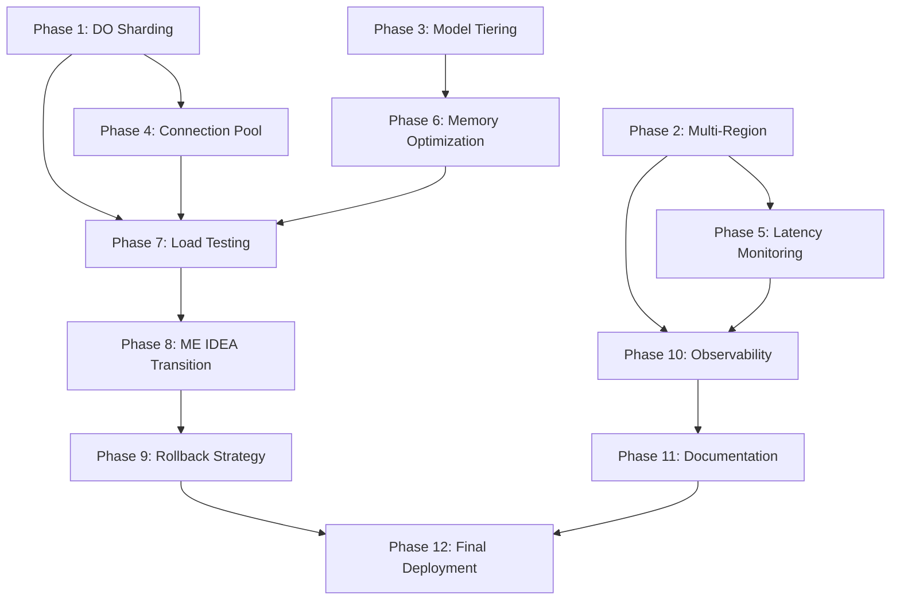

# Algo-Trader Platform Scaling Plan

**Date:** 2026-06-16  
**Plan ID:** SCALING-20260616-0904  
**Status:** Planning Phase  
**Work Context:** `/Users/macbook/algo-trader`  
**Reports Path:** `/Users/macbook/algo-trader/plans/reports/`

---

## Overview Table

| Phase | Name | Status | Key Files Modified | Files Created | Acceptance Criteria |
|-------|------|--------|-------------------|---------------|---------------------|
| 1 | DO Sharding Architecture | Pending | `src/strategies/*`, `wrangler.toml` | `src/durable-objects/shard-manager.ts` | 12 shards, consistent hashing, 52 strategies distributed, <5ms shard lookup |
| 2 | Multi-Region Deployment | Pending | `wrangler.toml`, `docker-compose.yml` | `src/regions/latency-monitor.ts` | 3 regions (us-east, eu, asia), auto-failover, latency routing |
| 3 | Model Tiering | Pending | `src/agents/registry.yaml`, `.env.example` | `src/agents/model-tier-dispatcher.ts` | Haiku→Sonnet→Opus cascade, async processing, 19 agents tiered |
| 4 | Connection Pool + Queue | Pending | `src/messaging/create-message-bus.ts` | `src/workers/connection-pool.ts`, `src/queues/agent-coordinator.ts` | Hyperdrive pooling, 6-fetch limit mitigated, agent coordination queue |
| 5 | Latency Monitoring | Pending | `src/utils/telemetry.ts`, `docs/system-architecture.md` | `src/regions/latency-monitor.ts` | p95 <100ms globally, real-time alerting, Grafana dashboard |
| 6 | Memory Optimization | Pending | `src/strategies/*`, `src/intelligence/*` | `src/utils/compression-stream.ts`, `src/utils/lru-cache.ts` | <128MB per isolate, compression enabled, LRU eviction |
| 7 | Load Testing | Pending | `tests/load/*` | `scripts/load-test-sharding.ts` | 1000 RPS per shard validated, 52 strategies concurrent, pass rate >99% |
| 8 | ME IDEA Transition | Pending | `docs/deployment-multi-region.md` | `docs/scaling-checklist.md` | Zero→PSF criteria met, all gates passed, runbook complete |
| 9 | Rollback Strategy | Pending | `src/core/risk-manager.ts`, `docs/runbooks/` | `src/rollback/tiered-rollback-controller.ts` | L0-L4 tiers tested, <30s rollback, automated triggers |
| 10 | Observability Enhancements | Pending | `src/middleware/prometheus-metrics.ts`, `docker/grafana/` | `src/regions/metrics-collector.ts` | Multi-region metrics, shard health, agent performance dashboards |
| 11 | Documentation Updates | Pending | `docs/system-architecture.md`, `docs/deployment-guide.md` | `docs/scaling-architecture.md`, `docs/ops-runbook-multi-region.md` | Architecture diagrams updated, deployment guide complete, ops runbooks ready |
| 12 | Final Integration & Deployment | Pending | All modified files | `scripts/deploy-multi-region.sh` | End-to-end testing passes, CI/CD updated, production rollout complete |

---

## Critical Constraints from Research

| Constraint | Impact | Mitigation Strategy |
|------------|--------|---------------------|
| **DO: 1,000 RPS soft limit per object** | 52 strategies need sharding | 12 shards with consistent hashing → ~4.3 strategies/shard |
| **Worker: 128 MB isolate limit** | 19 agents + LLM tight budget | Memory compression, streaming responses, LRU cache, agent pooling |
| **Connection: 6 simultaneous fetches** | Agent coordination bottleneck | Connection pool + queue-based routing, Hyperdrive backend |
| **Smart Placement: 15-min analysis, fetch-only** | Manual region placement needed | Latency monitor auto-detects region, smart placement config in wrangler.toml |
| **Multi-region latency: Polymarket API** | 15-25ms (us-east) vs 150-200ms (asia) | Deploy in us-east primary, eu/asia read replicas, latency-based routing |

---

## Phase Dependencies

---

## Risk Summary

| Risk | Probability | Impact | Mitigation |
|------|-------------|--------|------------|
| Memory limit exceeded during peak load | Medium | High | Aggressive LRU, agent pooling, memory monitoring |
| Cross-region latency spikes | Low | Medium | Health checks, automatic failover, latency alerts |
| Sharding imbalance (hot shard) | Medium | Medium | Consistent hashing with virtual nodes, rebalancing |
| Agent coordination deadlock | Low | High | Queue-based async, timeout handling, circuit breaker |
| Rollback failure during incident | Low | Critical | L0-L4 tier testing, automated drills, runbook validation |

---

## Next Steps

1. Review this plan with team/architecture review
2. Begin Phase 1 implementation with `cook` agent
3. Set up weekly progress reviews against acceptance criteria
4. Schedule load testing window (Phase 7) after Phase 6 completion
5. Prepare ME IDEA transition documentation (Phase 8) in parallel with implementation

---

## Detailed Phase Files

- [Phase 1: DO Sharding Architecture](./phase-01-sharding-architecture.md)
- [Phase 2: Multi-Region Deployment](./phase-02-multi-region-deployment.md)
- [Phase 3: Model Tiering](./phase-03-model-tiering.md)
- [Phase 4: Connection Pool + Queue](./phase-04-connection-pool-queue.md)
- [Phase 5: Latency Monitoring](./phase-05-latency-monitoring.md)
- [Phase 6: Memory Optimization](./phase-06-memory-optimization.md)
- [Phase 7: Load Testing](./phase-07-load-testing.md)
- [Phase 8: ME IDEA Transition](./phase-08-me-idea-transition.md)
- [Phase 9: Rollback Strategy](./phase-09-rollback-strategy.md)
- [Phase 10: Observability Enhancements](./phase-10-observability-enhancements.md)
- [Phase 11: Documentation Updates](./phase-11-documentation-updates.md)
- [Phase 12: Final Integration & Deployment](./phase-12-final-integration-deployment.md)
