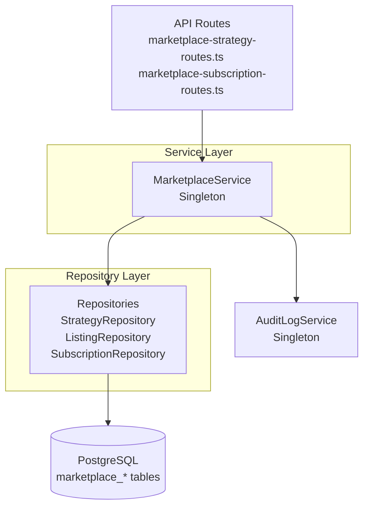

# Phase 1: Service Layer Foundation - Design

**Priority**: P0 - Core infrastructure  
**Status**: Ready for Implementation  
**Dependencies**: Migration 025 (marketplace schema) must be applied

## Overview

Implement the repository layer and core MarketplaceService to handle strategy publishing, listing management, and subscription workflows. This establishes the data access patterns and business logic foundation for all subsequent phases.

## Architecture



### Data Flow: Publish Strategy

```
POST /api/v1/marketplace/strategies/publish
  ├─> Zod validation (publishStrategySchema)
  ├─> Auth middleware (extract tenantId, userId)
  ├─> Tenant tier check (PRO/ENTERPRISE only)
  ├─> MarketplaceService.createStrategy()
  │     ├─> StrategyRepository.create()
  │     ├─> ListingRepository.create() (inactive)
  │     └─> AuditLogService.log()
  └─> Response: 201 Created {strategy, listing}
```

### Data Flow: Subscribe to Strategy

```
POST /api/v1/marketplace/subscriptions
  ├─> Zod validation (subscribeSchema)
  ├─> Auth middleware (tenantId)
  ├─> MarketplaceService.subscribe()
  │     ├─> ListingRepository.get() (validate active listing)
  │     ├─> SubscriptionRepository.create()
  │     ├─> ListingRepository.incrementSubscriberCount()
  │     └─> AuditLogService.log()
  └─> Response: 201 Created {subscription}
```

## Files to Create

### Repositories (Data Access Layer)

**1. `/Users/macbook/algo-trader/src/marketplace/repositories/strategy-repository.ts`**
- Methods:
  - `create(strategy: CreateStrategyDto): Promise<IMarketplaceStrategy>`
  - `getById(id: string, tenantId?: string): Promise<IMarketplaceStrategy | null>`
  - `update(id: string, updates: Partial<IMarketplaceStrategy>): Promise<boolean>`
  - `updateStatus(id: string, status: StrategyStatus, vettedBy?: string): Promise<boolean>`
  - `list(filters: StrategyFilterDto): Promise<PaginatedResult<IMarketplaceStrategy>>`
  - `getByCreator(creatorId: string): Promise<IMarketplaceStrategy[]>`
  - `exists(id: string): Promise<boolean>`
- Uses: Prisma client (`prisma.marketplaceStrategy`)
- Tenant scoping: All queries filter by tenant_id unless explicitly cross-tenant (public listings)

**2. `/Users/macbook/algo-trader/src/marketplace/repositories/listing-repository.ts`**
- Methods:
  - `create(listing: CreateListingDto): Promise<IMarketplaceListing>`
  - `getById(id: string, includeStrategy?: boolean): Promise<IMarketplaceListing | null>`
  - `getByStrategyId(strategyId: string): Promise<IMarketplaceListing | null>`
  - `update(id: string, updates: Partial<IMarketplaceListing>): Promise<boolean>`
  - `setActive(id: string, isActive: boolean): Promise<boolean>`
  - `incrementSubscriberCount(id: string): Promise<void>`
  - `decrementSubscriberCount(id: string): Promise<void>`
  - `listActive(strategyIds?: string[]): Promise<IMarketplaceListing[]>`

**3. `/Users/macbook/algo-trader/src/marketplace/repositories/subscription-repository.ts`**
- Methods:
  - `create(subscription: CreateSubscriptionDto): Promise<IMarketplaceSubscription>`
  - `getById(id: string, tenantId?: string): Promise<IMarketplaceSubscription | null>`
  - `getByTenant(tenantId: string, status?: SubscriptionStatus): Promise<IMarketplaceSubscription[]>`
  - `getByListing(listingId: string, status?: SubscriptionStatus): Promise<IMarketplaceSubscription[]>`
  - `getByStrategy(strategyId: string, status?: SubscriptionStatus): Promise<IMarketplaceSubscription[]>`
  - `updateStatus(id: string, status: SubscriptionStatus): Promise<boolean>`
  - `updateAllocation(id: string, allocationPercent: number): Promise<boolean>`
  - `updateCustomRiskLimits(id: string, limits: CustomRiskLimits): Promise<boolean>`
  - `existsActive(tenantId: string, listingId: string): Promise<boolean>`
  - `getActiveCount(listingId: string): Promise<number>`

**4. `/Users/macbook/algo-trader/src/marketplace/repositories/performance-repository.ts`**
- Methods:
  - `upsert(performance: UpsertPerformanceDto): Promise<IMarketplacePerformance>`
  - `getByStrategy(strategyId: string, tenantId?: string, startDate?: Date, endDate?: Date): Promise<IMarketplacePerformance[]>`
  - `getAggregateByStrategy(strategyId: string, startDate?: Date, endDate?: Date): Promise<IAggregatedPerformance | null>`
  - `deleteOldData(beforeDate: Date): Promise<number>` (cleanup)
  - `batchUpsert(performances: UpsertPerformanceDto[]): Promise<void>`

**5. `/Users/macbook/algo-trader/src/marketplace/repositories/review-repository.ts`**
- Methods:
  - `create(review: CreateReviewDto): Promise<IMarketplaceReview>`
  - `getById(id: string): Promise<IMarketplaceReview | null>`
  - `getByStrategy(strategyId: string, page: number, limit: number): Promise<PaginatedResult<IMarketplaceReview>>`
  - `getByTenant(tenantId: string, strategyId?: string): Promise<IMarketplaceReview[]>`
  - `incrementHelpfulVotes(id: string): Promise<boolean>`
  - `incrementReportedCount(id: string): Promise<boolean>`
  - `flagForModeration(id: string, reason?: string): Promise<boolean>`
  - `existsByTenantAndStrategy(tenantId: string, strategyId: string): Promise<boolean>`
  - `getVerifiedReviews(strategyId: string, page: number, limit: number): Promise<PaginatedResult<IMarketplaceReview>>`

**6. `/Users/macbook/algo-trader/src/marketplace/repositories/revenue-share-repository.ts`**
- Methods:
  - `create(revenueShare: CreateRevenueShareDto): Promise<IMarketplaceRevenueShare>`
  - `getById(id: string): Promise<IMarketplaceRevenueShare | null>`
  - `getByStrategy(strategyId: string, periodStart?: Date, periodEnd?: Date): Promise<IMarketplaceRevenueShare[]>`
  - `getByTenant(tenantId: string, status?: RevenueShareStatus): Promise<IMarketplaceRevenueShare[]>`
  - `updateStatus(id: string, status: RevenueShareStatus, paidAt?: Date, stripePayoutId?: string): Promise<boolean>`
  - `getPendingPayouts(tenantId: string): Promise<IMarketplaceRevenueShare[]>`
  - `getPeriodSummary(strategyId: string, periodStart: Date, periodEnd: Date): Promise<IPeriodSummary | null>`
  - `existsForPeriod(strategyId: string, tenantId: string, periodStart: Date, periodEnd: Date): Promise<boolean>`

**7. `/Users/macbook/algo-trader/src/marketplace/repositories/dispute-repository.ts`**
- Methods:
  - `create(dispute: CreateDisputeDto): Promise<IMarketplaceDispute>`
  - `getById(id: string): Promise<IMarketplaceDispute | null>`
  - `getByTenant(tenantId: string, status?: DisputeStatus): Promise<IMarketplaceDispute[]>`
  - `getByListing(listingId: string, status?: DisputeStatus): Promise<IMarketplaceDispute[]>`
  - `getOpenDisputes(): Promise<IMarketplaceDispute[]>` (admin)
  - `getEscalatedDisputes(): Promise<IMarketplaceDispute[]>` (admin)
  - `updateStatus(id: string, status: DisputeStatus, resolvedBy?: string, resolution?: string, compensationAmountCents?: number, compensationType?: CompensationType, adminNotes?: string): Promise<boolean>`
  - `assignToAdmin(id: string, adminId: string): Promise<boolean>`
  - `escalate(id: string, reason?: string): Promise<boolean>`
  - `existsActiveForSubscription(subscriptionId: string): Promise<boolean>`

### Services

**8. `/Users/macbook/algo-trader/src/marketplace/services/marketplace.service.ts`**
- Singleton class
- Dependencies: All repositories + AuditLogService
- Methods:
  - `createStrategy(data: CreateStrategyDto): Promise<IMarketplaceStrategy>`
  - `getStrategy(id: string, tenantId?: string): Promise<IMarketplaceStrategy | null>`
  - `updateStrategy(id: string, updates: Partial<IMarketplaceStrategy>, tenantId: string): Promise<IMarketplaceStrategy>`
  - `updateStrategyStatus(id: string, status: StrategyStatus, vettedBy?: string): Promise<void>`
  - `listStrategies(filters: ListStrategiesDto): Promise<PaginatedResult<IMarketplaceStrategy>>`
  - `getStrategyWithDetails(id: string): Promise<StrategyDetailResponse>` (joined with listing, performance, reviews)
  - `submitForVetting(strategyId: string, tenantId: string): Promise<void>`
  - `queueVettingJob(strategyId: string): Promise<void>` (dispatches to BullMQ worker)
  - `createListing(data: CreateListingDto): Promise<IMarketplaceListing>`
  - `updateListing(id: string, updates: Partial<IMarketplaceListing>): Promise<IMarketplaceListing>`
  - `subscribe(tenantId: string, listingId: string, allocationPercent: number, customRiskLimits?: CustomRiskLimits): Promise<IMarketplaceSubscription>`
  - `getSubscription(id: string, tenantId?: string): Promise<IMarketplaceSubscription | null>`
  - `listSubscriptions(tenantId: string, status?: SubscriptionStatus): Promise<IMarketplaceSubscription[]>`
  - `updateSubscriptionStatus(id: string, status: SubscriptionStatus): Promise<void>`
  - `getSubscriptionPerformance(subscriptionId: string, period: string): Promise<IMarketplacePerformance[]>`
  - `canSubscribe(listingId: string, tenantId: string): Promise<{allowed: boolean; reason?: string}>` (check allowed_tenants, excluded_tenants)

### DTOs (Data Transfer Objects)

**9. `/Users/macbook/algo-trader/src/marketplace/services/dtos.ts`** (new file)
- Export all DTO interfaces:
  - `CreateStrategyDto`
  - `UpdateStrategyDto`
  - `StrategyFilterDto`
  - `CreateListingDto`
  - `UpdateListingDto`
  - `CreateSubscriptionDto`
  - `UpdateSubscriptionDto`
  - `SubscriptionFilterDto`
  - `UpsertPerformanceDto`
  - `CreateReviewDto`
  - `ReviewFilterDto`
  - `CreateRevenueShareDto`
  - `RevenueShareFilterDto`
  - `CreateDisputeDto`
  - `DisputeFilterDto`

## Files to Modify

### 1. Prisma Schema (if needed)

**File**: `/Users/macbook/algo-trader/prisma/schema.prisma`

Check if marketplace models are already generated from migration 025. If not, add:

```prisma
model MarketplaceStrategy {
  id                String                   @id @default(cuid())
  tenantId          String
  creatorId         String
  name              String
  description       String
  category          String
  status            MarketplaceStrategyStatus
  riskLevel         Int
  minAllocationUsd  Int                      @default(100)
  maxAllocationUsd  Int                      @default(100000)
  supportedExchanges String[]
  tags              String[]
  backtestSummary   Json?
  vettedAt          DateTime?
  vettedBy          String?
  rejectionReason   String?
  createdAt         DateTime                 @default(now())
  updatedAt         DateTime                 @updatedAt

  listing          MarketplaceListing?
  subscriptions    MarketplaceSubscription[]
  performance      MarketplacePerformance[]
  reviews          MarketplaceReview[]
  revenueShares    MarketplaceRevenueShare[]
  disputes         MarketplaceDispute[]

  @@index([tenantId])
  @@index([status])
  @@index([category])
  @@index([creatorId])
}

model MarketplaceListing {
  id                  String                   @id @default(cuid())
  strategyId          String
  strategy            MarketplaceStrategy      @relation(fields: [strategyId], references: [id], onDelete: Cascade)
  tenantId            String
  priceUsdMonthly     Int
  billingCycle        MarketplaceBillingCycle  @default(monthly)
  riskLimits          Json                     // {maxDailyLossPercent, maxPositionSizePercent, stopLossPercent, maxConcurrentTrades}
  allowedTenants      String[]                 // empty = all allowed
  excludedTenants     String[]
  isActive            Boolean                  @default(true)
  subscriberCount     Int                      @default(0)
  createdAt           DateTime                 @default(now())
  updatedAt           DateTime                 @updatedAt

  subscriptions       MarketplaceSubscription[]
  disputes            MarketplaceDispute[]

  @@index([strategyId])
  @@index([tenantId])
  @@index([isActive], where: "is_active = true")
}

// ... other models (check migration 025 for full list)
```

Run: `pnpm prisma generate` after schema update.

### 2. Register Marketplace Routes

**File**: `/Users/macbook/algo-trader/src/api/routes/index.ts`

Add:
```typescript
import { marketplaceStrategyRouter } from './routes/marketplace-strategy-routes';
import { marketplaceSubscriptionRouter } from './routes/marketplace-subscription-routes';
import { marketplaceReviewRouter } from './routes/marketplace-review-routes';
import { marketplaceDisputeRouter } from './routes/marketplace-dispute-routes';
import { marketplaceRevenueRouter } from './routes/marketplace-revenue-routes';

// In route registration:
server.register(marketplaceStrategyRouter, { prefix: '/api/v1/marketplace/strategies' });
server.register(marketplaceSubscriptionRouter, { prefix: '/api/v1/marketplace/subscriptions' });
server.register(marketplaceReviewRouter, { prefix: '/api/v1/marketplace/reviews' });
server.register(marketplaceDisputeRouter, { prefix: '/api/v1/marketplace/disputes' });
server.register(marketplaceRevenueRouter, { prefix: '/api/v1/marketplace/revenue' });
```

### 3. Add Marketplace to Billing Webhook Handler

**File**: `/Users/macbook/algo-trader/src/billing/stripe-webhook-handler.ts` (or existing billing integration)

Add logic: When subscription payment succeeds, create/update `marketplace_subscriptions` and increment subscriber counts.

### 4. Risk Limit Enforcement Middleware

**File**: `/Users/macbook/algo-trader/src/marketplace/middleware/risk-limit-middleware.ts` (new)

```typescript
import { Request, Response, NextFunction } from 'express';
import { SubscriptionService } from '../services/marketplace.service';

export async function riskLimitMiddleware(req: Request, res: Response, next: NextFunction) {
  const subscriptionId = req.headers['x-subscription-id'] as string;
  if (!subscriptionId) {
    return res.status(400).json({ error: 'Missing subscription ID' });
  }

  const subscriptionService = SubscriptionService.getInstance();
  const subscription = await subscriptionService.getSubscription(subscriptionId, req.tenantId);
  
  if (!subscription || subscription.status !== 'active') {
    return res.status(403).json({ error: 'Invalid or inactive subscription' });
  }

  // Check daily loss limit (query from recent performance)
  // Check position size limit (compare against allocation)
  // Check max concurrent trades (count open positions)
  // If any limit breached: reject trade, log event
  
  req['subscription'] = subscription; // attach to request
  next();
}
```

## Migration

**No new migration required** - Migration 025 already defines all marketplace tables. Verify it's applied:

```sql
-- Check migration status
SELECT * FROM migrations WHERE id = '025-create-marketplace-schema';

-- If not applied, run via Prisma:
-- pnpm prisma migrate deploy
```

## Interfaces

### Core Service Interfaces

```typescript
// MarketplaceService
interface IMarketplaceService {
  createStrategy(data: CreateStrategyDto): Promise<IMarketplaceStrategy>;
  updateStrategy(id: string, updates: Partial<IMarketplaceStrategy>, tenantId: string): Promise<IMarketplaceStrategy>;
  getStrategy(id: string, tenantId?: string): Promise<IMarketplaceStrategy | null>;
  listStrategies(filters: StrategyFilterDto): Promise<PaginatedResult<IMarketplaceStrategy>>;
  getStrategyWithDetails(id: string): Promise<StrategyDetailResponse>;
  updateStrategyStatus(id: string, status: StrategyStatus, vettedBy?: string): Promise<void>;
  submitForVetting(strategyId: string, tenantId: string): Promise<void>;
  queueVettingJob(strategyId: string): Promise<void>;
  createListing(data: CreateListingDto): Promise<IMarketplaceListing>;
  updateListing(id: string, updates: Partial<IMarketplaceListing>): Promise<IMarketplaceListing>;
  subscribe(tenantId: string, listingId: string, allocationPercent: number, customRiskLimits?: CustomRiskLimits): Promise<IMarketplaceSubscription>;
  getSubscription(id: string, tenantId?: string): Promise<IMarketplaceSubscription | null>;
  listSubscriptions(tenantId: string, status?: SubscriptionStatus): Promise<IMarketplaceSubscription[]>;
  updateSubscriptionStatus(id: string, status: SubscriptionStatus): Promise<void>;
  getSubscriptionPerformance(subscriptionId: string, period: string): Promise<IMarketplacePerformance[]>;
  canSubscribe(listingId: string, tenantId: string): Promise<{allowed: boolean; reason?: string}>;
}

// Repository interfaces (per repository)
interface IStrategyRepository {
  create(strategy: CreateStrategyDto): Promise<IMarketplaceStrategy>;
  getById(id: string, tenantId?: string): Promise<IMarketplaceStrategy | null>;
  update(id: string, updates: Partial<IMarketplaceStrategy>): Promise<boolean>;
  updateStatus(id: string, status: StrategyStatus, vettedBy?: string): Promise<boolean>;
  list(filters: StrategyFilterDto): Promise<PaginatedResult<IMarketplaceStrategy>>;
  getByCreator(creatorId: string): Promise<IMarketplaceStrategy[]>;
  exists(id: string): Promise<boolean>;
}
```

## Prometheus Metrics

```typescript
// src/middleware/prometheus-metrics.ts (add new metrics)

// Marketplace strategy metrics
marketplaceStrategiesTotal = new Counter({
  name: 'marketplace_strategies_total',
  help: 'Total number of marketplace strategies by status',
  labelNames: ['status', 'category']
});

marketplaceSubscriptionsActive = new Gauge({
  name: 'marketplace_subscriptions_active',
  help: 'Number of active subscriptions'
});

marketplaceSubscriptionsByTier = new Gauge({
  name: 'marketplace_subscriptions_by_tier',
  help: 'Active subscriptions by tenant tier',
  labelNames: ['tier']
});

marketplaceRevenueTotalCents = new Counter({
  name: 'marketplace_revenue_total_cents',
  help: 'Total platform revenue in cents'
});

marketplacePayoutsTotalCents = new Counter({
  name: 'marketplace_payouts_total_cents',
  help: 'Total creator payouts in cents'
});

marketplaceRiskLimitBreachesTotal = new Counter({
  name: 'marketplace_risk_limit_breaches_total',
  help: 'Number of trades rejected due to risk limit breach',
  labelNames: ['subscription_id', 'limit_type']
});

marketplaceVettingQueueSize = new Gauge({
  name: 'marketplace_vetting_queue_size',
  help: 'Number of strategies pending vetting'
});

marketplaceRankingQueryDuration = new Histogram({
  name: 'marketplace_ranking_query_duration_seconds',
  help: 'Latency of ranking queries',
  buckets: [0.05, 0.1, 0.25, 0.5, 1.0, 2.5, 5.0]
});
```

## Admin Endpoints

**New file**: `/Users/macbook/algo-trader/src/api/routes/admin-marketplace-routes.ts`

```typescript
import { Router } from 'express';
import { z } from 'zod';
import { MarketplaceService } from '../../marketplace/services/marketplace.service';
import { adminAuthMiddleware } from '../../auth/middleware/admin-auth-middleware';

const router = Router();
const marketplaceService = MarketplaceService.getInstance();

// Admin middleware
router.use(adminAuthMiddleware);

// Strategy vetting
router.get('/strategies/pending', async (req, res) => {
  // List strategies with status = 'pending_vetting'
  // Include backtest metrics, creator info
});

router.post('/strategies/:id/vetting/decision', async (req, res) => {
  // Body: { decision: 'approve' | 'reject' | 'request_changes', rejectionReason?: string, notes?: string }
  // Update strategy status, set vettedAt, vettedBy
  // Audit log
});

router.get('/strategies/:id/history', async (req, res) => {
  // Get vetting audit trail (from audit log)
});

// Dispute management
router.get('/disputes', async (req, res) => {
  // List disputes with filters (status, age)
  // Include subscription, strategy, tenant info
});

router.get('/disputes/:id', async (req, res) => {
  // Get dispute details + evidence
});

router.patch('/disputes/:id/resolve', async (req, res) => {
  // Body: { resolution: 'resolved_creator' | 'resolved_subscriber' | 'escalated', compensationAmountCents?: number, compensationType?: string, adminNotes?: string }
  // Update dispute, apply compensation, send notifications
});

router.get('/disputes/escalated', async (req, res) => {
  // List escalated disputes (>7 days)
});

// Revenue oversight
router.get('/revenue', async (req, res) => {
  // Query: periodStart, periodEnd
  // Platform revenue, creator payouts, top strategies
});

router.get('/payouts', async (req, res) => {
  // List all creator payouts (Stripe payout IDs)
});

router.post('/payouts/:id/mark-paid', async (req, res) => {
  // Manual override: mark payout as paid (if Stripe webhook failed)
});

// Review moderation
router.post('/reviews/:id/hide', async (req, res) => {
  // Hide flagged review (set isFlagged = true)
});

// Strategy suspension
router.post('/strategies/:id/suspend', async (req, res) => {
  // Suspend strategy (status = 'suspended')
  // Auto-cancel all subscriptions
});

// Export all routes as `adminMarketplaceRouter`
```

## Rollback Posture

| Failure Mode | Tier | Mechanism |
|--------------|------|-----------|
| Marketplace service crashes | L1 | Feature flag `MARKETPLACE_ENABLED=false` → disable routes in `index.ts` |
| Revenue calculation error | L1 | Manual rollback: disable revenue worker, investigate logs, recalc manually |
| Database migration failure | L2 | Migration down: `prisma migrate resolve --rolled-back 025` |
| Subscription billing sync error | L3 | Reconcile via admin endpoint: `GET /api/admin/marketplace/subscriptions/sync-errors` |
| Performance ranking slow | L3 | Redis cache TTL increase, add DB indexes |
| Dispute spam | L2 | Rate limiting per tenant (existing rate limiter) |
| Strategy vetting backlog | L3 | Admin reassignment, SLA alerts via Prometheus |

**Kill Switch**: Admin can globally disable marketplace via:
```bash
curl -X POST https://admin.algo-trader.workers.dev/api/admin/feature-flags/marketplace \
  -H "Authorization: Bearer $ADMIN_TOKEN" \
  -d '{"enabled": false}'
```
Implementation: Set in-memory flag, all marketplace routes return 503.

## Security Considerations

1. **Authentication**: All routes use existing tenant auth middleware. Admin routes use `adminAuthMiddleware` with `X-Admin-Key` header.
2. **Authorization**: 
   - Strategy updates: check `strategy.tenantId === req.tenantId && strategy.creatorId === req.userId`
   - Subscription access: `subscription.tenantId === req.tenantId`
   - Reviews: `review.tenantId === req.tenantId` for delete/modify
3. **Input Validation**: All Zod schemas validate:
   - String lengths (name 3-255, description 50-2000)
   - Numeric ranges (riskLevel 1-10, allocationPercent 1-100)
   - Enums (category, status)
   - URLs (evidenceUrls in disputes)
4. **SQL Injection Prevention**: Prisma parameterized queries only - no raw SQL in repositories.
5. **Revenue Auditing**: All revenue share records immutable once `status='paid'`. Use database constraints (CHECK) for positive amounts.
6. **Rate Limiting**: Existing sliding-window rate limiter applies (100 req/min per tenant). Admin routes separate limit (10 req/min).
7. **Stripe Webhooks**: Verify signatures using `stripe.webhooks.constructEvent()`. Store webhook event ID for idempotency.
8. **Tenant Isolation**: All repository queries filter by `tenant_id` unless public (approved strategies visible cross-tenant). Enforce in repository methods.

## Testing Strategy

### Unit Tests (per repository)
- Mock Prisma client with `jest-mock-extended`
- Test all CRUD operations
- Test filter/sort/pagination logic
- Test tenant scoping (queries include tenant_id filter)
- Test error handling (record not found, duplicate key)

### Service Layer Tests
- Test business logic: `subscribe()` validates listing active, tenant allowed
- Test `canSubscribe()` checks allowed_tenants/excluded_tenants
- Test `createStrategy()` sets status='pending_vetting' for PRO/ENT
- Test audit logging on all mutations

### Integration Tests
- API routes with supertest against test database
- Full publish → vet → subscribe → performance → review flow
- Admin vetting decision → status transition → notification
- Revenue calculation end-to-end (subscription payments → revenue shares)

### Performance Tests
- Ranking query: 1000 strategies, 10000 subscriptions → <200ms p95
- Strategy list with filters: <100ms p95

**Target**: ≥80% line coverage for new code.

## Quick Reference

### Key Commands

```bash
# Run repository tests
pnpm test -- --testPathPattern="marketplace/repositories"

# Run service tests
pnpm test -- --testPathPattern="marketplace/services"

# Typecheck
pnpm run typecheck

# Prisma generate (if schema changed)
pnpm prisma generate
```

### Configuration Files

- `.env.example`: Add `MARKETPLACE_ENABLED=true`, `MARKETPLACE_PLATFORM_FEE_PERCENT=80`
- `src/marketplace/services/marketplace.service.ts`: Main service singleton
- `src/marketplace/repositories/`: Data access layer
- `src/api/routes/marketplace-*.ts`: API endpoints

## Unresolved Questions

1. **Strategy code storage**: Where is strategy code stored? In database (JSON) or separate git repo?
   - **Assumption**: Strategy code stored in `marketplace_strategies.backtest_summary` JSONB + separate code artifact (S3/R2). Need `codeRepositoryUrl` field?
   - **Decision pending**: Use database for metadata, external storage for code artifacts (versioned).

2. **Billing integration**: How to map subscription payments to marketplace revenue?
   - **Assumption**: Billing system creates `subscription` records for recurring payments. Marketplace listens to Stripe webhook `invoice.paid` to trigger revenue share calculation.
   - **Need**: Integration with existing billing service (`src/billing/`).

3. **Performance aggregation frequency**: Real-time vs daily batch?
   - **Proposed**: Daily batch (midnight UTC) via BullMQ worker. Real-time per-subscriber P&L tracked separately.

4. **Strategy versioning**: When creator updates strategy, do existing subscribers auto-update?
   - **Proposed**: No auto-update. Subscribers stay on version they subscribed to. Notify of new version, allow manual upgrade.

5. **Review moderation threshold**: How many reports trigger auto-hide?
   - **Proposed**: Auto-hide after 5+ reports, or avg rating < 2.0 with ≥10 reviews. Admin review required to restore.

---

## Next Phase

After Phase 1 completion, Phase 2 (Vetting & Admin Workflows) will implement:
- VettingService with standardized checklist
- Admin routes for approval/rejection
- Notification system (email/Slack)
- Admin dashboard React component
