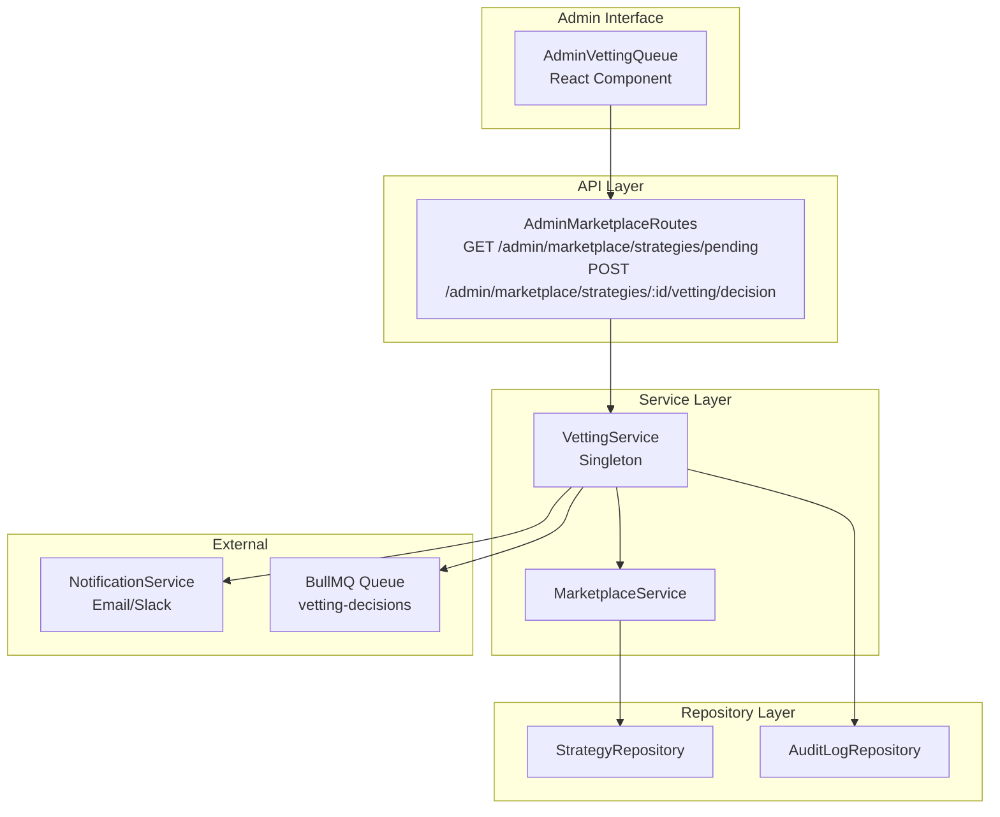

# Phase 2: Vetting & Admin Workflows - Design

**Priority**: P0 - Quality control gate  
**Status**: Ready for Implementation  
**Dependencies**: Phase 1 complete, strategy publishing functional

## Overview

Implement the admin vetting workflow with standardized approval/rejection criteria, audit trail, and creator notifications. This phase establishes the quality gate for marketplace strategies before they become publicly available.

## Architecture



### Data Flow: Strategy Vetting Decision

```
POST /api/admin/marketplace/strategies/:id/vetting/decision
  ├─> Admin auth middleware (X-Admin-Key)
  ├─> VettingService.approveStrategy() or .rejectStrategy()
  │     ├─> MarketplaceService.updateStrategyStatus()
  │     │     ├─> StrategyRepository.updateStatus()
  │     │     └─> ListingRepository.setActive() (if approved)
  │     ├─> AuditLogService.log() (decision, notes)
  │     ├─> NotificationService.sendToCreator() (email with decision + notes)
  │     └─> Queue vetting decision event (for analytics)
  └─> Response: 200 OK {strategy, decision}
```

## Files to Create

### 1. Vetting Service

**File**: `/Users/macbook/algo-trader/src/marketplace/services/vetting.service.ts`

```typescript
import { MarketplaceService } from './marketplace.service';
import { AuditLogService } from '../../audit/audit-log-service';
import { NotificationService } from '../../notifications/notification-service';
import { QueueService } from '../../queues/queue-service';

export type VettingDecision = 'approve' | 'reject' | 'request_changes';

export interface VettingCriteria {
  minSharpe: number;
  maxDrawdown: number;
  minWinRate: number;
  minPeriodDays: number;
  minTrades: number;
}

export class VettingService {
  private static instance: VettingService;
  private readonly marketplaceService: MarketplaceService;
  private readonly auditService: AuditLogService;
  private readonly notificationService: NotificationService;
  private readonly queueService: QueueService;
  
  // Standard vetting checklist (configurable)
  private readonly criteria: VettingCriteria = {
    minSharpe: 1.0,
    maxDrawdown: 20.0, // percentage
    minWinRate: 45.0, // percentage
    minPeriodDays: 90,
    minTrades: 100,
  };

  private constructor() {
    this.marketplaceService = MarketplaceService.getInstance();
    this.auditService = AuditLogService.getInstance();
    this.notificationService = NotificationService.getInstance();
    this.queueService = QueueService.getInstance();
  }

  static getInstance(): VettingService {
    if (!VettingService.instance) {
      VettingService.instance = new VettingService();
    }
    return VettingService.instance;
  }

  async submitForVetting(strategyId: string, tenantId: string): Promise<void> {
    const strategy = await this.marketplaceService.getStrategy(strategyId, tenantId);
    if (!strategy) {
      throw new Error('Strategy not found');
    }

    // Validate strategy has backtest summary
    if (!strategy.backtestSummary) {
      throw new Error('Backtest summary required for vetting');
    }

    // Auto-preliminary check (soft gate)
    const preliminaryCheck = this.runPreliminaryCheck(strategy.backtestSummary);
    if (!preliminaryCheck.passed) {
      // Queue for admin review but flag concerns
      await this.auditService.log({
        tenantId,
        userId: strategy.creatorId,
        action: 'strategy_vetting_preliminary_failed',
        resourceId: strategyId,
        metadata: { issues: preliminaryCheck.issues },
      });
    }

    await this.marketplaceService.updateStrategyStatus(strategyId, 'pending_vetting');
    
    // Queue for admin review (could auto-assign to next available admin)
    await this.queueService.add('vetting-review', {
      strategyId,
      tenantId,
      submittedAt: new Date().toISOString(),
    });
  }

  async approveStrategy(strategyId: string, adminUserId: string, notes?: string): Promise<void> {
    const strategy = await this.marketplaceService.getStrategy(strategyId);
    if (!strategy) {
      throw new Error('Strategy not found');
    }

    if (strategy.status !== 'pending_vetting' && strategy.status !== 'rejected') {
      throw new Error(`Cannot approve strategy in status: ${strategy.status}`);
    }

    await this.marketplaceService.updateStrategyStatus(strategyId, 'approved', adminUserId);

    // Activate listing
    await this.marketplaceService.updateListing(strategyId, { isActive: true });

    // Audit log
    await this.auditService.log({
      tenantId: strategy.tenantId,
      userId: adminUserId,
      action: 'strategy_approved',
      resourceId: strategyId,
      metadata: { notes, strategyName: strategy.name },
    });

    // Notify creator
    await this.notificationService.sendEmail({
      to: strategy.creator.email, // need to fetch user email
      subject: `Strategy Approved: ${strategy.name}`,
      template: 'strategy-approved',
      data: { strategyName: strategy.name, notes },
    });

    // Queue analytics event
    await this.queueService.add('vetting-decision', {
      strategyId,
      decision: 'approve',
      adminUserId,
      timestamp: new Date().toISOString(),
    });
  }

  async rejectStrategy(strategyId: string, adminUserId: string, rejectionReason: string, notes?: string): Promise<void> {
    const strategy = await this.marketplaceService.getStrategy(strategyId);
    if (!strategy) {
      throw new Error('Strategy not found');
    }

    await this.marketplaceService.updateStrategyStatus(strategyId, 'rejected', adminUserId);

    // Audit log
    await this.auditService.log({
      tenantId: strategy.tenantId,
      userId: adminUserId,
      action: 'strategy_rejected',
      resourceId: strategyId,
      metadata: { rejectionReason, notes, strategyName: strategy.name },
    });

    // Notify creator
    await this.notificationService.sendEmail({
      to: strategy.creator.email,
      subject: `Strategy Rejected: ${strategy.name}`,
      template: 'strategy-rejected',
      data: { strategyName: strategy.name, rejectionReason, notes },
    });

    // Queue analytics
    await this.queueService.add('vetting-decision', {
      strategyId,
      decision: 'reject',
      adminUserId,
      rejectionReason,
      timestamp: new Date().toISOString(),
    });
  }

  async requestChanges(strategyId: string, adminUserId: string, feedback: string): Promise<void> {
    const strategy = await this.marketplaceService.getStrategy(strategyId);
    if (!strategy) {
      throw new Error('Strategy not found');
    }

    await this.marketplaceService.updateStrategyStatus(strategyId, 'draft'); // return to draft

    // Audit log
    await this.auditService.log({
      tenantId: strategy.tenantId,
      userId: adminUserId,
      action: 'strategy_changes_requested',
      resourceId: strategyId,
      metadata: { feedback, strategyName: strategy.name },
    });

    // Notify creator
    await this.notificationService.sendEmail({
      to: strategy.creator.email,
      subject: `Changes Requested: ${strategy.name}`,
      template: 'strategy-changes-requested',
      data: { strategyName: strategy.name, feedback },
    });
  }

  async getPendingStrategies(page: number, limit: number): Promise<PaginatedResult<VettingQueueItem>> {
    return await this.marketplaceService.listStrategies({
      status: 'pending_vetting',
      page,
      limit,
      sortBy: 'created_at',
      sortOrder: 'asc', // oldest first
    });
  }

  async getVettingHistory(strategyId: string): Promise<VettingHistory[]> {
    // Query audit log for all vetting actions on this strategy
    return await this.auditService.getResourceHistory(strategyId, ['strategy_published', 'strategy_approved', 'strategy_rejected', 'strategy_changes_requested']);
  }

  private runPreliminaryCheck(backtestSummary: any): { passed: boolean; issues: string[] } {
    const issues: string[] = [];
    const { sharpe, maxDrawdown, winRate, periodDays, totalTrades } = backtestSummary;

    if (sharpe < this.criteria.minSharpe) issues.push(`Sharpe ratio ${sharpe} below minimum ${this.criteria.minSharpe}`);
    if (maxDrawdown > this.criteria.maxDrawdown) issues.push(`Max drawdown ${maxDrawdown}% exceeds maximum ${this.criteria.maxDrawdown}%`);
    if (winRate < this.criteria.minWinRate) issues.push(`Win rate ${winRate}% below minimum ${this.criteria.minWinRate}%`);
    if (periodDays < this.criteria.minPeriodDays) issues.push(`Backtest period ${periodDays} days below minimum ${this.criteria.minPeriodDays}`);
    if (totalTrades && totalTrades < this.criteria.minTrades) issues.push(`Total trades ${totalTrades} below minimum ${this.criteria.minTrades}`);

    return { passed: issues.length === 0, issues };
  }
}

// Supporting types
export interface VettingQueueItem extends IMarketplaceStrategy {
  creatorName: string;
  creatorEmail: string;
  submittedAt: Date;
}

export interface VettingHistory {
  action: string;
  userId: string;
  timestamp: Date;
  metadata: any;
}
```

### 2. Admin Routes

**File**: `/Users/macbook/algo-trader/src/api/routes/admin-marketplace-routes.ts`

```typescript
import { Router, Request, Response } from 'express';
import { z } from 'zod';
import { VettingService } from '../../marketplace/services/vetting.service';
import { MarketplaceService } from '../../marketplace/services/marketplace.service';
import { adminAuthMiddleware } from '../../auth/middleware/admin-auth-middleware';
import { rateLimiter } from '../../middleware/rate-limiter';

const router = Router();
const vettingService = VettingService.getInstance();
const marketplaceService = MarketplaceService.getInstance();

// All routes require admin auth + rate limiting
router.use(adminAuthMiddleware);
router.use(rateLimiter({ windowMs: 60_000, max: 30 })); // 30 req/min for admin

// GET /api/admin/marketplace/strategies/pending
router.get('/strategies/pending', async (req: Request, res: Response) => {
  try {
    const { page = 1, limit = 20 } = req.query;
    const result = await vettingService.getPendingStrategies(parseInt(page as string, 10), parseInt(limit as string, 10));
    return res.json(result);
  } catch (error) {
    return res.status(500).json({ error: 'Failed to fetch pending strategies', message: error.message });
  }
});

// POST /api/admin/marketplace/strategies/:id/vetting/decision
router.post('/strategies/:id/vetting/decision', async (req: Request, res: Response) => {
  try {
    const { id } = req.params;
    const { decision, rejectionReason, notes } = req.body;
    const adminUserId = (req as any).user.id;

    if (!['approve', 'reject', 'request_changes'].includes(decision)) {
      return res.status(400).json({ error: 'Invalid decision', valid: ['approve', 'reject', 'request_changes'] });
    }

    if (decision === 'reject' && !rejectionReason) {
      return res.status(400).json({ error: 'rejectionReason required when rejecting' });
    }

    switch (decision) {
      case 'approve':
        await vettingService.approveStrategy(id, adminUserId, notes);
        break;
      case 'reject':
        await vettingService.rejectStrategy(id, adminUserId, rejectionReason, notes);
        break;
      case 'request_changes':
        await vettingService.requestChanges(id, adminUserId, notes || 'Please review feedback and resubmit');
        break;
    }

    return res.json({ success: true, decision });
  } catch (error) {
    return res.status(500).json({ error: 'Vetting decision failed', message: error.message });
  }
});

// GET /api/admin/marketplace/strategies/:id/history
router.get('/strategies/:id/history', async (req: Request, res: Response) => {
  try {
    const { id } = req.params;
    const history = await vettingService.getVettingHistory(id);
    return res.json(history);
  } catch (error) {
    return res.status(500).json({ error: 'Failed to fetch vetting history', message: error.message });
  }
});

// GET /api/admin/marketplace/disputes (also include in admin routes)
router.get('/disputes', async (req: Request, res: Response) => {
  // Forward to DisputeService (Phase 6) - placeholder for now
  return res.status(501).json({ error: 'Not implemented in Phase 2' });
});

// GET /api/admin/marketplace/revenue (placeholder)
router.get('/revenue', async (req: Request, res: Response) => {
  return res.status(501).json({ error: 'Not implemented in Phase 5' });
});

export default router;
```

### 3. Notification Templates

**Files**: (assuming existing notification service)

Add templates to `/Users/macbook/algo-trader/src/notifications/templates/`:

- `strategy-approved.html`
- `strategy-rejected.html`
- `strategy-changes-requested.html`

Content:
```html
<!-- strategy-approved.html -->
<h1>Strategy Approved: {{strategyName}}</h1>
<p>Congratulations! Your strategy has been approved and is now live in the marketplace.</p>
{{#if notes}}
<h3>Admin Notes:</h3>
<p>{{notes}}</p>
{{/if}}
<p>View your strategy: <a href="https://algo-trader.workers.dev/dashboard/marketplace/strategy/{{strategyId}}">Strategy Page</a></p>
```

### 4. BullMQ Worker for Vetting Queue

**File**: `/Users/macbook/algo-trader/src/workers/vetting-worker.ts` (new)

```typescript
import { Worker } from 'bullmq';
import { VettingService } from '../marketplace/services/vetting.service';
import { logger } from '../utils/logger';

export async function startVettingWorker(): Promise<void> {
  const worker = new Worker('vetting-review', async (job) => {
    const { strategyId, tenantId, submittedAt } = job.data;
    
    // Auto-assign to available admin (round-robin or least busy)
    // For now: just log for manual processing
    logger.info('[VettingWorker] Strategy queued for manual review', { strategyId, tenantId });
    
    // Could implement:
    // - Auto-preliminary check and quick reject if clearly fails criteria
    // - Notify admin Slack channel
    // - Escalate if >48h pending
  });

  worker.on('completed', (job) => {
    logger.info('[VettingWorker] Job completed', { jobId: job.id });
  });

  worker.on('failed', (job, error) => {
    logger.error('[VettingWorker] Job failed', { jobId: job.id, error });
  });

  return worker;
}
```

## Files to Modify

### 1. Audit Log Service

**File**: `/Users/macbook/algo-trader/src/audit/audit-log-service.ts`

Ensure it can query by resource ID and action for vetting history:
```typescript
getResourceHistory(resourceId: string, actions?: string[]): Promise<AuditEvent[]> {
  const where: any = { resourceId };
  if (actions) {
    where.action = { in: actions };
  }
  return this.prisma.auditLog.findMany({
    where,
    orderBy: { createdAt: 'desc' },
  });
}
```

### 2. Notification Service

**File**: `/Users/macbook/algo-trader/src/notifications/notification-service.ts`

Add email templates for vetting decisions. Ensure creator email is available (query from user/tenant table).

## Migration

**No new migration needed** - reuse existing `audit_log` table.

## Interfaces

```typescript
// VettingService
interface IVettingService {
  submitForVetting(strategyId: string, tenantId: string): Promise<void>;
  approveStrategy(strategyId: string, adminUserId: string, notes?: string): Promise<void>;
  rejectStrategy(strategyId: string, adminUserId: string, rejectionReason: string, notes?: string): Promise<void>;
  requestChanges(strategyId: string, adminUserId: string, feedback: string): Promise<void>;
  getPendingStrategies(page: number, limit: number): Promise<PaginatedResult<VettingQueueItem>>;
  getVettingHistory(strategyId: string): Promise<VettingHistory[]>;
}

// VettingQueueItem
interface VettingQueueItem extends IMarketplaceStrategy {
  creatorName: string;
  creatorEmail: string;
  submittedAt: Date;
}

// VettingHistory
interface VettingHistory {
  action: string;
  userId: string;
  timestamp: Date;
  metadata: any;
}
```

## Prometheus Metrics

```typescript
// Add to marketplace metrics

vettingQueueSize = new Gauge({
  name: 'marketplace_vetting_queue_size',
  help: 'Number of strategies pending vetting',
});

vettingDecisionsTotal = new Counter({
  name: 'marketplace_vetting_decisions_total',
  help: 'Total vetting decisions by type',
  labelNames: ['decision', 'admin_id'],
});

vettingLatencySeconds = new Histogram({
  name: 'marketplace_vetting_latency_seconds',
  help: 'Time from submission to decision',
  buckets: [3600, 7200, 14400, 28800, 86400, 172800, 604800], // 1h to 7d
});

vettingPreliminaryFailuresTotal = new Counter({
  name: 'marketplace_vetting_preliminary_failures_total',
  help: 'Number of strategies failing auto-check',
  labelNames: ['issue_type'],
});
```

## Admin Endpoints

All admin endpoints protected by `X-Admin-Key` header:

- `GET /api/admin/marketplace/strategies/pending` - List pending vetting (paginated)
- `POST /api/admin/marketplace/strategies/:id/vetting/decision` - Approve/reject/request changes
- `GET /api/admin/marketplace/strategies/:id/history` - Full vetting audit trail
- `GET /api/admin/marketplace/disputes` - Dispute queue (Phase 6)
- `GET /api/admin/marketplace/revenue` - Revenue dashboard (Phase 5)
- `POST /api/admin/marketplace/reviews/:id/hide` - Moderate reviews (Phase 4)
- `POST /api/admin/marketplace/strategies/:id/suspend` - Emergency suspension

## Rollback Posture

| Failure Mode | Tier | Mechanism |
|--------------|------|-----------|
| Vetting service throws error | L3 | Admin manual override: directly update DB status (emergency) |
| Email notification fails | L3 | Log error, continue (non-blocking) |
| BullMQ worker down | L3 | Manual vetting via admin UI still works (no dependency) |
| Wrong decision (false approve) | L1 | Admin can immediately suspend strategy, revert status |
| Audit log missing | L3 | Retry logging, if fails alert admin (non-blocking) |

**Kill Switch**: Disable marketplace entirely (L1) → all publish/subscribe blocked.

## Security Considerations

1. **Admin Auth**: All admin routes use `adminAuthMiddleware` checking `X-Admin-Key` header. Separate from tenant auth.
2. **RBAC**: Only users with `role: 'admin'` can access admin routes.
3. **Input Validation**: Rejection reason max 500 chars, notes max 1000 chars.
4. **Audit Trail**: Every decision logged with admin user ID, timestamp, reason. Immutable.
5. **Creator Privacy**: Admin can see creator email, but not exposed to public.
6. **Rate Limiting**: Admin vetting routes rate-limited to prevent abuse (30/min).

## Unresolved Questions

1. **Admin assignment**: Auto-assign vetting to specific admin or shared queue?
   - **Proposed**: Shared queue visible to all admins. Claim system to avoid duplicate work (Phase 3 enhancement).

2. **Vetting SLA**: What's the target turnaround time?
   - **Proposed**: 48 hours for first response (auto-escalate after 48h to senior admin). Track SLA in Prometheus.

3. **Preliminary auto-reject**: Should we auto-reject strategies clearly failing criteria?
   - **Proposed**: No - always human review. Auto-flag with warnings but queue for admin. Avoid false negatives.

4. **Creator appeal process**: How to handle creator disputing rejection?
   - **Proposed**: Reply-to email on rejection notification creates ticket in support system. Admin can re-open vetoing.

5. **Multi-admin conflict**: What if two admins approve/reject same strategy simultaneously?
   - **Proposed**: Database row-level lock on update. Last-write-wins with audit trail showing both actions.

---

## Next Phase

Phase 3 (Subscription & Copy Trading) will implement:
- SubscriptionService with risk limit overrides
- Risk limit enforcement middleware for trade execution
- Billing cycle integration
- Dashboard subscription management UI
