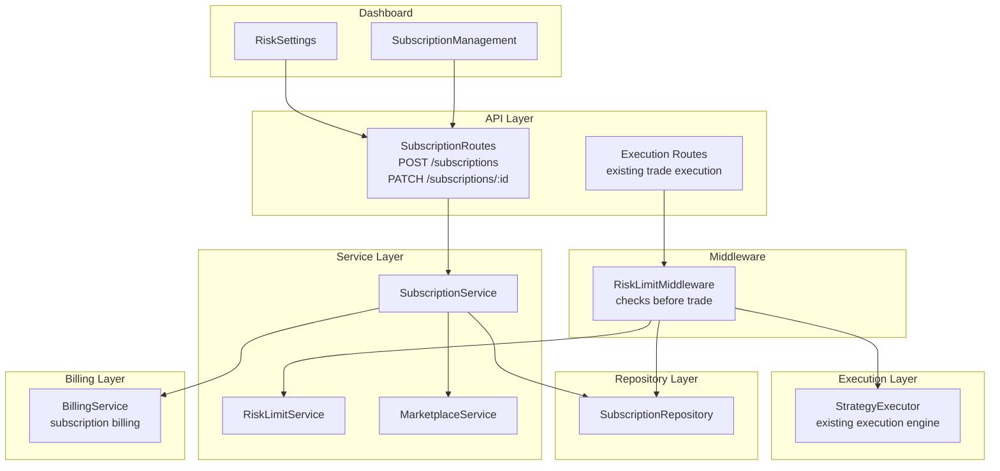

# Phase 3: Subscription & Copy Trading - Design

**Priority**: P0 - Core monetization  
**Status**: Ready for Implementation  
**Dependencies**: Phase 1 & 2 complete (strategy publishing + vetting)

## Overview

Implement subscription management with custom risk limit overrides and enforcement in the trade execution pipeline. Subscribers can allocate capital to strategies with per-subscription risk parameters that are enforced before each trade.

## Architecture



### Data Flow: Subscribe to Strategy

```
POST /api/v1/marketplace/subscriptions
  ├─> Zod validation (subscribeSchema)
  ├─> Auth (tenantId)
  ├─> SubscriptionService.subscribe()
  │     ├─> MarketplaceService.canSubscribe() (check allowed/excluded tenants)
  │     ├─> SubscriptionRepository.create()
  │     ├─> ListingRepository.incrementSubscriberCount()
  │     ├─> BillingService.createSubscription() (recurring billing)
  │     └─> AuditLogService.log()
  └─> Response: 201 {subscription, listing, strategy}
```

### Data Flow: Trade Execution with Risk Limits

```
POST /api/v1/strategies/:id/execute (existing trade endpoint)
  ├─> Auth (tenantId, subscriptionId from header X-Subscription-Id)
  ├─> RiskLimitMiddleware.checkLimits()
  │     ├─> SubscriptionRepository.getActive(tenantId)
  │     ├─> Check maxDailyLossPercent (query today's P&L)
  │     ├─> Check maxPositionSizePercent (vs portfolio value)
  │     ├─> Check maxConcurrentTrades (count open positions)
  │     └─> If breach: reject with 403
  ├─> StrategyExecutor.execute() (existing logic)
  └─> Response: 200 {order} or 403 {error: 'risk_limit_breached'}
```

## Files to Create

### 1. Subscription Service

**File**: `/Users/macbook/algo-trader/src/marketplace/services/subscription.service.ts`

```typescript
import { MarketplaceService } from './marketplace.service';
import { BillingService } from '../../billing/billing-service';
import { AuditLogService } from '../../audit/audit-log-service';

export class SubscriptionService {
  private static instance: SubscriptionService;
  private readonly marketplaceService: MarketplaceService;
  private readonly billingService: BillingService;
  private readonly auditService: AuditLogService;

  private constructor() {
    this.marketplaceService = MarketplaceService.getInstance();
    this.billingService = BillingService.getInstance();
    this.auditService = AuditLogService.getInstance();
  }

  static getInstance(): SubscriptionService {
    if (!SubscriptionService.instance) {
      SubscriptionService.instance = new SubscriptionService();
    }
    return SubscriptionService.instance;
  }

  async subscribe(tenantId: string, listingId: string, allocationPercent: number, customRiskLimits?: CustomRiskLimits): Promise<IMarketplaceSubscription> {
    // Validate listing exists and is active
    const listing = await this.marketplaceService.getListing(listingId);
    if (!listing) {
      throw new Error('Listing not found');
    }
    if (!listing.isActive) {
      throw new Error('Listing is not active');
    }

    // Check tenant allowed (allowed_tenants whitelist, excluded_tenants blacklist)
    const canSubscribe = await this.marketplaceService.canSubscribe(listingId, tenantId);
    if (!canSubscribe.allowed) {
      throw new Error(`Cannot subscribe: ${canSubscribe.reason}`);
    }

    // Check allocation percent (1-100)
    if (allocationPercent < 1 || allocationPercent > 100) {
      throw new Error('Allocation percent must be between 1 and 100');
    }

    // Check if already active subscription exists
    const existing = await this.marketplaceService.existsActiveSubscription(tenantId, listingId);
    if (existing) {
      throw new Error('Active subscription already exists for this listing');
    }

    // Merge custom risk limits with listing defaults
    const mergedRiskLimits = this.mergeRiskLimits(listing.riskLimits, customRiskLimits);

    // Create subscription
    const subscription = await this.marketplaceService.createSubscription({
      id: `sub_${Date.now()}_${tenantId.slice(0, 8)}`,
      tenantId,
      listingId,
      strategyId: listing.strategyId,
      status: 'active',
      allocationPercent,
      customRiskLimits: mergedRiskLimits,
      currentInvestmentUsd: 0,
      totalPnlUsd: 0,
    });

    // Increment subscriber count on listing
    await this.marketplaceService.incrementSubscriberCount(listingId);

    // Create billing subscription (recurring payment)
    try {
      await this.billingService.createSubscription({
        tenantId,
        listingId,
        priceCents: listing.priceUsdMonthly,
        billingCycle: listing.billingCycle,
      });
    } catch (billingError) {
      // Billing failure → rollback subscription
      await this.marketplaceService.cancelSubscription(subscription.id, tenantId);
      throw new Error(`Billing setup failed: ${billingError.message}`);
    }

    // Audit log
    await this.auditService.log({
      tenantId,
      userId: tenantId, // or extract from auth context
      action: 'subscription_created',
      resourceId: subscription.id,
      metadata: { listingId, allocationPercent, riskLimits: mergedRiskLimits },
    });

    return subscription;
  }

  async pauseSubscription(subscriptionId: string, tenantId: string): Promise<void> {
    const subscription = await this.validateOwnership(subscriptionId, tenantId);
    if (subscription.status !== 'active') {
      throw new Error(`Cannot pause subscription in status: ${subscription.status}`);
    }

    await this.marketplaceService.updateSubscriptionStatus(subscriptionId, 'paused');
    
    // Pause billing
    await this.billingService.pauseSubscription(subscriptionId);

    await this.auditService.log({
      tenantId,
      userId: tenantId,
      action: 'subscription_paused',
      resourceId: subscriptionId,
    });
  }

  async resumeSubscription(subscriptionId: string, tenantId: string): Promise<void> {
    const subscription = await this.validateOwnership(subscriptionId, tenantId);
    if (subscription.status !== 'paused') {
      throw new Error(`Cannot resume subscription in status: ${subscription.status}`);
    }

    await this.marketplaceService.updateSubscriptionStatus(subscriptionId, 'active');

    // Resume billing
    await this.billingService.resumeSubscription(subscriptionId);

    await this.auditService.log({
      tenantId,
      userId: tenantId,
      action: 'subscription_resumed',
      resourceId: subscriptionId,
    });
  }

  async cancelSubscription(subscriptionId: string, tenantId: string, immediate: boolean = false): Promise<void> {
    const subscription = await this.validateOwnership(subscriptionId, tenantId);
    if (subscription.status === 'cancelled') {
      throw new Error('Subscription already cancelled');
    }

    await this.marketplaceService.updateSubscriptionStatus(subscriptionId, 'cancelled');
    await this.marketplaceService.decrementSubscriberCount(subscription.listingId);

    // Cancel billing (prorated refund if within billing cycle)
    if (immediate) {
      await this.billingService.cancelSubscriptionImmediate(subscriptionId);
    } else {
      await this.billingService.cancelSubscriptionAtPeriodEnd(subscriptionId);
    }

    await this.auditService.log({
      tenantId,
      userId: tenantId,
      action: 'subscription_cancelled',
      resourceId: subscriptionId,
      metadata: { immediate },
    });
  }

  async updateAllocation(subscriptionId: string, tenantId: string, allocationPercent: number): Promise<void> {
    const subscription = await this.validateOwnership(subscriptionId, tenantId);
    if (subscription.status !== 'active') {
      throw new Error('Cannot update allocation for non-active subscription');
    }

    if (allocationPercent < 1 || allocationPercent > 100) {
      throw new Error('Allocation percent must be between 1 and 100');
    }

    await this.marketplaceService.updateAllocation(subscriptionId, allocationPercent);

    await this.auditService.log({
      tenantId,
      userId: tenantId,
      action: 'subscription_allocation_updated',
      resourceId: subscriptionId,
      metadata: { allocationPercent },
    });
  }

  async updateRiskLimits(subscriptionId: string, tenantId: string, limits: CustomRiskLimits): Promise<void> {
    const subscription = await this.validateOwnership(subscriptionId, tenantId);
    if (subscription.status !== 'active') {
      throw new Error('Cannot update risk limits for non-active subscription');
    }

    // Validate limits (must be positive, reasonable bounds)
    this.validateRiskLimits(limits);

    await this.marketplaceService.updateCustomRiskLimits(subscriptionId, limits);

    await this.auditService.log({
      tenantId,
      userId: tenantId,
      action: 'subscription_risk_limits_updated',
      resourceId: subscriptionId,
      metadata: { limits },
    });
  }

  private async validateOwnership(subscriptionId: string, tenantId: string): Promise<IMarketplaceSubscription> {
    const subscription = await this.marketplaceService.getSubscription(subscriptionId, tenantId);
    if (!subscription) {
      throw new Error('Subscription not found or access denied');
    }
    return subscription;
  }

  private mergeRiskLimits(listingLimits: RiskLimits, custom?: CustomRiskLimits): RiskLimits {
    return {
      maxDailyLossPercent: custom?.maxDailyLossPercent ?? listingLimits.maxDailyLossPercent,
      maxPositionSizePercent: custom?.maxPositionSizePercent ?? listingLimits.maxPositionSizePercent,
      stopLossPercent: custom?.stopLossPercent ?? listingLimits.stopLossPercent,
      maxConcurrentTrades: custom?.maxConcurrentTrades ?? listingLimits.maxConcurrentTrades,
    };
  }

  private validateRiskLimits(limits: CustomRiskLimits): void {
    if (limits.maxDailyLossPercent && (limits.maxDailyLossPercent < 0.1 || limits.maxDailyLossPercent > 50)) {
      throw new Error('maxDailyLossPercent must be between 0.1% and 50%');
    }
    if (limits.maxPositionSizePercent && (limits.maxPositionSizePercent < 0.1 || limits.maxPositionSizePercent > 100)) {
      throw new Error('maxPositionSizePercent must be between 0.1% and 100%');
    }
    if (limits.stopLossPercent && (limits.stopLossPercent < 0.1 || limits.stopLossPercent > 50)) {
      throw new Error('stopLossPercent must be between 0.1% and 50%');
    }
    if (limits.maxConcurrentTrades && (limits.maxConcurrentTrades < 1 || limits.maxConcurrentTrades > 50)) {
      throw new Error('maxConcurrentTrades must be between 1 and 50');
    }
  }
}
```

### 2. Risk Limit Service

**File**: `/Users/macbook/algo-trader/src/marketplace/services/risk-limit.service.ts`

```typescript
import { SubscriptionRepository } from '../repositories/subscription-repository';
import { PerformanceRepository } from '../repositories/performance-repository';

export class RiskLimitService {
  private static instance: RiskLimitService;
  private readonly subscriptionRepository: SubscriptionRepository;
  private readonly performanceRepository: PerformanceRepository;

  private constructor() {
    this.subscriptionRepository = new SubscriptionRepository();
    this.performanceRepository = new PerformanceRepository();
  }

  static getInstance(): RiskLimitService {
    if (!RiskLimitService.instance) {
      RiskLimitService.instance = new RiskLimitService();
    }
    return RiskLimitService.instance;
  }

  async checkDailyLossLimit(subscriptionId: string, potentialLossCents: number): Promise<{ allowed: boolean; reason?: string }> {
    const subscription = await this.subscriptionRepository.getById(subscriptionId);
    if (!subscription || subscription.status !== 'active') {
      return { allowed: false, reason: 'Subscription not active' };
    }

    const today = new Date().toISOString().split('T')[0]; // YYYY-MM-DD
    const todayPerformance = await this.performanceRepository.getByStrategy(subscription.strategyId, subscription.tenantId, today, today);
    
    const totalPnlCents = todayPerformance.reduce((sum, p) => sum + p.totalPnlUsd, 0);
    const newTotalPnl = totalPnlCents - potentialLossCents; // potential loss is negative
    const dailyLossPercent = Math.abs(newTotalPnl / subscription.currentInvestmentUsd) * 100;

    if (dailyLossPercent > subscription.customRiskLimits?.maxDailyLossPercent!) {
      return { 
        allowed: false, 
        reason: `Daily loss limit breached: ${dailyLossPercent.toFixed(2)}% > ${subscription.customRiskLimits?.maxDailyLossPercent}%` 
      };
    }

    return { allowed: true };
  }

  async checkPositionSizeLimit(subscriptionId: string, positionSizeCents: number, portfolioValueCents: number): Promise<{ allowed: boolean; reason?: string }> {
    const subscription = await this.subscriptionRepository.getById(subscriptionId);
    if (!subscription || subscription.status !== 'active') {
      return { allowed: false, reason: 'Subscription not active' };
    }

    const positionPercent = (positionSizeCents / portfolioValueCents) * 100;
    const limit = subscription.customRiskLimits?.maxPositionSizePercent ?? 10; // default 10%

    if (positionPercent > limit) {
      return { 
        allowed: false, 
        reason: `Position size ${positionPercent.toFixed(2)}% exceeds limit ${limit}%` 
      };
    }

    return { allowed: true };
  }

  async checkMaxConcurrentTrades(subscriptionId: string, currentOpenTrades: number): Promise<{ allowed: boolean; reason?: string }> {
    const subscription = await this.subscriptionRepository.getById(subscriptionId);
    if (!subscription || subscription.status !== 'active') {
      return { allowed: false, reason: 'Subscription not active' };
    }

    const limit = subscription.customRiskLimits?.maxConcurrentTrades ?? 5;

    if (currentOpenTrades >= limit) {
      return { 
        allowed: false, 
        reason: `Max concurrent trades ${currentOpenTrades} reached limit ${limit}` 
      };
    }

    return { allowed: true };
  }

  async checkAllLimits(subscriptionId: string, checks: {
    potentialLossCents?: number;
    positionSizeCents?: number;
    portfolioValueCents: number;
    currentOpenTrades: number;
  }): Promise<RiskCheckResult> {
    const results: RiskCheckResult = { allowed: true, breaches: [] };

    // Concurrent trades check
    const concurrentCheck = await this.checkMaxConcurrentTrades(subscriptionId, checks.currentOpenTrades);
    if (!concurrentCheck.allowed) {
      results.allowed = false;
      results.breaches.push({ limitType: 'max_concurrent_trades', reason: concurrentCheck.reason! });
    }

    // Position size check
    if (checks.positionSizeCents) {
      const positionCheck = await this.checkPositionSizeLimit(subscriptionId, checks.positionSizeCents, checks.portfolioValueCents);
      if (!positionCheck.allowed) {
        results.allowed = false;
        results.breaches.push({ limitType: 'max_position_size_percent', reason: positionCheck.reason! });
      }
    }

    // Daily loss check (optional pre-trade estimation)
    if (checks.potentialLossCents) {
      const lossCheck = await this.checkDailyLossLimit(subscriptionId, checks.potentialLossCents);
      if (!lossCheck.allowed) {
        results.allowed = false;
        result.breaches.push({ limitType: 'max_daily_loss_percent', reason: lossCheck.reason! });
      }
    }

    return results;
  }
}

export interface RiskCheckResult {
  allowed: boolean;
  breaches: Array<{ limitType: string; reason: string }>;
}
```

### 3. Risk Limit Middleware

**File**: `/Users/macbook/algo-trader/src/marketplace/middleware/risk-limit-middleware.ts`

```typescript
import { Request, Response, NextFunction } from 'express';
import { RiskLimitService } from '../services/risk-limit.service';
import { SubscriptionRepository } from '../repositories/subscription-repository';

const riskLimitService = RiskLimitService.getInstance();
const subscriptionRepository = new SubscriptionRepository();

export async function riskLimitMiddleware(req: Request, res: Response, next: NextFunction) {
  try {
    // Extract subscription ID from header (set by strategy execution wrapper)
    const subscriptionId = req.headers['x-subscription-id'] as string;
    if (!subscriptionId) {
      return res.status(400).json({ error: 'Missing subscription ID header' });
    }

    // Extract trade parameters from body
    const { positionSizeCents, potentialLossCents, portfolioValueCents, openPositionsCount } = req.body;

    if (!portfolioValueCents || openPositionsCount === undefined) {
      return res.status(400).json({ error: 'Missing required trade parameters for risk check' });
    }

    // Perform risk checks
    const result = await riskLimitService.checkAllLimits(subscriptionId, {
      potentialLossCents,
      positionSizeCents,
      portfolioValueCents,
      currentOpenTrades: openPositionsCount,
    });

    if (!result.allowed) {
      // Record breach for metrics
      for (const breach of result.breaches) {
        // TODO: increment Prometheus counter
        // marketplaceRiskLimitBreachesTotal.inc({ subscriptionId, limit_type: breach.limitType });
      }

      return res.status(403).json({
        error: 'Risk limit breached',
        breaches: result.breaches,
      });
    }

    // Attach subscription to request for downstream use
    const subscription = await subscriptionRepository.getById(subscriptionId);
    req['subscription'] = subscription;

    next();
  } catch (error) {
    if (error.message.includes('not found') || error.message.includes('access denied')) {
      return res.status(404).json({ error: error.message });
    }
    next(error); // pass to global error handler
  }
}
```

### 4. Subscription Routes

**File**: `/Users/macbook/algo-trader/src/api/routes/marketplace-subscription-routes.ts` (complete)

```typescript
import { Router, Request, Response } from 'express';
import { z } from 'zod';
import { SubscriptionService } from '../../marketplace/services/subscription.service';
import { MarketplaceService } from '../../marketplace/services/marketplace.service';
import { riskLimitMiddleware } from '../../marketplace/middleware/risk-limit-middleware';

const router = Router();
const subscriptionService = SubscriptionService.getInstance();
const marketplaceService = MarketplaceService.getInstance();

// POST /api/v1/marketplace/subscriptions - Subscribe to strategy
router.post('/', async (req: Request, res: Response) => {
  try {
    const tenantId = (req as any).tenant.id;
    const { listingId, allocationPercent, customRiskLimits } = req.body;

    const subscription = await subscriptionService.subscribe(tenantId, listingId, allocationPercent, customRiskLimits);
    
    // Return subscription + strategy + listing details
    const strategy = await marketplaceService.getStrategyWithDetails(subscription.strategyId);
    const listing = await marketplaceService.getListing(listingId);

    return res.status(201).json({
      subscription,
      strategy: {
        id: strategy.id,
        name: strategy.name,
        category: strategy.category,
        performance: strategy.performance,
      },
      listing: {
        id: listing.id,
        priceUsdMonthly: listing.priceUsdMonthly,
        riskLimits: listing.riskLimits,
      },
    });
  } catch (error) {
    return res.status(400).json({ error: error.message });
  }
});

// GET /api/v1/marketplace/subscriptions - List my subscriptions
router.get('/', async (req: Request, res: Response) => {
  try {
    const tenantId = (req as any).tenant.id;
    const { status } = req.query;
    
    const subscriptions = await subscriptionService.listSubscriptions(tenantId, status as string);
    
    // Enrich with strategy and listing data
    const enriched = await Promise.all(
      subscriptions.map(async (sub) => {
        const strategy = await marketplaceService.getStrategyWithDetails(sub.strategyId);
        const listing = await marketplaceService.getListing(sub.listingId);
        return { subscription: sub, strategy, listing };
      })
    );

    return res.json(enriched);
  } catch (error) {
    return res.status(500).json({ error: 'Failed to fetch subscriptions' });
  }
});

// GET /api/v1/marketplace/subscriptions/:id - Get subscription details
router.get('/:id', async (req: Request, res: Response) => {
  try {
    const { id } = req.params;
    const tenantId = (req as any).tenant.id;
    
    const subscription = await subscriptionService.getSubscription(id, tenantId);
    if (!subscription) {
      return res.status(404).json({ error: 'Subscription not found' });
    }

    const strategy = await marketplaceService.getStrategyWithDetails(subscription.strategyId);
    const listing = await marketplaceService.getListing(subscription.listingId);

    return res.json({ subscription, strategy, listing });
  } catch (error) {
    return res.status(500).json({ error: 'Failed to fetch subscription' });
  }
});

// PATCH /api/v1/marketplace/subscriptions/:id - Update subscription
router.patch('/:id', async (req: Request, res: Response) => {
  try {
    const { id } = req.params;
    const tenantId = (req as any).tenant.id;
    const { status, allocationPercent, customRiskLimits } = req.body;

    if (status) {
      if (!['active', 'paused', 'cancelled'].includes(status)) {
        return res.status(400).json({ error: 'Invalid status' });
      }
      await subscriptionService.updateSubscriptionStatus(id, status);
    }

    if (allocationPercent) {
      await subscriptionService.updateAllocation(id, tenantId, allocationPercent);
    }

    if (customRiskLimits) {
      await subscriptionService.updateRiskLimits(id, tenantId, customRiskLimits);
    }

    const updated = await subscriptionService.getSubscription(id, tenantId);
    return res.json(updated);
  } catch (error) {
    return res.status(400).json({ error: error.message });
  }
});

// POST /api/v1/marketplace/subscriptions/:id/pause
router.post('/:id/pause', async (req: Request, res: Response) => {
  try {
    const { id } = req.params;
    const tenantId = (req as any).tenant.id;
    
    await subscriptionService.pauseSubscription(id, tenantId);
    return res.json({ success: true, status: 'paused' });
  } catch (error) {
    return res.status(400).json({ error: error.message });
  }
});

// POST /api/v1/marketplace/subscriptions/:id/resume
router.post('/:id/resume', async (req: Request, res: Response) => {
  try {
    const { id } = req.params;
    const tenantId = (req as any).tenant.id;
    
    await subscriptionService.resumeSubscription(id, tenantId);
    return res.json({ success: true, status: 'active' });
  } catch (error) {
    return res.status(400).json({ error: error.message });
  }
});

// POST /api/v1/marketplace/subscriptions/:id/cancel
router.post('/:id/cancel', async (req: Request, res: Response) => {
  try {
    const { id } = req.params;
    const tenantId = (req as any).tenant.id;
    const { immediate } = req.body;
    
    await subscriptionService.cancelSubscription(id, tenantId, immediate);
    return res.json({ success: true, status: 'cancelled' });
  } catch (error) {
    return res.status(400).json({ error: error.message });
  }
});

// GET /api/v1/marketplace/subscriptions/:id/performance
router.get('/:id/performance', async (req: Request, res: Response) => {
  try {
    const { id } = req.params;
    const { period = '30d' } = req.query;
    const tenantId = (req as any).tenant.id;

    const subscription = await subscriptionService.getSubscription(id, tenantId);
    if (!subscription) {
      return res.status(404).json({ error: 'Subscription not found' });
    }

    const performance = await marketplaceService.getSubscriptionPerformance(id, period as string);

    return res.json(performance);
  } catch (error) {
    return res.status(500).json({ error: 'Failed to fetch performance' });
  }
});

// Risk limits check endpoint (for dashboard preview)
router.get('/:id/risk-limits', async (req: Request, res: Response) => {
  try {
    const { id } = req.params;
    const tenantId = (req as any).tenant.id;
    
    const subscription = await subscriptionService.getSubscription(id, tenantId);
    if (!subscription) {
      return res.status(404).json({ error: 'Subscription not found' });
    }

    return res.json({
      customRiskLimits: subscription.customRiskLimits,
      listingDefaults: (await marketplaceService.getListing(subscription.listingId))?.riskLimits,
    });
  } catch (error) {
    return res.status(500).json({ error: 'Failed to fetch risk limits' });
  }
});

export default router;
```

## Files to Modify

### 1. Strategy Execution Pipeline

**File**: Wherever strategy trade execution happens (e.g., `src/strategies/strategy-executor.ts` or similar)

Add risk limit check before executing trades:

```typescript
import { riskLimitMiddleware } from '../../marketplace/middleware/risk-limit-middleware';

async function executeStrategyTrade(strategyId: string, tradeParams: any, subscriptionId?: string) {
  // If subscriptionId provided, wrap trade with risk middleware
  if (subscriptionId) {
    // Create mock request to run middleware
    const req = {
      headers: { 'x-subscription-id': subscriptionId },
      body: {
        positionSizeCents: tradeParams.positionSize,
        potentialLossCents: tradeParams.estimatedLoss,
        portfolioValueCents: tradeParams.portfolioValue,
        openPositionsCount: tradeParams.currentOpenTrades,
      },
    };
    const res = {
      status: (code: number) => ({ json: (body: any) => body }),
      json: (body: any) => { throw new Error(JSON.stringify(body)); },
    };

    await riskLimitMiddleware(req, res as any, () => {});
    // If middleware doesn't throw, risk check passed
  }

  // Proceed with existing trade execution logic
  return await this.executeTrade(strategyId, tradeParams);
}
```

**Alternative**: Inject risk check directly without Express middleware for performance.

### 2. Billing Service Integration

**File**: `/Users/macbook/algo-trader/src/billing/billing-service.ts`

Ensure it supports creating/updating/cancelling marketplace subscriptions:
```typescript
async createSubscription(data: {
  tenantId: string;
  listingId: string;
  priceCents: number;
  billingCycle: 'monthly' | 'quarterly' | 'yearly';
}): Promise<void> {
  // Create recurring billing via Stripe/NOWPayments
  // Store billing subscription ID for reconciliation
}
```

## Migration

**No new migration** - subscription table already exists.

## Interfaces

```typescript
// SubscriptionService
interface ISubscriptionService {
  subscribe(tenantId: string, listingId: string, allocationPercent: number, customRiskLimits?: CustomRiskLimits): Promise<IMarketplaceSubscription>;
  pauseSubscription(subscriptionId: string, tenantId: string): Promise<void>;
  resumeSubscription(subscriptionId: string, tenantId: string): Promise<void>;
  cancelSubscription(subscriptionId: string, tenantId: string, immediate?: boolean): Promise<void>;
  updateAllocation(subscriptionId: string, tenantId: string, allocationPercent: number): Promise<void>;
  updateRiskLimits(subscriptionId: string, tenantId: string, limits: CustomRiskLimits): Promise<void>;
  listSubscriptions(tenantId: string, status?: SubscriptionStatus): Promise<IMarketplaceSubscription[]>;
  getSubscription(id: string, tenantId?: string): Promise<IMarketplaceSubscription | null>;
}

// RiskLimitService
interface IRiskLimitService {
  checkDailyLossLimit(subscriptionId: string, potentialLossCents: number): Promise<{ allowed: boolean; reason?: string }>;
  checkPositionSizeLimit(subscriptionId: string, positionSizeCents: number, portfolioValueCents: number): Promise<{ allowed: boolean; reason?: string }>;
  checkMaxConcurrentTrades(subscriptionId: string, currentOpenTrades: number): Promise<{ allowed: boolean; reason?: string }>;
  checkAllLimits(subscriptionId: string, checks: RiskCheckParams): Promise<RiskCheckResult>;
}

interface RiskCheckParams {
  potentialLossCents?: number;
  positionSizeCents?: number;
  portfolioValueCents: number;
  currentOpenTrades: number;
}
```

## Prometheus Metrics

```typescript
marketplaceSubscriptionsCreatedTotal = new Counter({
  name: 'marketplace_subscriptions_created_total',
  help: 'Total subscriptions created',
  labelNames: ['listing_id', 'tier'],
});

marketplaceSubscriptionsActive = new Gauge({
  name: 'marketplace_subscriptions_active',
  help: 'Currently active subscriptions',
  labelNames: ['listing_id'],
});

marketplaceRiskLimitBreachesTotal = new Counter({
  name: 'marketplace_risk_limit_breaches_total',
  help: 'Trades rejected by risk limits',
  labelNames: ['subscription_id', 'limit_type'],
});

marketplaceAllocationPercent = new Histogram({
  name: 'marketplace_allocation_percent',
  help: 'Subscriber allocation percentages',
  buckets: [1, 5, 10, 25, 50, 75, 100],
});
```

## Admin Endpoints

None in this phase (subscriptions are tenant-scoped).

## Rollback Posture

| Failure Mode | Tier | Mechanism |
|--------------|------|-----------|
| Risk middleware throws error | L3 | Log error, continue (risk check non-blocking if billing integration down) |
| Billing sync failure | L3 | Subscription created but billing pending → reconcile via admin |
| Subscription creation race condition | L2 | Database UNIQUE constraint (tenant_id, listing_id) prevents duplicates |
| Performance tracking down | L3 | Risk limits relying on performance data fall back to defaults |

**Kill Switch**: Disable marketplace globally (L1) blocks new subscriptions. Existing subscriptions continue execution.

## Security Considerations

1. **Subscription Ownership**: All subscription queries filter by `tenantId`. Users can only access their own subscriptions.
2. **Risk Limit Bypass Prevention**: Middleware runs on every trade execution. Cannot be bypassed even if subscription service is down.
3. **Allocation Validation**: Allocation percent 1-100, enforced at create/update.
4. **Concurrency**: Database UNIQUE constraint prevents duplicate active subscriptions (tenant_id + listing_id).
5. **Billing Coupling**: Subscription creation fails if billing setup fails (atomic transaction via rollback).

## Unresolved Questions

1. **Strategy execution integration**: How does strategy executor know which subscription to use?
   - **Proposed**: Strategy trading UI sets `X-Subscription-Id` header. CLI traders can specify `--subscription-id` flag.

2. **Portfolio value source**: Where does `portfolioValueCents` come from in risk check?
   - **Proposed**: Tenant's current portfolio value from account balance API. Cache for 5 minutes.

3. **Open positions count**: How to track current open trades per subscription?
   - **Proposed**: Query position table filtered by subscription ID. Or maintain counter in Redis.

4. **Daily loss tracking**: How to calculate today's P&L for risk limit?
   - **Proposed**: PerformanceRepository aggregates today's trades by strategy/tenant. Update in real-time or refresh every 5 minutes.

5. **Stop-loss enforcement**: Does `stopLossPercent` mean automatic stop-loss order or manual alert?
   - **Proposed**: Automatic - risk service triggers stop-loss order if portfolio drawdown exceeds threshold. Hook into existing order management.

---

## Next Phase

Phase 4 (Performance Ranking & Reviews) will implement:
- Daily performance aggregation jobs
- Ranking algorithm with caching
- Verified review system
- Review moderation
