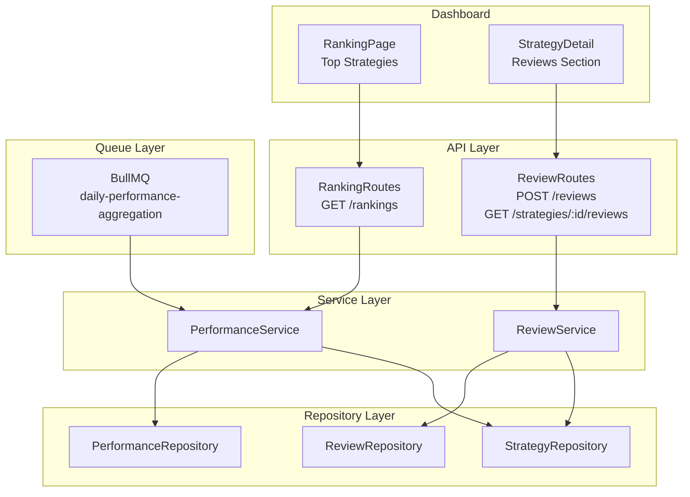

# Phase 4: Performance Ranking & Reviews - Design

**Priority**: P1 - Marketplace discovery quality  
**Status**: Ready for Implementation  
**Dependencies**: Phase 1-3 complete (subscriptions tracking performance)

## Overview

Implement performance aggregation, ranking algorithm, and verified review system. This phase enables subscribers to discover top-performing strategies through objective metrics and community reviews.

## Architecture



### Data Flow: Daily Performance Aggregation

```
[Daily Cron 02:00 UTC]
  ├─> PerformanceService.aggregateDailyPerformance()
  │     ├─> For each active strategy:
  │     │     ├─> PerformanceRepository.getTodaysTrades(strategyId)
  │     │     ├─> Calculate: totalPnl, winRate, sharpe, maxDrawdown, profitFactor
  │     │     ├─> PerformanceRepository.upsertDailyRecord()
  │     │     └─> StrategyRepository.updateAggregateMetrics()
  │     └─> Emit metrics
  └─> Log completion
```

### Data Flow: Submit Verified Review

```
POST /api/v1/marketplace/reviews
  ├─> Zod validation (reviewSchema)
  ├─> Auth (tenantId)
  ├─> ReviewService.createReview()
  │     ├─> Verify active subscription exists (tenant + strategy)
  │     ├─> Check no existing review from this tenant
  │     ├─> ReviewRepository.create()
  │     ├─> StrategyRepository.updateAvgRating()
  │     └─> AuditLogService.log()
  └─> Response: 201 {review}
```

## Files to Create

### 1. Performance Service

**File**: `/Users/macbook/algo-trader/src/marketplace/services/performance.service.ts`

```typescript
import { PerformanceRepository } from '../repositories/performance-repository';
import { StrategyRepository } from '../repositories/strategy-repository';

export class PerformanceService {
  private static instance: PerformanceService;
  private readonly performanceRepository: PerformanceRepository;
  private readonly strategyRepository: StrategyRepository;

  private constructor() {
    this.performanceRepository = new PerformanceRepository();
    this.strategyRepository = new StrategyRepository();
  }

  static getInstance(): PerformanceService {
    if (!PerformanceService.instance) {
      PerformanceService.instance = new PerformanceService();
    }
    return PerformanceService.instance;
  }

  async aggregateDailyPerformance(date: Date = new Date()): Promise<void> {
    const strategies = await this.strategyRepository.list({
      status: 'approved',
    });

    for (const strategy of strategies.data) {
      try {
        // Get all trades for this strategy on this date (across all subscribers)
        const trades = await this.performanceRepository.getTradesByStrategyAndDate(
          strategy.id,
          date
        );

        if (trades.length === 0) {
          continue; // No activity, skip
        }

        // Calculate metrics
        const metrics = this.calculateDailyMetrics(trades);

        // Upsert performance record
        await this.performanceRepository.upsert({
          strategyId: strategy.id,
          tenantId: null, // aggregate across all subscribers
          date: date,
          ...metrics,
        });

        // Update strategy aggregate metrics (last 30d rolling)
        await this.updateStrategyAggregates(strategy.id);
      } catch (error) {
        console.error(`Failed to aggregate performance for strategy ${strategy.id}:`, error);
        // Continue with other strategies, log error
      }
    }
  }

  async getStrategyPerformance(strategyId: string, period: '7d' | '30d' | '90d' | 'all' = '30d'): Promise<IMarketplacePerformance[]> {
    const endDate = new Date();
    const startDate = this.calculateStartDate(endDate, period);

    return await this.performanceRepository.getByStrategy(strategyId, null, startDate, endDate);
  }

  async getSubscriberPerformance(subscriptionId: string, period: string = '30d'): Promise<IMarketplacePerformance[]> {
    const subscription = await this.strategyRepository.getSubscription(subscriptionId);
    if (!subscription) {
      throw new Error('Subscription not found');
    }

    return await this.getStrategyPerformance(subscription.strategyId, period);
  }

  async computeRankings(filters: RankingFilters): Promise<PaginatedResult<IStrategyRanking>> {
    const { metric, timeframe, page, limit, category, riskLevel, minSubscribers } = filters;
    
    // Get strategies meeting criteria
    const strategies = await this.strategyRepository.listWithAggregates({
      status: 'approved',
      category,
      riskLevel,
      minSubscribers,
      page,
      limit,
      sortBy: this.mapMetricToDbColumn(metric),
      sortOrder: 'desc',
    });

    // Calculate ranking position
    const ranked = strategies.data.map((strategy, index) => ({
      ...strategy,
      rank: (page - 1) * limit + index + 1,
    }));

    return {
      data: ranked,
      total: strategies.total,
      page,
      limit,
      totalPages: Math.ceil(strategies.total / limit),
    };
  }

  private calculateDailyMetrics(trades: any[]): Omit<IMarketplacePerformance, 'id' | 'strategyId' | 'tenantId' | 'date' | 'createdAt' | 'updatedAt'> {
    const totalTrades = trades.length;
    const winningTrades = trades.filter(t => t.pnlUsd > 0).length;
    const losingTrades = trades.filter(t => t.pnlUsd < 0).length;
    const totalPnlUsd = trades.reduce((sum, t) => sum + t.pnlUsd, 0);
    const avgWinUsd = winningTrades > 0 
      ? trades.filter(t => t.pnlUsd > 0).reduce((sum, t) => sum + t.pnlUsd, 0) / winningTrades 
      : 0;
    const avgLossUsd = losingTrades > 0 
      ? Math.abs(trades.filter(t => t.pnlUsd < 0).reduce((sum, t) => sum + t.pnlUsd, 0) / losingTrades) 
      : 0;
    
    const winRate = totalTrades > 0 ? (winningTrades / totalTrades) * 100 : 0;
    const profitFactor = avgLossUsd > 0 ? avgWinUsd / avgLossUsd : 0;

    // Sharpe ratio calculation (requires risk-free rate, daily returns)
    // Simplified: assume risk-free rate = 0, use daily P&L standard deviation
    const returns = trades.map(t => t.pnlUsd / t.positionValueUsd).filter(r => !isNaN(r));
    const sharpe = this.calculateSharpeRatio(returns);
    
    // Max drawdown (simplified: running max drawdown from cumulative P&L)
    const maxDrawdown = this.calculateMaxDrawdown(trades);

    return {
      totalPnlUsd,
      totalTrades,
      winningTrades,
      losingTrades,
      winRate: parseFloat(winRate.toFixed(2)),
      sharpe: parseFloat(sharpe.toFixed(4)),
      maxDrawdown: parseFloat(maxDrawdown.toFixed(4)),
      avgWinUsd: Math.round(avgWinUsd),
      avgLossUsd: Math.round(avgLossUsd),
      profitFactor: parseFloat(profitFactor.toFixed(4)),
      volatility: parseFloat(this.calculateVolatility(returns).toFixed(4)),
    };
  }

  private calculateSharpeRatio(dailyReturns: number[], riskFreeRate: number = 0): number {
    if (dailyReturns.length === 0) return 0;
    const mean = dailyReturns.reduce((a, b) => a + b, 0) / dailyReturns.length;
    const variance = dailyReturns.reduce((sum, r) => sum + Math.pow(r - mean, 2), 0) / dailyReturns.length;
    const stdDev = Math.sqrt(variance);
    if (stdDev === 0) return 0;
    return (mean - riskFreeRate) / stdDev;
  }

  private calculateMaxDrawdown(trades: any[]): number {
    // Sort by date, compute cumulative P&L, track max drawdown
    const sorted = [...trades].sort((a, b) => new Date(a.date).getTime() - new Date(b.date).getTime());
    let cumulative = 0;
    let peak = 0;
    let maxDrawdown = 0;

    for (const trade of sorted) {
      cumulative += trade.pnlUsd;
      if (cumulative > peak) peak = cumulative;
      const drawdown = (peak - cumulative) / peak * 100;
      if (drawdown > maxDrawdown) maxDrawdown = drawdown;
    }

    return maxDrawdown;
  }

  private calculateVolatility(returns: number[]): number {
    if (returns.length < 2) return 0;
    const mean = returns.reduce((a, b) => a + b, 0) / returns.length;
    const variance = returns.reduce((sum, r) => sum + Math.pow(r - mean, 2), 0) / (returns.length - 1);
    return Math.sqrt(variance);
  }

  private calculateStartDate(endDate: Date, period: string): Date {
    const days = { '7d': 7, '30d': 30, '90d': 90, 'all': 3650 }[period];
    const start = new Date(endDate);
    start.setDate(start.getDate() - (days as number));
    return start;
  }

  private mapMetricToDbColumn(metric: string): string {
    const mapping: Record<string, string> = {
      'sharpe': 'sharpe_ratio',
      'total_pnl': 'total_pnl_usd',
      'win_rate': 'win_rate',
      'subscriber_count': 'subscriber_count',
    };
    return mapping[metric] || 'sharpe_ratio';
  }

  private async updateStrategyAggregates(strategyId: string): Promise<void> {
    // Calculate 30-day rolling aggregates
    const recent = await this.getStrategyPerformance(strategyId, '30d');
    
    const aggregate = {
      avgSharpe30d: this.average(recent, r => r.sharpeRatio),
      avgWinRate30d: this.average(recent, r => r.winRate),
      totalPnl30d: recent.reduce((sum, r) => sum + r.totalPnlUsd, 0),
    };

    await this.strategyRepository.updateAggregates(strategyId, aggregate);
  }

  private average(arr: any[], selector: (x: any) => number): number {
    const values = arr.map(selector).filter(v => v != null);
    return values.length > 0 ? values.reduce((a, b) => a + b, 0) / values.length : 0;
  }
}

export type RankingFilters = {
  metric: 'sharpe' | 'total_pnl' | 'win_rate' | 'subscriber_count';
  timeframe: '7d' | '30d' | '90d' | 'all';
  page: number;
  limit: number;
  category?: string;
  riskLevel?: number;
  minSubscribers?: number;
};
```

### 2. Review Service

**File**: `/Users/macbook/algo-trader/src/marketplace/services/review.service.ts`

```typescript
import { ReviewRepository } from '../repositories/review-repository';
import { SubscriptionRepository } from '../repositories/subscription-repository';
import { StrategyRepository } from '../repositories/strategy-repository';
import { AuditLogService } from '../../audit/audit-log-service';

export class ReviewService {
  private static instance: ReviewService;
  private readonly reviewRepository: ReviewRepository;
  private readonly subscriptionRepository: SubscriptionRepository;
  private readonly strategyRepository: StrategyRepository;
  private readonly auditService: AuditLogService;

  private constructor() {
    this.reviewRepository = new ReviewRepository();
    this.subscriptionRepository = new SubscriptionRepository();
    this.strategyRepository = new StrategyRepository();
    this.auditService = AuditLogService.getInstance();
  }

  static getInstance(): ReviewService {
    if (!ReviewService.instance) {
      ReviewService.instance = new ReviewService();
    }
    return ReviewService.instance;
  }

  async createReview(tenantId: string, strategyId: string, rating: number, comment: string): Promise<IMarketplaceReview> {
    // Validate rating (1-5)
    if (rating < 1 || rating > 5) {
      throw new Error('Rating must be between 1 and 5');
    }

    // Validate comment length (10-1000 chars)
    if (comment.length < 10 || comment.length > 1000) {
      throw new Error('Comment must be between 10 and 1000 characters');
    }

    // Verify active subscription exists for this tenant + strategy
    const hasActiveSubscription = await this.subscriptionRepository.existsActive(tenantId, strategyId);
    if (!hasActiveSubscription) {
      throw new Error('Only active subscribers can leave reviews');
    }

    // Check for existing review
    const existing = await this.reviewRepository.existsByTenantAndStrategy(tenantId, strategyId);
    if (existing) {
      throw new Error('You have already reviewed this strategy');
    }

    // Create review
    const review = await this.reviewRepository.create({
      id: `review_${Date.now()}_${tenantId.slice(0, 8)}`,
      tenantId,
      strategyId,
      subscriptionId: await this.getSubscriptionId(tenantId, strategyId),
      rating,
      comment,
      isVerified: true,
      helpfulVotes: 0,
      reportedCount: 0,
      isFlagged: false,
    });

    // Update strategy's average rating
    await this.strategyRepository.updateAverageRating(strategyId);

    // Audit log
    await this.auditService.log({
      tenantId,
      userId: tenantId,
      action: 'review_created',
      resourceId: review.id,
      metadata: { strategyId, rating },
    });

    return review;
  }

  async getReviewsForStrategy(strategyId: string, { page, limit }: { page: number; limit: number }): Promise<PaginatedResult<IMarketplaceReview>> {
    // Only return verified reviews (isVerified = true)
    return await this.reviewRepository.getVerifiedReviews(strategyId, page, limit);
  }

  async incrementHelpfulVote(reviewId: string, tenantId: string): Promise<boolean> {
    const review = await this.reviewRepository.getById(reviewId);
    if (!review) {
      throw new Error('Review not found');
    }

    // Check if same tenant already voted (need separate tracking table for votes)
    // For now: simple increment (could be abused, improve later)
    const result = await this.reviewRepository.incrementHelpfulVotes(reviewId);
    
    if (result) {
      await this.auditService.log({
        tenantId,
        userId: tenantId,
        action: 'review_helpful_voted',
        resourceId: reviewId,
      });
    }

    return result;
  }

  async reportReview(reviewId: string, tenantId: string): Promise<boolean> {
    const review = await this.reviewRepository.getById(reviewId);
    if (!review) {
      throw new Error('Review not found');
    }

    const result = await this.reviewRepository.incrementReportedCount(reviewId);

    // Auto-flag if threshold reached (e.g., 5 reports)
    if (review.reportedCount + 1 >= 5) {
      await this.reviewRepository.flagForModeration(reviewId, 'auto_flag_threshold');
    }

    if (result) {
      await this.auditService.log({
        tenantId,
        userId: tenantId,
        action: 'review_reported',
        resourceId: reviewId,
      });
    }

    return result;
  }

  private async getSubscriptionId(tenantId: string, strategyId: string): Promise<string> {
    const subscriptions = await this.subscriptionRepository.getByTenant(tenantId);
    const subscription = subscriptions.find(s => s.strategyId === strategyId && s.status === 'active');
    if (!subscription) {
      throw new Error('Active subscription not found');
    }
    return subscription.id;
  }
}
```

### 3. BullMQ Daily Aggregation Worker

**File**: `/Users/macbook/algo-trader/src/workers/performance-aggregation.worker.ts`

```typescript
import { Worker } from 'bullmq';
import { PerformanceService } from '../marketplace/services/performance.service';
import { logger } from '../utils/logger';

export async function startPerformanceAggregationWorker(): Promise<void> {
  const worker = new Worker('daily-performance-aggregation', async (job) => {
    const { date } = job.data;
    
    const performanceService = PerformanceService.getInstance();
    await performanceService.aggregateDailyPerformance(new Date(date));
    
    logger.info('[PerformanceAggregation] Daily aggregation completed', { date });
  }, {
    connection: { host: 'localhost', port: 6379 }, // configure properly
  });

  // Schedule daily at 02:00 UTC
  await worker.add('daily-performance-aggregation', 
    { date: new Date().toISOString() }, 
    { repeat: { cron: '0 2 * * *' } }
  );

  worker.on('completed', (job) => {
    logger.info('[PerformanceAggregation] Job completed', { jobId: job.id });
  });

  worker.on('failed', (job, error) => {
    logger.error('[PerformanceAggregation] Job failed', { jobId: job.id, error });
  });

  return worker;
}
```

### 4. Ranking Routes

**File**: `/Users/macbook/algo-trader/src/api/routes/marketplace-ranking-routes.ts` (new)

```typescript
import { Router, Request, Response } from 'express';
import { z } from 'zod';
import { PerformanceService } from '../../marketplace/services/performance.service';
import { RedisService } from '../../cache/redis.service';

const router = Router();
const performanceService = PerformanceService.getInstance();
const redisService = RedisService.getInstance();

const rankingFilterSchema = z.object({
  metric: z.enum(['sharpe', 'total_pnl', 'win_rate', 'subscriber_count']).default('sharpe'),
  timeframe: z.enum(['7d', '30d', '90d', 'all']).default('30d'),
  category: z.string().optional(),
  riskLevel: z.number().int().min(1).max(10).optional(),
  minSubscribers: z.number().int().min(0).optional(),
  page: z.number().int().min(1).optional().default(1),
  limit: z.number().int().min(1).max(100).optional().default(20),
});

// GET /api/v1/marketplace/rankings - Get ranked strategies
router.get('/rankings', async (req: Request, res: Response) => {
  try {
    const parsed = rankingFilterSchema.safeParse(req.query);
    if (!parsed.success) {
      return res.status(400).json({ error: 'Invalid query parameters', details: parsed.error.issues });
    }

    const filters = parsed.data;
    const cacheKey = `rankings:${JSON.stringify(filters)}`;

    // Try cache first (5 min TTL)
    const cached = await redisService.get(cacheKey);
    if (cached) {
      return res.json(JSON.parse(cached));
    }

    const result = await performanceService.computeRankings(filters);

    // Cache result
    await redisService.setex(cacheKey, 300, JSON.stringify(result)); // 5 minutes

    return res.json(result);
  } catch (error) {
    return res.status(500).json({ error: 'Failed to fetch rankings', message: error.message });
  }
});

// GET /api/v1/marketplace/strategies/:id/performance - Already in strategy routes, implement in PerformanceService
router.get('/strategies/:id/performance', async (req: Request, res: Response) => {
  try {
    const { id } = req.params;
    const { period = '30d' } = req.query;

    const performance = await performanceService.getStrategyPerformance(id, period as string);
    return res.json(performance);
  } catch (error) {
    return res.status(500).json({ error: 'Failed to fetch performance', message: error.message });
  }
});

export default router;
```

### 5. Review Routes (complete)

**File**: `/Users/macbook/algo-trader/src/api/routes/marketplace-review-routes.ts` (complete)

```typescript
import { Router, Request, Response } from 'express';
import { z } from 'zod';
import { ReviewService } from '../../marketplace/services/review.service';

const router = Router();
const reviewService = ReviewService.getInstance();

const reviewSchema = z.object({
  strategyId: z.string().min(1),
  rating: z.number().int().min(1).max(5),
  comment: z.string().min(10).max(1000),
});

const helpfulVoteSchema = z.object({
  helpful: z.boolean(),
});

// POST /api/v1/marketplace/reviews - Create review (subscriber only)
router.post('/', async (req: Request, res: Response) => {
  try {
    const tenantId = (req as any).tenant.id;
    const { strategyId, rating, comment } = reviewSchema.parse(req.body);

    const review = await reviewService.createReview(tenantId, strategyId, rating, comment);
    
    return res.status(201).json(review);
  } catch (error) {
    return res.status(400).json({ error: error.message });
  }
});

// GET /api/v1/marketplace/strategies/:id/reviews - Get reviews for strategy
router.get('/strategies/:id', async (req: Request, res: Response) => {
  try {
    const { id } = req.params;
    const { page = 1, limit = 20 } = req.query;

    const reviews = await reviewService.getReviewsForStrategy(id, {
      page: parseInt(page as string, 10),
      limit: parseInt(limit as string, 10),
    });

    return res.json(reviews);
  } catch (error) {
    return res.status(500).json({ error: 'Failed to fetch reviews' });
  }
});

// POST /api/v1/marketplace/reviews/:id/helpful - Mark review as helpful
router.post('/:id/helpful', async (req: Request, res: Response) => {
  try {
    const { id } = req.params;
    const tenantId = (req as any).tenant.id;

    const result = await reviewService.incrementHelpfulVote(id, tenantId);
    if (!result) {
      return res.status(404).json({ error: 'Review not found' });
    }

    return res.json({ success: true });
  } catch (error) {
    return res.status(400).json({ error: error.message });
  }
});

// POST /api/v1/marketplace/reviews/:id/report - Report review for moderation
router.post('/:id/report', async (req: Request, res: Response) => {
  try {
    const { id } = req.params;
    const tenantId = (req as any).tenant.id;

    const result = await reviewService.reportReview(id, tenantId);
    if (!result) {
      return res.status(404).json({ error: 'Review not found' });
    }

    return res.json({ success: true });
  } catch (error) {
    return res.status(400).json({ error: error.message });
  }
});

export default router;
```

## Files to Modify

### 1. Register New Routes

**File**: `/Users/macbook/algo-trader/src/api/routes/index.ts`

Add:
```typescript
import { marketplaceRankingRouter } from './routes/marketplace-ranking-routes';
import { marketplaceReviewRouter } from './routes/marketplace-review-routes';

server.register(marketplaceRankingRouter, { prefix: '/api/v1/marketplace' });
server.register(marketplaceReviewRouter, { prefix: '/api/v1/marketplace' });
```

### 2. Strategy Repository Extensions

**File**: `/Users/macbook/algo-trader/src/marketplace/repositories/strategy-repository.ts` (add methods)

```typescript
async updateAggregates(strategyId: string, aggregates: {
  avgSharpe30d?: number;
  avgWinRate30d?: number;
  totalPnl30d: number;
}): Promise<void> {
  await this.prisma.marketplaceStrategy.update({
    where: { id: strategyId },
    data: {
      // Add aggregate fields to schema if not present
      // Or maintain separate aggregate table
    },
  });
}

async updateAverageRating(strategyId: string): Promise<void> {
  const reviews = await this.prisma.marketplaceReview.findMany({
    where: { strategyId, isVerified: true, isFlagged: false },
    select: { rating: true },
  });

  const avgRating = reviews.length > 0
    ? reviews.reduce((sum, r) => sum + r.rating, 0) / reviews.length
    : 0;

  await this.prisma.marketplaceStrategy.update({
    where: { id: strategyId },
    data: { avgRating },
  });
}

async listWithAggregates(filters: any): Promise<PaginatedResult<any>> {
  // Complex query with JOINs for rankings
  return await this.prisma.$queryRaw`
    SELECT 
      s.*,
      p.avg_sharpe_30d,
      p.avg_win_rate_30d,
      p.total_pnl_30d,
      COUNT(DISTINCT r.id) as review_count
    FROM marketplace_strategies s
    LEFT JOIN (
      SELECT strategy_id, 
        AVG(sharpe_ratio) FILTER (WHERE date >= NOW() - INTERVAL '30 days') as avg_sharpe_30d,
        AVG(win_rate) FILTER (WHERE date >= NOW() - INTERVAL '30 days') as avg_win_rate_30d,
        SUM(total_pnl_usd) FILTER (WHERE date >= NOW() - INTERVAL '30 days') as total_pnl_30d
      FROM marketplace_performance
      GROUP BY strategy_id
    ) p ON s.id = p.strategy_id
    LEFT JOIN marketplace_reviews r ON s.id = r.strategy_id AND r.is_verified = true AND r.is_flagged = false
    WHERE s.status = ${filters.status}
      ${filters.category ? `AND s.category = ${filters.category}` : ''}
      ${filters.riskLevel ? `AND s.risk_level = ${filters.riskLevel}` : ''}
    GROUP BY s.id, p.avg_sharpe_30d, p.avg_win_rate_30d, p.total_pnl_30d
    ORDER BY ${this.mapMetricToSql(filters.sortBy)} ${filters.sortOrder}
    LIMIT ${filters.limit} OFFSET ${(filters.page - 1) * filters.limit};
  `;
}
```

### 3. Redis Cache Service

**File**: `/Users/macbook/algo-trader/src/cache/redis.service.ts` (new, or extend existing)

```typescript
import Redis from 'ioredis';

export class RedisService {
  private static instance: RedisService;
  private client: Redis;

  private constructor() {
    this.client = new Redis({
      host: process.env.REDIS_HOST,
      port: parseInt(process.env.REDIS_PORT || '6379'),
      password: process.env.REDIS_PASSWORD,
    });
  }

  static getInstance(): RedisService {
    if (!RedisService.instance) {
      RedisService.instance = new RedisService();
    }
    return RedisService.instance;
  }

  async get(key: string): Promise<string | null> {
    return await this.client.get(key);
  }

  async setex(key: string, ttl: number, value: string): Promise<void> {
    await this.client.setex(key, ttl, value);
  }

  async del(key: string): Promise<void> {
    await this.client.del(key);
  }
}
```

## Migration

**No new migration** - all tables exist. Ensure indexes:

```sql
-- Add if missing
CREATE INDEX IF NOT EXISTS idx_marketplace_reviews_strategy_verified ON marketplace_reviews(strategy_id) WHERE is_verified = true;
```

## Interfaces

```typescript
// PerformanceService
interface IPerformanceService {
  aggregateDailyPerformance(date?: Date): Promise<void>;
  getStrategyPerformance(strategyId: string, period: RankingTimeframe): Promise<IMarketplacePerformance[]>;
  getSubscriberPerformance(subscriptionId: string, period: string): Promise<IMarketplacePerformance[]>;
  computeRankings(filters: RankingFilters): Promise<PaginatedResult<IStrategyRanking>>;
}

// ReviewService
interface IReviewService {
  createReview(tenantId: string, strategyId: string, rating: number, comment: string): Promise<IMarketplaceReview>;
  getReviewsForStrategy(strategyId: string, pagination: PaginationParams): Promise<PaginatedResult<IMarketplaceReview>>;
  incrementHelpfulVote(reviewId: string, tenantId: string): Promise<boolean>;
  reportReview(reviewId: string, tenantId: string): Promise<boolean>;
}

// IStrategyRanking (from types.ts, add fields)
interface IStrategyRanking {
  strategyId: string;
  name: string;
  category: string;
  riskLevel: number;
  creatorName: string;
  priceUsdMonthly: number;
  subscriberCount: number;
  avgRating: number;
  reviewCount: number;
  sharpeRatio: number; // 30d rolling
  maxDrawdown: number; // 30d rolling
  winRate: number; // 30d rolling
  totalPnlUsd: number; // 30d rolling
  rank: number;
}
```

## Prometheus Metrics

```typescript
marketplaceRankingQueryDuration = new Histogram({
  name: 'marketplace_ranking_query_duration_seconds',
  help: 'Latency of ranking queries',
  buckets: [0.05, 0.1, 0.25, 0.5, 1.0, 2.5, 5.0],
});

marketplacePerformanceAggregationDuration = new Histogram({
  name: 'marketplace_performance_aggregation_duration_seconds',
  help: 'Time to aggregate daily performance for all strategies',
  buckets: [60, 300, 600, 1800, 3600],
});

marketplaceReviewsCreatedTotal = new Counter({
  name: 'marketplace_reviews_created_total',
  help: 'Total reviews created',
  labelNames: ['strategy_id', 'rating'],
});

marketplaceHelpfulVotesTotal = new Counter({
  name: 'marketplace_helpful_votes_total',
  help: 'Total helpful votes on reviews',
});

marketplaceReviewReportsTotal = new Counter({
  name: 'marketplace_review_reports_total',
  help: 'Total review reports',
});

marketplaceStrategyAvgRating = new Gauge({
  name: 'marketplace_strategy_avg_rating',
  help: 'Average rating per strategy',
  labelNames: ['strategy_id'],
});
```

## Admin Endpoints

- `GET /api/admin/marketplace/reviews/flagged` - List flagged reviews (auto-flagged by reports)
- `POST /api/admin/marketplace/reviews/:id/hide` - Hide/remove flagged review
- `POST /api/admin/marketplace/reviews/:id/restore` - Restore hidden review

## Rollback Posture

| Failure Mode | Tier | Mechanism |
|--------------|------|-----------|
| Daily aggregation job fails | L3 | Manual run via admin endpoint; rankings use cached data (max 1 day stale) |
| Ranking query slow (>500ms) | L3 | Increase Redis TTL, add DB composite indexes (strategy_id + date) |
| Review spam burst | L2 | Rate limit reviews (1 per 30 days per tenant), auto-throttle |
| Avg rating calculation error | L3 | Recompute from raw reviews via admin endpoint |
| Redis cache unavailable | L3 | Fallback to DB query (performance impact, still functional) |

## Security Considerations

1. **Review Verification**: Only active subscribers can review. Check subscription exists and is `active` at review time.
2. **One Review Per Tenant**: Database UNIQUE constraint (tenant_id, strategy_id) enforced.
3. **Review Moderation**: Flagged reviews hidden from public listings. Admin can override.
4. **Helpful Vote Abuse**: No tenant check on helpful votes (could be gamed). Future: track per-tenant vote.
5. **Rating Validation**: Zod ensures 1-5 integer only.
6. **Comment Sanitization**: Escape HTML to prevent XSS (use DOMPurify on frontend, strip on backend).

## Unresolved Questions

1. **Performance aggregation scope**: Should subscriber-specific performance be separate from aggregate strategy performance?
   - **Decision**: Separate tables: `marketplace_performance` with `tenant_id = NULL` for aggregate, `tenant_id = subscriber_id` for per-subscriber.

2. **Ranking freshness**: How often should rankings be recomputed?
   - **Proposed**: Daily batch (02:00 UTC) with 5min Redis cache. Real-time for high-volume strategies (optional Phase 6).

3. **Review helpfulness**: Can a tenant vote multiple times? Should helpful count show "X of Y found helpful"?
   - **Proposed**: One vote per tenant per review (track in separate `review_votes` table). Display ratio.

4. **Review editing**: Can users edit reviews after submission?
   - **Proposed**: Yes, with edit history tracked. Update timestamp when edited.

5. **Review response**: Can creators reply to reviews?
   - **Proposed**: Yes, `review_responses` table with `creator_id`. Publicly visible below review.

---

## Next Phase

Phase 5 (Revenue Sharing & Payouts) will implement:
- Revenue calculation (80% platform, 20% creator)
- Monthly aggregation BullMQ worker
- Stripe Connect payout integration
- Creator dashboard with revenue charts
