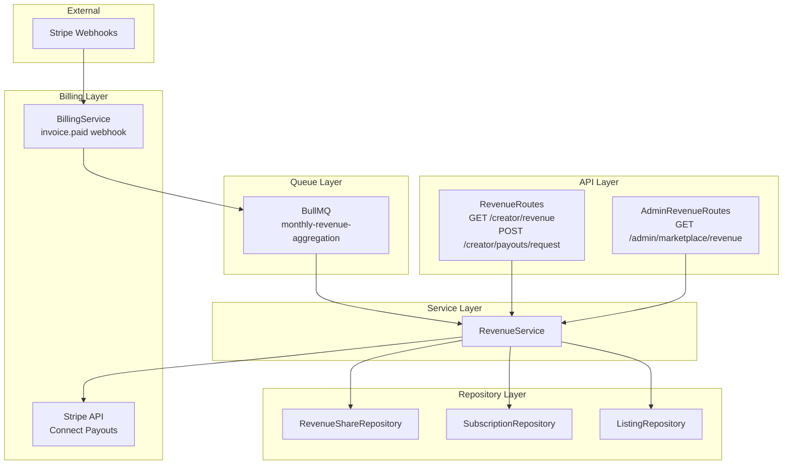

# Phase 5: Revenue Sharing & Payouts - Design

**Priority**: P0 - Creator monetization  
**Status**: Ready for Implementation  
**Dependencies**: Phase 1-4 complete (subscriptions active, performance tracked)

## Overview

Implement revenue calculation with 80/20 split (platform/creator), monthly aggregation, Stripe payout integration, and creator dashboard. This phase ensures creators get paid automatically based on subscriber revenue.

## Architecture



### Data Flow: Monthly Revenue Aggregation

```
[Cron: 1st of month 00:00 UTC]
  ├─> RevenueService.generateMonthlyRevenueShares(previousMonth)
  │     ├─> For each active strategy:
  │     │     ├─> SubscriptionRepository.getByStrategy(strategyId, status='active')
  │     │     ├─> For each subscription:
  │     │     │     ├─> Calculate prorated revenue (subscription price × active days / days in month)
  │     │     │     ├─> Create RevenueShare record:
  │     │     │     │     grossRevenueCents = prorated amount
  │     │     │     │     platformShareCents = gross × 0.8
  │     │     │     │     creatorShareCents = gross × 0.2
  │     │     │     │     status = 'pending'
  │     │     │     └─> RevenueShareRepository.create()
  │     │     └─> Total creatorRevenue, platformRevenue
  │     └─> Emit metrics, log summary
  └─> Notify creators (email: "Your revenue share for June is ready")
```

### Data Flow: Creator Requests Payout

```
POST /api/v1/marketplace/creator/payouts/request
  ├─> Auth (tenantId, check isCreator)
  ├─> RevenueService.getPendingPayouts(tenantId)
  │     ├─> RevenueShareRepository.getPendingPayouts(tenantId)
  │     └─> Sum creatorShareCents where status = 'pending'
  ├─> Validate minimum threshold ($50)
  ├─> StripeService.createPayout(amountCents, creatorStripeAccountId)
  │     └─> Stripe API POST /v1/payouts
  ├─> RevenueShareRepository.updateStatuses(payoutIds, 'paid', {stripePayoutId})
  ├─> AuditLogService.log()
  └─> Response: 200 {payoutId, amount, status}
```

## Files to Create

### 1. Revenue Service

**File**: `/Users/macbook/algo-trader/src/marketplace/services/revenue.service.ts`

```typescript
import { RevenueShareRepository } from '../repositories/revenue-share-repository';
import { SubscriptionRepository } from '../repositories/subscription-repository';
import { ListingRepository } from '../repositories/listing-repository';
import { StrategyRepository } from '../repositories/strategy-repository';
import { StripeService } from '../../billing/stripe.service';

export class RevenueService {
  private static instance: RevenueService;
  private readonly revenueShareRepository: RevenueShareRepository;
  private readonly subscriptionRepository: SubscriptionRepository;
  private readonly listingRepository: ListingRepository;
  private readonly strategyRepository: StrategyRepository;
  private readonly stripeService: StripeService;

  // Configuration
  private readonly platformFeePercent = 80; // 80% platform, 20% creator
  private readonly minimumPayoutUsd = 50; // $50 minimum

  private constructor() {
    this.revenueShareRepository = new RevenueShareRepository();
    this.subscriptionRepository = new SubscriptionRepository();
    this.listingRepository = new ListingRepository();
    this.strategyRepository = new StrategyRepository();
    this.stripeService = StripeService.getInstance();
  }

  static getInstance(): RevenueService {
    if (!RevenueService.instance) {
      RevenueService.instance = new RevenueService();
    }
    return RevenueService.instance;
  }

  async generateMonthlyRevenueShares(periodStart: Date, periodEnd: Date): Promise<void> {
    // Get all approved strategies with active listings
    const strategies = await this.strategyRepository.list({
      status: 'approved',
    });

    for (const strategy of strategies.data) {
      try {
        const listing = await this.listingRepository.getByStrategyId(strategy.id);
        if (!listing || !listing.isActive) continue;

        // Get all active subscriptions for this strategy
        const subscriptions = await this.subscriptionRepository.getByStrategy(strategy.id, 'active');

        for (const subscription of subscriptions) {
          // Check if revenue share already exists for this period
          const exists = await this.revenueShareRepository.existsForPeriod(
            strategy.id,
            subscription.tenantId,
            periodStart,
            periodEnd
          );
          if (exists) continue;

          // Calculate prorated revenue
          const proratedAmount = this.calculateProratedRevenue(
            listing.priceUsdMonthly,
            subscription.subscriptionStartedAt,
            periodStart,
            periodEnd
          );

          if (proratedAmount === 0) continue;

          const grossRevenueCents = proratedAmount;
          const platformShareCents = Math.round(grossRevenueCents * (this.platformFeePercent / 100));
          const creatorShareCents = grossRevenueCents - platformShareCents;

          await this.revenueShareRepository.create({
            id: `rev_${Date.now()}_${subscription.id.slice(0, 8)}`,
            strategyId: strategy.id,
            tenantId: subscription.tenantId,
            subscriptionId: subscription.id,
            periodStart,
            periodEnd,
            grossRevenueCents,
            platformShareCents,
            creatorShareCents,
            status: 'pending',
          });

          // Increment Prometheus counter
          // marketplaceRevenueTotalCents.inc(grossRevenueCents);
        }
      } catch (error) {
        console.error(`Failed to generate revenue shares for strategy ${strategy.id}:`, error);
      }
    }
  }

  async getCreatorRevenueDashboard(tenantId: string): Promise<ICreatorDashboard> {
    // Verify tenant is a strategy creator
    const strategies = await this.strategyRepository.getByCreator(tenantId);
    if (strategies.length === 0) {
      throw new Error('No strategies found for this creator');
    }

    // Get all revenue shares for creator's strategies
    const allRevenueShares = await Promise.all(
      strategies.map(s => this.revenueShareRepository.getByStrategy(s.id))
    );
    const flatRevenue = allRevenueShares.flat();

    const totalRevenueCents = flatRevenue.reduce((sum, r) => sum + r.grossRevenueCents, 0);
    const totalPayoutsCents = flatRevenue
      .filter(r => r.status === 'paid')
      .reduce((sum, r) => sum + r.creatorShareCents, 0);
    const pendingPayoutsCents = flatRevenue
      .filter(r => r.status === 'pending')
      .reduce((sum, r) => sum + r.creatorShareCents, 0);

    const activeSubscriberCount = await this.subscriptionRepository.getActiveCountForStrategies(
      strategies.map(s => s.id)
    );

    const avgRevenuePerSubscriberCents = activeSubscriberCount > 0
      ? totalRevenueCents / activeSubscriberCount
      : 0;

    // Recent payouts (last 10)
    const recentPayouts = flatRevenue
      .filter(r => r.status === 'paid')
      .sort((a, b) => new Date(b.paidAt!).getTime() - new Date(a.paidAt!).getTime())
      .slice(0, 10)
      .map(r => ({
        id: r.id,
        amountCents: r.creatorShareCents,
        status: r.status,
        paidAt: r.paidAt,
        stripePayoutId: r.stripePayoutId,
      }));

    // Monthly trend (last 12 months)
    const monthlyTrend = await this.calculateMonthlyTrend(strategies.map(s => s.id));

    // Top strategies by revenue
    const topStrategies = await this.getTopStrategiesByRevenue(strategies.map(s => s.id), 5);

    return {
      totalRevenueCents,
      totalPayoutsCents,
      pendingPayoutsCents,
      activeSubscriberCount,
      avgRevenuePerSubscriberCents,
      recentPayouts,
      monthlyTrend,
      topStrategies,
    };
  }

  async requestPayout(tenantId: string, amountUsd?: number): Promise<{ payoutId: string; amountCents: number; stripePayoutId: string }> {
    // Get all pending revenue shares for this creator
    const pendingShares = await this.revenueShareRepository.getPendingPayouts(tenantId);
    
    const totalPendingCents = pendingShares.reduce((sum, r) => sum + r.creatorShareCents, 0);
    const amountCents = amountUsd ? amountUsd * 100 : totalPendingCents;

    // Check minimum threshold
    if (amountCents < this.minimumPayoutUsd * 100) {
      throw new Error(`Minimum payout amount is $${this.minimumPayoutUsd}. Current pending: $${(totalPendingCents / 100).toFixed(2)}`);
    }

    if (amountCents > totalPendingCents) {
      throw new Error(`Requested amount $${amountCents / 100} exceeds pending balance $${totalPendingCents / 100}`);
    }

    // Get creator's Stripe account ID (need user table integration)
    const creator = await this.strategyRepository.getCreator(tenantId);
    if (!creator?.stripeAccountId) {
      throw new Error('Creator has no Stripe account connected. Please set up payouts in billing settings.');
    }

    // Create Stripe payout
    const stripePayout = await this.stripeService.createPayout(
      creator.stripeAccountId,
      amountCents,
      'marketplace_revenue'
    );

    // Mark revenue shares as paid (use FIFO: oldest first)
    const toMark = pendingShares
      .sort((a, b) => new Date(a.createdAt).getTime() - new Date(b.createdAt).getTime())
      .filter(r => {
        const cumulative = r.creatorShareCents;
        return cumulative <= amountCents;
      })
      .map(r => r.id);

    await this.revenueShareRepository.updateStatuses(
      toMark,
      'paid',
      stripePayout.id
    );

    // Audit log
    await this.auditService.log({
      tenantId,
      userId: tenantId,
      action: 'payout_requested',
      resourceId: stripePayout.id,
      metadata: { amountCents, count: toMark.length },
    });

    return {
      payoutId: stripePayout.id,
      amountCents,
      stripePayoutId: stripePayout.id,
    };
  }

  async getPlatformRevenueDashboard(periodStart?: Date, periodEnd?: Date): Promise<IPlatformRevenueDashboard> {
    // Admin endpoint: total platform revenue, payouts, strategy breakdown
    const end = periodEnd || new Date();
    const start = periodStart || new Date(Date.now() - 30 * 24 * 60 * 60 * 1000); // last 30 days

    const revenueShares = await this.revenueShareRepository.getByDateRange(start, end);

    const totalPlatformRevenueCents = revenueShares
      .filter(r => r.status === 'paid')
      .reduce((sum, r) => sum + r.platformShareCents, 0);

    const totalCreatorPayoutsCents = revenueShares
      .filter(r => r.status === 'paid')
      .reduce((sum, r) => sum + r.creatorShareCents, 0);

    const pendingPayoutsCents = revenueShares
      .filter(r => r.status === 'pending')
      .reduce((sum, r) => sum + r.creatorShareCents, 0);

    const newSubscribers = await this.subscriptionRepository.countNewInPeriod(start, end);

    return {
      totalRevenueCents: totalPlatformRevenueCents,
      totalPayoutsCents: totalCreatorPayoutsCents,
      pendingPayoutsCents,
      newSubscribers,
      // Additional breakdowns by strategy, by month
    };
  }

  private calculateProratedRevenue(
    monthlyPriceCents: number,
    subscriptionStart: Date,
    periodStart: Date,
    periodEnd: Date
  ): number {
    // If subscription started after periodStart, prorate from start date
    const effectiveStart = subscriptionStart > periodStart ? subscriptionStart : periodStart;
    
    const daysInPeriod = Math.floor((periodEnd.getTime() - periodStart.getTime()) / (1000 * 60 * 60 * 24));
    const daysActive = Math.floor((periodEnd.getTime() - effectiveStart.getTime()) / (1000 * 60 * 60 * 24));

    if (daysActive <= 0 || daysInPeriod <= 0) return 0;

    const dailyRate = monthlyPriceCents / daysInPeriod;
    return Math.round(dailyRate * daysActive);
  }

  private async calculateMonthlyTrend(strategyIds: string[]): Promise<IMonthlyTrend[]> {
    // Query revenue shares grouped by month for last 12 months
    return await this.revenueShareRepository.getMonthlyTrend(strategyIds, 12);
  }

  private async getTopStrategiesByRevenue(strategyIds: string[], limit: number): Promise<ITopStrategy[]> {
    // Sum revenue shares by strategy, return top N
    return await this.revenueShareRepository.getTopStrategiesByRevenue(strategyIds, limit);
  }
}

// Supporting types
interface ITopStrategy {
  strategyId: string;
  name: string;
  subscriberCount: number;
  revenueCents: number;
  avgRating: number;
}

interface IPlatformRevenueDashboard {
  totalRevenueCents: number;
  totalPayoutsCents: number;
  pendingPayoutsCents: number;
  newSubscribers: number;
  // Add monthly breakdown, top strategies, etc.
}
```

### 2. Stripe Service (extend existing)

**File**: `/Users/macbook/algo-trader/src/billing/stripe.service.ts` (add payout methods)

```typescript
import Stripe from 'stripe';

export class StripeService {
  private static instance: StripeService;
  private stripe: Stripe;

  private constructor() {
    this.stripe = new Stripe(process.env.STRIPE_SECRET_KEY!, {
      apiVersion: '2024-06-20',
    });
  }

  static getInstance(): StripeService {
    if (!StripeService.instance) {
      StripeService.instance = new StripeService();
    }
    return StripeService.instance;
  }

  async createPayout(accountId: string, amountCents: number, description?: string): Promise<Stripe.Payout> {
    return await this.stripe.payouts.create({
      amount: amountCents,
      currency: 'usd',
      description: description || 'Marketplace revenue payout',
      // For Connect: use destination account
      // destination: accountId, // if using Connect
    });
  }

  async getPayout(payoutId: string): Promise<Stripe.Payout> {
    return await this.stripe.payouts.retrieve(payoutId);
  }
}
```

### 3. Monthly Aggregation Worker

**File**: `/Users/macbook/algo-trader/src/workers/revenue-aggregation.worker.ts`

```typescript
import { Worker } from 'bullmq';
import { RevenueService } from '../marketplace/services/revenue.service';
import { logger } from '../utils/logger';

export async function startRevenueAggregationWorker(): Promise<void> {
  const worker = new Worker('monthly-revenue-aggregation', async (job) => {
    const { periodStart, periodEnd } = job.data;
    
    const revenueService = RevenueService.getInstance();
    await revenueService.generateMonthlyRevenueShares(
      new Date(periodStart),
      new Date(periodEnd)
    );

    logger.info('[RevenueAggregation] Monthly revenue shares generated', {
      periodStart,
      periodEnd,
    });

    // Notify creators (async, don't block)
    await this.notifyCreators(periodStart, periodEnd);
  });

  // Schedule: 1st of every month at 00:00 UTC
  await worker.add('monthly-revenue-aggregation', 
    { 
      periodStart: '2025-06-01', // calculate dynamically
      periodEnd: '2025-06-30' 
    }, 
    { repeat: { cron: '0 0 1 * *' } }
  );

  worker.on('completed', (job) => {
    logger.info('[RevenueAggregation] Job completed', { jobId: job.id });
  });

  worker.on('failed', (job, error) => {
    logger.error('[RevenueAggregation] Job failed', { jobId: job.id, error });
    // Alert admin
  });

  return worker;
}

private async notifyCreators(periodStart: string, periodEnd: string): Promise<void> {
  // Query all creators with pending revenue shares
  // Send email: "Your revenue share for ${month} is ready: $X.XX"
  // Include link to creator dashboard
}
```

### 4. Revenue Routes

**File**: `/Users/macbook/algo-trader/src/api/routes/marketplace-revenue-routes.ts` (new)

```typescript
import { Router, Request, Response } from 'express';
import { z } from 'zod';
import { RevenueService } from '../../marketplace/services/revenue.service';

const router = Router();
const revenueService = RevenueService.getInstance();

// Creator routes
router.get('/creator/revenue', async (req: Request, res: Response) => {
  try {
    const tenantId = (req as any).tenant.id;
    const dashboard = await revenueService.getCreatorRevenueDashboard(tenantId);
    return res.json(dashboard);
  } catch (error) {
    return res.status(500).json({ error: 'Failed to fetch revenue dashboard' });
  }
});

router.post('/creator/payouts/request', async (req: Request, res: Response) => {
  try {
    const tenantId = (req as any).tenant.id;
    const { amountUsd } = req.body; // optional - if not provided, use all pending

    const result = await revenueService.requestPayout(tenantId, amountUsd);
    return res.json({
      success: true,
      payout: result,
      message: `Payout of $${result.amountCents / 100} initiated via Stripe`,
    });
  } catch (error) {
    return res.status(400).json({ error: error.message });
  }
});

router.get('/creator/payouts', async (req: Request, res: Response) => {
  try {
    const tenantId = (req as any).tenant.id;
    const revenue = await revenueService.getCreatorRevenueDashboard(tenantId);
    return res.json({ payouts: revenue.recentPayouts });
  } catch (error) {
    return res.status(500).json({ error: 'Failed to fetch payouts' });
  }
});

// Admin routes (protected by adminAuthMiddleware in index.ts)
router.get('/admin/revenue', async (req: Request, res: Response) => {
  try {
    const { periodStart, periodEnd } = req.query;
    const dashboard = await revenueService.getPlatformRevenueDashboard(
      periodStart as string,
      periodEnd as string
    );
    return res.json(dashboard);
  } catch (error) {
    return res.status(500).json({ error: 'Failed to fetch platform revenue' });
  }
});

router.get('/admin/payouts', async (req: Request, res: Response) => {
  try {
    const { page = 1, limit = 50, status } = req.query;
    const payouts = await revenueService.revenueShareRepository.list({
      status: status as string,
      page: parseInt(page as string, 10),
      limit: parseInt(limit as string, 10),
    });
    return res.json(payouts);
  } catch (error) {
    return res.status(500).json({ error: 'Failed to fetch payouts' });
  }
});

router.post('/admin/payouts/:id/mark-paid', async (req: Request, res: Response) => {
  try {
    const { id } = req.params;
    const { stripePayoutId } = req.body;

    await revenueService.revenueShareRepository.updateStatus(id, 'paid', undefined, stripePayoutId);
    return res.json({ success: true });
  } catch (error) {
    return res.status(400).json({ error: error.message });
  }
});

export default router;
```

## Files to Modify

### 1. Strategy Repository: Creator Stripe Account

Add field to `marketplace_strategies` or create `creators` table:
```sql
ALTER TABLE marketplace_strategies ADD COLUMN creator_stripe_account_id TEXT;
```

Or extend User model if exists:
```typescript
// In User model (if separate from tenant)
interface User {
  id: string;
  email: string;
  stripeAccountId?: string;
  stripeConnectStatus: string;
}
```

### 2. Billing Webhook Integration

**File**: `/Users/macbook/algo-trader/src/billing/webhook-handler.ts`

Handle `invoice.paid` events to trigger revenue share generation:
```typescript
case 'invoice.paid':
  const invoice = event.data.object;
  const subscriptionId = invoice.subscription;
  
  // Lookup subscription → listing → strategy
  // Queue immediate revenue share calculation for this subscription
  await queueService.add('immediate-revenue-share', {
    subscriptionId,
    invoiceId: invoice.id,
    amountPaid: invoice.amount_paid,
  });
  break;
```

## Migration

**No new migration** - all tables exist. Verify `marketplace_revenue_shares` schema matches:

```sql
-- Ensure creator_share_cents and platform_share_cents columns exist
-- Add index for pending payouts lookup:
CREATE INDEX IF NOT EXISTS idx_marketplace_revenue_shares_creator_pending 
ON marketplace_revenue_shares(tenant_id, status) 
WHERE status = 'pending';
```

## Interfaces

```typescript
// RevenueService
interface IRevenueService {
  generateMonthlyRevenueShares(periodStart: Date, periodEnd: Date): Promise<void>;
  getCreatorRevenueDashboard(tenantId: string): Promise<ICreatorDashboard>;
  requestPayout(tenantId: string, amountUsd?: number): Promise<{ payoutId: string; amountCents: number; stripePayoutId: string }>;
  getPlatformRevenueDashboard(periodStart?: Date, periodEnd?: Date): Promise<IPlatformRevenueDashboard>;
}

// ICreatorDashboard (from types.ts, already defined)
// IPlatformRevenueDashboard (new)
```

## Prometheus Metrics

```typescript
marketplaceRevenueTotalCents = new Counter({
  name: 'marketplace_revenue_total_cents',
  help: 'Total platform revenue (all time)',
});

marketplaceCreatorPayoutsTotalCents = new Counter({
  name: 'marketplace_creator_payouts_total_cents',
  help: 'Total creator payouts processed',
});

marketplacePendingPayoutsCents = new Gauge({
  name: 'marketplace_pending_payouts_cents',
  help: 'Total pending payout amount awaiting processing',
});

marketplaceRevenueAggregationDuration = new Histogram({
  name: 'marketplace_revenue_aggregation_duration_seconds',
  help: 'Time to generate monthly revenue shares',
  buckets: [60, 300, 600, 1800, 3600],
});

marketplacePayoutRequestsTotal = new Counter({
  name: 'marketplace_payout_requests_total',
  help: 'Creator payout requests',
  labelNames: ['status'], // success, failed
});

marketplaceAvgRevenuePerStrategy = new Gauge({
  name: 'marketplace_avg_revenue_per_strategy_cents',
  help: 'Average monthly revenue per active strategy',
});
```

## Admin Endpoints

- `GET /api/admin/marketplace/revenue?periodStart=2025-06-01&periodEnd=2025-06-30` - Platform revenue dashboard
- `GET /api/admin/marketplace/payouts?page=1&limit=50&status=pending` - Payout queue
- `POST /api/admin/marketplace/payouts/:id/mark-paid` - Manual payout confirmation (Stripe webhook fallback)

## Rollback Posture

| Failure Mode | Tier | Mechanism |
|--------------|------|-----------|
| Monthly aggregation fails | L3 | Manual run via admin endpoint `POST /api/admin/marketplace/revenue/generate` |
| Stripe payout API down | L3 | Queue payout requests, retry with exponential backoff; admin can trigger manual payout later |
| Revenue calculation error | L1 | Stop aggregation, investigate; previous month's data unaffected |
| Payout amount incorrect | L2 | Manual adjustment via admin: `POST /api/admin/revenue-shares/:id/adjust` |
| Creator disputes payout | L3 | Audit log review, manual Stripe refund if warranted |

**Kill Switch**: Disable marketplace (L1) → no new subscriptions, but revenue continues for existing subs.

## Security Considerations

1. **Creator Payout Access**: Only strategy creators can request payouts (check `strategy.creatorId === req.tenantId`).
2. **Payout Authorization**: Users can only request payout for their own pending revenue shares.
3. **Minimum Threshold**: $50 minimum prevents micro-payout spam.
4. **Stripe Connect**: Creator must have connected Stripe account (KYC complete) before payouts.
5. **Amount Validation**: Requested amount cannot exceed pending balance.
6. **Audit Trail**: All revenue share records immutable once `status='paid'`. Manual adjustments require admin auth.

## Unresolved Questions

1. **Revenue calculation timing**: Should revenue be calculated immediately upon subscription payment, or monthly batch?
   - **Proposed**: Monthly batch (simpler, aligns with billing cycles). But need immediate for real-time dashboard? Add immediate small-share generation for dashboard display, reconcile monthly.

2. **Tax reporting**: How to generate 1099/K-1 for creators?
   - **Proposed**: Year-end aggregation: query all paid revenue shares for creator (tax year), generate CSV. Stripe provides tax forms if using Connect.

3. **Refund handling**: What if subscriber refunds after creator paid?
   - **Proposed**: Clawback from next month's payout, or debit creator balance. Refund triggers `marketplace_revenue_shares` status reversal.

4. **Creator on hold**: What if creator's Stripe account is suspended?
   - **Proposed**: Pause payouts, flag account, notify admin. Revenue continues accruing (held).

5. **Platform fee variations**: Should fee % be configurable per strategy?
   - **Proposed**: Start with fixed 80/20. Future: promotional discounts, tiered fees based on volume.

---

## Next Phase

Phase 6 (Dispute Resolution & Final Integration) will implement:
- Dispute filing workflow
- Admin dispute resolution with compensation
- Full end-to-end integration testing
- Dashboard components completion
- Documentation updates
