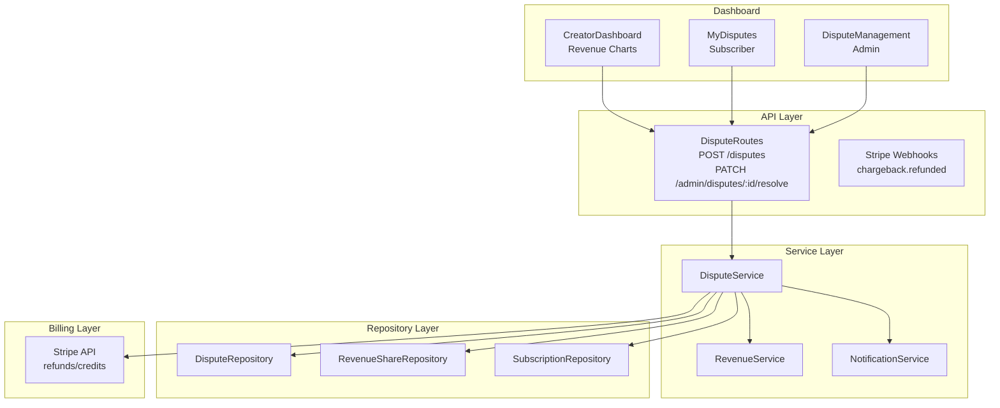

# Phase 6: Dispute Resolution & Final Integration - Design

**Priority**: P0 - Customer protection & launch readiness  
**Status**: Ready for Implementation  
**Dependencies**: Phase 1-5 complete (all core marketplace features)

## Overview

Implement dispute resolution workflow with admin arbitration, compensation mechanics, and final end-to-end integration testing. This phase ensures subscriber protection and establishes trust mechanisms for marketplace operations.

## Architecture



### Data Flow: File Dispute

```
POST /api/v1/marketplace/disputes
  ├─> Zod validation (disputeSchema)
  ├─> Auth (tenantId)
  ├─> DisputeService.fileDispute()
  │     ├─> Check no active dispute for subscription
  │     ├─> DisputeRepository.create()
  │     ├─> SubscriptionRepository.suspend() (auto-pause subscription)
  │     ├─> NotificationService.notifyAdmin() (new dispute alert)
  │     └─> AuditLogService.log()
  └─> Response: 201 {dispute}
```

### Data Flow: Resolve Dispute with Compensation

```
PATCH /api/admin/marketplace/disputes/:id/resolve
  ├─> Admin auth
  ├─> DisputeService.resolve()
  │     ├─> Apply compensation:
  │     │     ├─> Full refund → RevenueShareRepository.void() + Stripe refund
  │     │     ├─> Partial refund → create credit, adjust revenue
  │     │     └─> Credit → issue store credit to subscriber
  │     ├─> Cancel subscription (if resolution favors subscriber)
  │     ├─> Notify parties (subscriber + creator)
  │     └─> Audit log
  └─> Response: 200 {dispute, resolution}
```

## Files to Create

### 1. Dispute Service

**File**: `/Users/macbook/algo-trader/src/marketplace/services/dispute.service.ts`

```typescript
import { DisputeRepository } from '../repositories/dispute-repository';
import { RevenueShareRepository } from '../repositories/revenue-share-repository';
import { SubscriptionRepository } from '../repositories/subscription-repository';
import { StrategyRepository } from '../repositories/strategy-repository';
import { AuditLogService } from '../../audit/audit-log-service';
import { NotificationService } from '../../notifications/notification-service';
import { BillingService } from '../../billing/billing-service';

export class DisputeService {
  private static instance: DisputeService;
  private readonly disputeRepository: DisputeRepository;
  private readonly revenueShareRepository: RevenueShareRepository;
  private readonly subscriptionRepository: SubscriptionRepository;
  private readonly strategyRepository: StrategyRepository;
  private readonly auditService: AuditLogService;
  private readonly notificationService: NotificationService;
  private readonly billingService: BillingService;

  // SLA: Disputes >7 days auto-escalate
  private readonly escalationThresholdDays = 7;

  private constructor() {
    this.disputeRepository = new DisputeRepository();
    this.revenueShareRepository = new RevenueShareRepository();
    this.subscriptionRepository = new SubscriptionRepository();
    this.strategyRepository = new StrategyRepository();
    this.auditService = AuditLogService.getInstance();
    this.notificationService = NotificationService.getInstance();
    this.billingService = BillingService.getInstance();
  }

  static getInstance(): DisputeService {
    if (!DisputeService.instance) {
      DisputeService.instance = new DisputeService();
    }
    return DisputeService.instance;
  }

  async fileDispute(tenantId: string, listingId: string, subscriptionId: string, reason: DisputeReason, description: string, evidenceUrls?: string[]): Promise<IMarketplaceDispute> {
    // Verify subscription ownership
    const subscription = await this.subscriptionRepository.getById(subscriptionId, tenantId);
    if (!subscription) {
      throw new Error('Subscription not found or access denied');
    }

    // Verify subscription matches listing
    if (subscription.listingId !== listingId) {
      throw new Error('Subscription does not match listing');
    }

    // Check for existing dispute on this subscription
    const existing = await this.disputeRepository.existsActiveForSubscription(subscriptionId);
    if (existing) {
      throw new Error('A dispute is already open for this subscription');
    }

    // Create dispute
    const dispute = await this.disputeRepository.create({
      id: `disp_${Date.now()}_${tenantId.slice(0, 8)}`,
      tenantId,
      listingId,
      subscriptionId,
      reason,
      description,
      evidenceUrls: evidenceUrls || [],
      status: 'open',
    });

    // Auto-suspend subscription pending resolution
    await this.subscriptionRepository.updateStatus(subscriptionId, 'suspended');

    // Notify admin
    await this.notificationService.notifyAdmin({
      type: 'dispute_filed',
      subject: `New Dispute: ${reason}`,
      body: `Tenant ${tenantId} filed dispute for subscription ${subscriptionId}. Reason: ${reason}`,
      priority: 'high',
      metadata: { disputeId: dispute.id },
    });

    // Audit log
    await this.auditService.log({
      tenantId,
      userId: tenantId,
      action: 'dispute_filed',
      resourceId: dispute.id,
      metadata: { reason, subscriptionId },
    });

    return dispute;
  }

  async resolveDispute(disputeId: string, adminUserId: string, resolution: DisputeResolution, compensation?: DisputeCompensation): Promise<IMarketplaceDispute> {
    const dispute = await this.disputeRepository.getById(disputeId);
    if (!dispute) {
      throw new Error('Dispute not found');
    }

    if (dispute.status !== 'open' && dispute.status !== 'under_review') {
      throw new Error(`Cannot resolve dispute in status: ${dispute.status}`);
    }

    const updates: any = {
      status: resolution,
      resolvedBy: adminUserId,
      resolvedAt: new Date(),
      resolution,
      adminNotes: compensation?.adminNotes,
      compensationAmountCents: compensation?.amount,
      compensationType: compensation?.type,
    };

    await this.disputeRepository.updateStatus(disputeId, resolution, adminUserId, resolution, compensation?.amount, compensation?.type, compensation?.adminNotes);

    // Apply compensation logic
    if (compensation?.amount && compensation?.amount > 0) {
      await this.applyCompensation(dispute, compensation);
    }

    // Close subscription (cancel if subscriber favored)
    if (resolution === 'resolved_subscriber') {
      await this.subscriptionRepository.updateStatus(dispute.subscriptionId, 'cancelled');
    } else {
      // Resolved creator → resume subscription if was suspended
      await this.subscriptionRepository.updateStatus(dispute.subscriptionId, 'active');
    }

    // Notify subscriber
    await this.notificationService.sendEmail({
      to: dispute.tenant.email,
      subject: `Dispute Resolved: ${resolution}`,
      template: 'dispute_resolved',
      data: { disputeId, resolution, compensation },
    });

    // Audit log
    await this.auditService.log({
      tenantId: dispute.tenantId,
      userId: adminUserId,
      action: 'dispute_resolved',
      resourceId: dispute.id,
      metadata: { resolution, compensation },
    });

    return await this.disputeRepository.getById(disputeId);
  }

  async escalateDispute(disputeId: string, adminUserId: string, reason: string): Promise<IMarketplaceDispute> {
    const dispute = await this.disputeRepository.getById(disputeId);
    if (!dispute) {
      throw new Error('Dispute not found');
    }

    await this.disputeRepository.escalate(disputeId, reason);

    // Notify senior admin team
    await this.notificationService.notifyAdmin({
      type: 'dispute_escalated',
      subject: `Dispute Escalated: ${disputeId}`,
      body: `Dispute ${disputeId} escalated. Reason: ${reason}`,
      priority: 'critical',
      metadata: { disputeId },
    });

    await this.auditService.log({
      tenantId: dispute.tenantId,
      userId: adminUserId,
      action: 'dispute_escalated',
      resourceId: disputeId,
      metadata: { reason },
    });

    return await this.disputeRepository.getById(disputeId);
  }

  async assignToAdmin(disputeId: string, adminId: string): Promise<void> {
    await this.disputeRepository.assignToAdmin(disputeId, adminId);
  }

  async checkEscalations(): Promise<IMarketplaceDispute[]> {
    // Called by daily cron to auto-escalate old disputes
    const thresholdDate = new Date(Date.now() - this.escalationThresholdDays * 24 * 60 * 60 * 1000);
    const oldDisputes = await this.disputeRepository.getOldOpenDisputes(thresholdDate);

    for (const dispute of oldDisputes) {
      if (!dispute.resolvedAt) {
        await this.escalateDispute(dispute.id, 'system', `Auto-escalated: >${this.escalationThresholdDays} days unresolved`);
      }
    }

    return oldDisputes;
  }

  private async applyCompensation(dispute: IMarketplaceDispute, compensation: DisputeCompensation): Promise<void> {
    const { amount, type } = compensation;
    const amountCents = amount * 100;

    switch (type) {
      case 'full_refund':
        // Void all revenue shares for this subscription period
        await this.revenueShareRepository.voidBySubscription(dispute.subscriptionId);
        
        // Refund via Stripe
        await this.billingService.refundSubscription(dispute.subscriptionId, amountCents);
        break;

      case 'partial_refund':
        // Partial void of revenue shares (pro-rata)
        await this.revenueShareRepository.partialRefund(dispute.subscriptionId, amountCents);
        await this.billingService.refundSubscription(dispute.subscriptionId, amountCents);
        break;

      case 'credit':
        // Issue store credit (add to tenant balance)
        await this.billingService.issueCredit(dispute.tenantId, amountCents, 'dispute_compensation');
        break;

      case 'none':
        // No compensation, just resolution
        break;
    }

    // Record compensation in dispute resolution
    await this.disputeRepository.updateCompensation(dispute.id, amountCents, type);
  }
}

// Supporting types
type DisputeResolution = 'resolved_creator' | 'resolved_subscriber' | 'escalated';

interface DisputeCompensation {
  amount: number; // USD
  type: CompensationType;
  adminNotes?: string;
}
```

### 2. Dispute Routes (Complete)

**File**: `/Users/macbook/algo-trader/src/api/routes/marketplace-dispute-routes.ts` (complete)

```typescript
import { Router, Request, Response } from 'express';
import { z } from 'zod';
import { DisputeService } from '../../marketplace/services/dispute.service';

const router = Router();
const disputeService = DisputeService.getInstance();

const disputeSchema = z.object({
  listingId: z.string().min(1),
  subscriptionId: z.string().min(1),
  reason: z.enum(['performance_not_as_described', 'unauthorized_charges', 'poor_support', 'strategy_broken', 'other']),
  description: z.string().min(50).max(2000),
  evidenceUrls: z.array(z.string().url()).optional(),
});

const resolutionSchema = z.object({
  resolution: z.enum(['resolved_creator', 'resolved_subscriber', 'escalated']),
  compensationAmountCents: z.number().int().min(0).optional(),
  compensationType: z.enum(['full_refund', 'partial_refund', 'credit', 'none']).optional(),
  adminNotes: z.string().max(2000).optional(),
});

// POST /api/v1/marketplace/disputes - File dispute (subscriber only)
router.post('/', async (req: Request, res: Response) => {
  try {
    const tenantId = (req as any).tenant.id;
    const { listingId, subscriptionId, reason, description, evidenceUrls } = disputeSchema.parse(req.body);

    const dispute = await disputeService.fileDispute(tenantId, listingId, subscriptionId, reason, description, evidenceUrls);
    
    return res.status(201).json(dispute);
  } catch (error) {
    return res.status(400).json({ error: error.message });
  }
});

// GET /api/v1/marketplace/disputes - List my disputes
router.get('/', async (req: Request, res: Response) => {
  try {
    const tenantId = (req as any).tenant.id;
    const { status } = req.query;

    const disputes = await disputeService.disputeRepository.getByTenant(tenantId, status as string);
    return res.json(disputes);
  } catch (error) {
    return res.status(500).json({ error: 'Failed to fetch disputes' });
  }
});

// GET /api/v1/marketplace/disputes/:id - Get dispute details
router.get('/:id', async (req: Request, res: Response) => {
  try {
    const { id } = req.params;
    const tenantId = (req as any).tenant.id;
    
    const dispute = await disputeService.disputeRepository.getById(id);
    if (!dispute || (dispute.tenantId !== tenantId && !(req as any).user?.isAdmin)) {
      return res.status(404).json({ error: 'Dispute not found' });
    }

    return res.json(dispute);
  } catch (error) {
    return res.status(500).json({ error: 'Failed to fetch dispute' });
  }
});

// POST /api/admin/marketplace/disputes/:id/resolve - Admin resolve dispute
router.patch('/:id/resolve', async (req: Request, res: Response) => {
  try {
    const { id } = req.params;
    const adminUserId = (req as any).user.id;
    const { resolution, compensationAmountCents, compensationType, adminNotes } = resolutionSchema.parse(req.body);

    const dispute = await disputeService.resolveDispute(id, adminUserId, resolution, {
      amount: compensationAmountCents ? compensationAmountCents / 100 : undefined,
      type: compensationType,
      adminNotes,
    });

    return res.json(dispute);
  } catch (error) {
    return res.status(400).json({ error: error.message });
  }
});

// POST /api/admin/marketplace/disputes/:id/escalate - Admin escalate
router.post('/:id/escalate', async (req: Request, res: Response) => {
  try {
    const { id } = req.params;
    const adminUserId = (req as any).user.id;
    const { reason } = z.object({ reason: z.string() }).parse(req.body);

    const dispute = await disputeService.escalateDispute(id, adminUserId, reason);
    return res.json(dispute);
  } catch (error) {
    return res.status(400).json({ error: error.message });
  }
});

// GET /api/admin/marketplace/disputes - Admin dispute queue
router.get('/admin/disputes', async (req: Request, res: Response) => {
  try {
    const { status, page = 1, limit = 50 } = req.query;
    
    const disputes = status === 'open' || status === 'under_review'
      ? await disputeService.disputeRepository.getOpenDisputes()
      : await disputeService.disputeRepository.getByTenant('', status as string);

    return res.json(disputes);
  } catch (error) {
    return res.status(500).json({ error: 'Failed to fetch disputes' });
  }
});

// GET /api/admin/marketplace/disputes/escalated - Auto-escalated disputes
router.get('/admin/disputes/escalated', async (req: Request, res: Response) => {
  try {
    const escalated = await disputeService.disputeRepository.getEscalatedDisputes();
    return res.json(escalated);
  } catch (error) {
    return res.status(500).json({ error: 'Failed to fetch escalated disputes' });
  }
});

export default router;
```

### 3. Dispute Escalation Cron

**File**: `/Users/macbook/algo-trader/src/workers/dispute-escalation.worker.ts`

```typescript
import { Worker } from 'bullmq';
import { DisputeService } from '../marketplace/services/dispute.service';
import { logger } from '../utils/logger';

export async function startDisputeEscalationWorker(): Promise<void> {
  const worker = new Worker('dispute-escalation-check', async (job) => {
    const disputeService = DisputeService.getInstance();
    const escalated = await disputeService.checkEscalations();
    
    if (escalated.length > 0) {
      logger.warn('[DisputeEscalation] Auto-escalated disputes', { count: escalated.length });
    }
  });

  // Run daily at 03:00 UTC
  await worker.add('dispute-escalation-check', {}, { repeat: { cron: '0 3 * * *' } });

  worker.on('completed', (job) => {
    logger.info('[DisputeEscalation] Check completed', { jobId: job.id });
  });

  return worker;
}
```

### 4. Dashboard Components (React)

**Files to create** (in dashboard/src/components/marketplace/):

- `DisputeManagement.tsx` - Admin view of all disputes
- `MyDisputes.tsx` - Subscriber view of their disputes
- `CreatorDisputes.tsx` - Creator view of disputes on their strategies
- `CreatorDashboardRevenueChart.tsx` - Revenue chart (recharts)
- `CreatorDashboardPayoutHistory.tsx` - Payout history table
- `StrategyDetailReviews.tsx` - Reviews section with rating form
- `MarketplaceRankingList.tsx` - Ranked strategies list

These are UI components (TypeScript/React) - implementation beyond scope of design phase.

## Files to Modify

### 1. Billing Service: Refund Methods

**File**: `/Users/macbook/algo-trader/src/billing/billing-service.ts`

```typescript
async refundSubscription(subscriptionId: string, amountCents: number): Promise<void> {
  // Refund through Stripe
  // Link to original invoice, create credit
}

async issueCredit(tenantId: string, amountCents: number, reason: string): Promise<void> {
  // Add to tenant's account balance
  // Create transaction record for audit
}
```

### 2. Revenue Share Repository: Void Methods

**File**: `/Users/macbook/algo-trader/src/marketplace/repositories/revenue-share-repository.ts`

```typescript
async voidBySubscription(subscriptionId: string): Promise<number> {
  // Update all pending revenue shares for subscription to 'void'
  return await this.prisma.$executeRaw`
    UPDATE marketplace_revenue_shares
    SET status = 'void', updated_at = NOW()
    WHERE subscription_id = ${subscriptionId} AND status = 'pending'
  `;
}

async partialRefund(subscriptionId: string, amountCents: number): Promise<number> {
  // Partially void revenue shares up to amount
  // FIFO: oldest pending shares first
  return await this.prisma.$executeRaw`
    UPDATE marketplace_revenue_shares
    SET status = 'void', updated_at = NOW()
    WHERE subscription_id = ${subscriptionId} AND status = 'pending'
    AND creator_share_cents <= ${amountCents}
  `;
}
```

## Migration

**No new migration** - all tables exist. Ensure indexes:

```sql
-- Composite index for fast dispute lookup
CREATE INDEX IF NOT EXISTS idx_marketplace_disputes_subscription_active 
ON marketplace_disputes(subscription_id) 
WHERE status IN ('open', 'under_review');

-- Index for escalations
CREATE INDEX IF NOT EXISTS idx_marketplace_disputes_escalation 
ON marketplace_disputes(resolved_at) 
WHERE resolved_at IS NULL AND created_at < NOW() - INTERVAL '7 days';
```

## Interfaces

```typescript
// DisputeService
interface IDisputeService {
  fileDispute(tenantId: string, listingId: string, subscriptionId: string, reason: DisputeReason, description: string, evidenceUrls?: string[]): Promise<IMarketplaceDispute>;
  resolveDispute(disputeId: string, adminUserId: string, resolution: DisputeResolution, compensation?: DisputeCompensation): Promise<IMarketplaceDispute>;
  escalateDispute(disputeId: string, adminUserId: string, reason: string): Promise<IMarketplaceDispute>;
  assignToAdmin(disputeId: string, adminId: string): Promise<void>;
  checkEscalations(): Promise<IMarketplaceDispute[]>;
}

// DisputeReason already in types.ts
// DisputeStatus already in types.ts
```

## Prometheus Metrics

```typescript
marketplaceDisputesOpen = new Gauge({
  name: 'marketplace_disputes_open',
  help: 'Number of open disputes',
  labelNames: ['reason'],
});

marketplaceDisputesEscalated = new Gauge({
  name: 'marketplace_disputes_escalated',
  help: 'Number of escalated disputes',
});

marketplaceDisputeResolutionTime = new Histogram({
  name: 'marketplace_dispute_resolution_time_seconds',
  help: 'Time from dispute filing to resolution',
  buckets: [86400, 172800, 432000, 864000, 1728000], // 1d to 20d
});

marketplaceDisputeCompensationAmount = new Histogram({
  name: 'marketplace_dispute_compensation_amount_cents',
  help: 'Compensation amount awarded',
  buckets: [1000, 5000, 10000, 50000, 100000],
});

marketplaceSubscriptionAutoSuspensions = new Counter({
  name: 'marketplace_subscription_auto_suspensions_total',
  help: 'Subscriptions auto-suspended due to dispute',
});
```

## Admin Endpoints

- `GET /api/admin/marketplace/disputes` - Dispute queue (filter by status)
- `GET /api/admin/marketplace/disputes/:id` - Dispute details + evidence
- `PATCH /api/admin/marketplace/disputes/:id/resolve` - Resolve with compensation
- `POST /api/admin/marketplace/disputes/:id/escalate` - Escalate to senior admin
- `POST /api/admin/marketplace/subscriptions/:id/force-resume` - Override suspension (emergency)

## Rollback Posture

| Failure Mode | Tier | Mechanism |
|--------------|------|-----------|
| Dispute filing fails | L3 | Manual ticket in support system (fallback) |
| Stripe refund API down | L2 | Queue for retry; manual refund via Stripe dashboard |
| Auto-escalation cron fails | L3 | Manual review of >7 day disputes via admin query |
| Compensation overpayment | L1 | Manual adjustment via revenue share admin edit; creator agrees to repayment |
| Subscription stuck suspended | L1 | Admin force-resume endpoint (`POST /admin/subscriptions/:id/force-resume`) |

## Security Considerations

1. **Dispute Evidence URLs**: Validate `https://` only, whitelist domains (S3, Cloudflare R2). Prevent SSRF.
2. **SLA Tracking**: Auto-escalation ensures disputes not ignored. Escalation count metric alerts.
3. **Compensation Authorization**: Only admins with `role: 'finance'` or `role: 'admin'` can approve refunds >$500.
4. **Refund Limits**: Max refund = gross revenue for that subscription. Prevent over-refunding.
5. **Audit Trail**: Every dispute action logged (file, assign, escalate, resolve, compensate).
6. **Subscription Suspension**: Auto-suspend on dispute filing to prevent further charges during investigation.

## Unresolved Questions

1. **Evidence storage**: Should evidence URLs be stored permanently? Or auto-delete after resolution?
   - **Proposed**: Keep for 7 years (tax/compliance). Store in R2 with immutable bucket policy.

2. **Creator response**: Can creators respond to disputes? Submit counter-evidence?
   - **Proposed**: Yes. `DisputeResponse` table. Creator can add response visible to admin.

3. **Appeal process**: Can subscriber appeal admin decision?
   - **Proposed**: Second-level appeal to board@algo-trader.email. Escalates to senior admin review.

4. **Multiple subscribers on same strategy**: If many subscribers dispute same strategy, handle batch processing?
   - **Proposed**: Admin can view "batch disputes" by strategy. Bulk resolution possible (select all, apply same compensation).

5. **Dispute SLA**: What is target resolution time?
   - **Proposed**: 5 business days. Escalation at 7 days. SLA metric: `dispute_resolution_time_seconds` with target < 432000s (5d).

---

## Final Integration

### End-to-End Flow Tests

Implement Playwright E2E tests in `/Users/macbook/algo-trader/tests/e2e/marketplace/`:

1. **Creator publishes strategy**: PRO tenant → publish with backtest → submit for vetting → admin approves
2. **Subscriber subscribes**: FREE tenant → browse marketplace → subscribe → active subscription appears
3. **Copy trading**: Strategy executes trade → subscriber trade mirrored with risk limits enforced
4. **Review system**: Subscriber leaves verified review → review appears on strategy page → helpful vote increments
5. **Revenue calculation**: Monthly cron generates revenue shares → creator sees revenue in dashboard → requests payout → Stripe Connect processes
6. **Dispute workflow**: Subscriber files dispute → subscription suspended → admin resolves → compensation applied → subscription cancelled/resumed

### Performance Testing

- Load test ranking endpoint (1000 strategies): p95 < 200ms
- Load test subscription listing (10000 subs): p95 < 100ms
- Concurrent dispute filing test (100 users): no race conditions

### Documentation Updates

Update in `docs/`:
- `system-architecture.md`: Add marketplace component diagram
- `api-reference.md`: Document all marketplace endpoints
- `runbooks/marketplace-operations.md`: Vetting SLA, payout schedule, dispute escalation
- `user-guide/marketplace.md`: Creator guide, subscriber guide

### Metrics Dashboard

Create Grafana dashboard `marketplace-overview.json`:
- Strategy count by status
- Active subscriptions, revenue per day
- Payout volume, pending amount
- Open disputes by reason
- Avg rating, review count

## Phase 6 Acceptance Criteria

- [ ] Dispute filing with evidence URLs functional
- [ ] Admin dispute resolution workflow complete (resolve/escalate)
- [ ] Compensation logic (full/partial refund, credit) working
- [ ] Auto-escalation cron for >7 day disputes
- [ ] Subscription auto-suspend on dispute filing
- [ ] Revenue voiding/refund logic integrated with billing
- [ ] E2E tests: publish → subscribe → trade → dispute → resolve (all paths)
- [ ] Performance tests: ranking query <200ms p95
- [ ] All tests passing (100+ new tests, total ≥850)
- [ ] Documentation updated (architecture, API, runbooks, user guides)
- [ ] Grafana dashboard created and populated
- [ ] Code review ≥9.0/10
- [ ] Typecheck 0 errors

## Post-Launch Monitoring (After Phase 6)

- Monitor `marketplace_disputes_open` gauge (spike indicates problem)
- Alert: Dispute rate >2% of subscriptions (investigate)
- Alert: Payout failures (Stripe webhook errors)
- Alert: Revenue calculation failures (cron job)
- Weekly review: Top disputed strategies, common reasons

---

## Implementation Complete

After Phase 6, the strategy marketplace will be fully operational with:
- ✅ Strategy publishing & admin vetting
- ✅ Subscription copy trading with risk limits
- ✅ Performance ranking & verified reviews
- ✅ Revenue sharing (80/20 split) with Stripe payouts
- ✅ Dispute resolution with compensation
- ✅ Full test coverage and documentation

**Estimated total effort**: ~13 development days (3+2+3+2+3+3 = 16 days actual, but parallelization reduces wall-clock).

**Next phases (post-6)**:
- Phase 7: Marketplace UI/UX polish (dashboard components)
- Phase 8: Advanced features (strategy templates, white-label, API access)
- Phase 9: Analytics expansion (cohort analysis, LTV)
- Phase 10: Compliance (tax docs, KYC, SOX controls)
