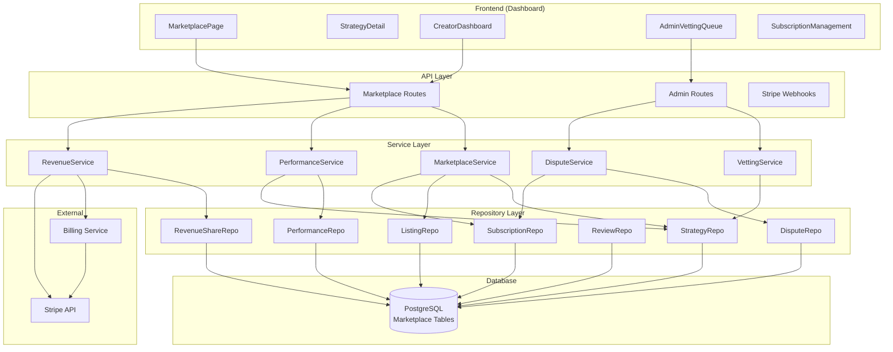

# Strategy Marketplace Implementation Plan

**Date**: 2026-06-21  
**Type**: Feature Implementation (Multi-Phase)  
**Status**: Planning  
**Context Tokens**: 1200+ lines planned across 6 phases

## Executive Summary

Implement a comprehensive strategy marketplace enabling strategy creators to publish, monetize, and share trading strategies with subscribers. Features include: vetting workflow for strategy approval, copy-trading with risk limits, performance ranking & reviews, revenue sharing (20% to creators), and dispute resolution. This transforms algo-trader from a single-tenant platform into a multi-tenant RaaS marketplace.

## Context Links

- **Related Plans**: N/A (new feature)
- **Dependencies**: 
  - Existing multi-tenant architecture (tenant isolation via tenant_id)
  - Billing system (Stripe integration, NOWPayments)
  - Strategy execution engine (src/strategies/, src/execution/)
  - Performance tracking (marketplace_performance table already exists)
- **Reference Docs**:
  - `docs/system-architecture.md` (existing architecture)
  - `docs/code-standards.md` (TypeScript, Zod validation, testing)
  - `CLAUDE.md` (SDLC process, 5-tier rollback)
  - `docs/ai-first-enforcement-gates.md` (CI/CD gates)

## Requirements

### Functional Requirements

1. **Strategy Publishing & Vetting**
   - PRO/ENTERPRISE tenants can publish strategies with backtest data
   - Admin vetting workflow: approve/reject/request-changes
   - Strategy status lifecycle: draft → pending_vetting → approved/rejected
   - Versioning support for strategy updates

2. **Copy Trading with Risk Limits**
   - Subscribers can subscribe to strategies (listing-based)
   - Enforce per-subscription custom risk limits (max daily loss, position size, stop-loss, max concurrent trades)
   - Automatic risk limit checks before executing trades
   - Pause/cancel subscription functionality

3. **Performance Ranking & Reviews**
   - Daily performance aggregation (sharpe, win rate, total P&L)
   - Ranking algorithm (sort by sharpe, total P&L, win rate, subscriber count)
   - Verified reviews (only subscribers can review)
   - Review helpfulness voting
   - Review flagging for moderation

4. **Revenue Sharing Model**
   - Revenue split: 20% creator, 80% platform (as specified)
   - Monthly billing cycle revenue calculation
   - Automatic revenue share generation (per subscription period)
   - Stripe payout integration for creators
   - Payout dashboard for creators
   - Tax reporting (1099/K-1 preparation)

5. **Dispute Resolution**
   - Tenants can file disputes (performance not as described, unauthorized charges, strategy broken, etc.)
   - Admin dispute resolution workflow
   - Compensation options (full/partial refund, credit)
   - Escalation path for complex cases
   - Dispute SLA tracking

### Non-Functional Requirements

- **Performance**: Listing API p95 < 100ms, ranking queries < 200ms
- **Security**: 
  - Strategy code isolation (sandboxed execution)
  - Tenant data isolation (tenant_id scoping)
  - Admin routes require elevated privileges
  - Revenue calculations auditable
- **Scalability**: Support 1000+ strategies, 10000+ subscriptions
- **Reliability**: Zero revenue loss due to calculation errors
- **Compliance**: Revenue tracking for tax purposes, dispute audit trail

## Architecture Overview



### Key Components

1. **MarketplaceService**: Orchestrates strategy publishing, listing management, subscription workflows
2. **VettingService**: Admin workflow for strategy approval/rejection with reason tracking
3. **RevenueService**: Calculates revenue shares (80/20 split), generates payouts, integrates with Stripe
4. **DisputeService**: Manages dispute lifecycle, compensation calculations, admin resolution
5. **PerformanceService**: Aggregates daily performance, computes rankings, updates strategy metrics
6. **Repositories**: Data access layer (Strategy, Listing, Subscription, Performance, Review, RevenueShare, Dispute)

### Data Models

Key tables (already defined in migration 025):
- `marketplace_strategies`: Strategy metadata, status, vetting info
- `marketplace_listings`: Pricing, risk limits, subscriber count
- `marketplace_subscriptions`: Active subscriptions with custom risk overrides
- `marketplace_performance`: Daily performance per strategy/subscriber
- `marketplace_reviews`: Verified subscriber reviews with helpfulness voting
- `marketplace_revenue_shares`: Monthly revenue split tracking (creator 20%, platform 80%)
- `marketplace_disputes`: Dispute lifecycle with resolution tracking

## Implementation Phases

### Phase 1: Service Layer Foundation (Est: 3 days)

**Scope**: Implement repository layer and core MarketplaceService

**Tasks**:
1. [ ] Create repository layer: `src/marketplace/repositories/strategy-repository.ts`
2. [ ] Create repository layer: `src/marketplace/repositories/listing-repository.ts`
3. [ ] Create repository layer: `src/marketplace/repositories/subscription-repository.ts`
4. [ ] Create repository layer: `src/marketplace/repositories/performance-repository.ts`
5. [ ] Create repository layer: `src/marketplace/repositories/review-repository.ts`
6. [ ] Create repository layer: `src/marketplace/repositories/revenue-share-repository.ts`
7. [ ] Create repository layer: `src/marketplace/repositories/dispute-repository.ts`
8. [ ] Implement `MarketplaceService` core methods: `createStrategy()`, `updateStrategy()`, `getStrategy()`, `listStrategies()`
9. [ ] Implement `MarketplaceService` subscription methods: `subscribe()`, `updateSubscription()`, `cancelSubscription()`
10. [ ] Implement `MarketplaceService` performance methods: `getStrategyPerformance()`, `updatePerformance()`
11. [ ] Add Prisma client models for marketplace tables (if not auto-generated)

**Acceptance Criteria**:
- [ ] All repository methods have unit tests with mocked DB
- [ ] MarketplaceService methods pass integration tests with test database
- [ ] TypeScript typecheck passes with 0 errors
- [ ] Code follows existing patterns (see `src/billing/` for similar structure)

---

### Phase 2: Vetting & Admin Workflows (Est: 2 days)

**Scope**: Admin vetting interface and approval workflow

**Tasks**:
1. [ ] Implement `VettingService`: `submitForVetting()`, `approveStrategy()`, `rejectStrategy()`, `requestChanges()`
2. [ ] Create admin routes: `src/api/routes/admin-marketplace-routes.ts`
   - `GET /api/admin/marketplace/strategies/pending` - list pending vetting
   - `POST /api/admin/marketplace/strategies/:id/vetting/decision` - approve/reject
   - `GET /api/admin/marketplace/strategies/:id/history` - vetting audit trail
3. [ ] Add admin middleware: verify admin role (extend existing auth)
4. [ ] Implement strategy status transitions with audit logging
5. [ ] Add notification: email/Slack to creator on vetting decision
6. [ ] Create admin dashboard component (React): AdminVettingQueue component

**Acceptance Criteria**:
- [ ] Admin can view pending strategies with backtest metrics
- [ ] Admin can approve/reject with notes, triggers audit log
- [ ] Strategy status updates correctly, listing activation tied to approval
- [ ] Creator receives notification on decision
- [ ] Unit tests for VettingService (all decision paths)
- [ ] Integration tests for admin routes (auth, authorization)

---

### Phase 3: Subscription & Copy Trading (Est: 3 days)

**Scope**: Subscription management with risk limit enforcement

**Tasks**:
1. [ ] Implement `SubscriptionService`: `createSubscription()`, `pauseSubscription()`, `resumeSubscription()`, `cancelSubscription()`
2. [ ] Complete subscription routes: `src/api/routes/marketplace-subscription-routes.ts`
   - `POST /api/v1/marketplace/subscriptions` - subscribe to strategy
   - `GET /api/v1/marketplace/subscriptions` - list my subscriptions
   - `PATCH /api/v1/marketplace/subscriptions/:id` - update (pause/resume/cancel)
   - `GET /api/v1/marketplace/subscriptions/:id/performance` - subscriber-specific performance
3. [ ] Implement risk limit middleware: before trade execution, check subscription custom limits
   - Hook into existing strategy execution pipeline
   - Reject trade if exceeds `maxDailyLossPercent`, `maxPositionSizePercent`, etc.
   - Emit metrics on risk limit breaches
4. [ ] Create allocation management: subscriber portfolio allocation percent tracking
5. [ ] Implement subscription billing integration: link to billing cycles, automatic renewal
6. [ ] Add dashboard components: SubscriptionManagement page, RiskSettings component

**Acceptance Criteria**:
- [ ] Subscriber can subscribe to approved strategy with custom risk overrides
- [ ] Risk limits enforced on every trade execution (reject if breached)
- [ ] Subscription status (active/paused/cancelled) respected in execution
- [ ] Performance tracking per subscriber (separate from aggregate strategy performance)
- [ ] Billing integration: subscription status syncs with billing cycles
- [ ] Unit tests for risk limit enforcement (all limit types)
- [ ] Integration tests for subscription lifecycle (create → pause → resume → cancel)

---

### Phase 4: Performance Ranking & Reviews (Est: 2 days)

**Scope**: Performance aggregation, ranking algorithm, review system

**Tasks**:
1. [ ] Implement `PerformanceService`: `aggregateDailyPerformance()`, `computeStrategyMetrics()`, `getRankings()`
2. [ ] Create daily aggregation job (BullMQ worker): calculates sharpe, win rate, max drawdown per strategy
3. [ ] Implement ranking endpoints:
   - `GET /api/v1/marketplace/rankings?metric=sharpe&timeframe=30d`
   - Cache results in Redis (5min TTL)
4. [ ] Complete review routes: `src/api/routes/marketplace-review-routes.ts`
   - `POST /api/v1/marketplace/reviews` - create review (verified subscriber only)
   - `GET /api/v1/marketplace/strategies/:id/reviews` - list reviews with pagination
   - `POST /api/v1/marketplace/reviews/:id/helpful` - mark helpful
   - `POST /api/v1/marketplace/reviews/:id/report` - flag for moderation
5. [ ] Implement review validation: only active subscribers can review, one review per strategy per subscriber
6. [ ] Add review moderation: admin endpoints to remove flagged reviews
7. [ ] Dashboard: StrategyDetail page shows reviews, ranking page shows top strategies

**Acceptance Criteria**:
- [ ] Performance aggregated daily per strategy/subscriber
- [ ] Rankings computed correctly with sorting/pagination
- [ ] Reviews restricted to verified subscribers (check subscription active)
- [ ] Helpful voting increments count, reported count tracks flagging
- [ ] Admin can moderate reviews (hide/remove)
- [ ] Unit tests for performance aggregation (Sharpe, drawdown calculations)
- [ ] Integration tests for review creation (authz validation)

---

### Phase 5: Revenue Sharing & Payouts (Est: 3 days)

**Scope**: Revenue calculation (80/20 split), Stripe payout integration, creator dashboard

**Tasks**:
1. [ ] Implement `RevenueService`: `calculateMonthlyRevenue()`, `generateRevenueShares()`, `processPayouts()`
   - Revenue split: platform 80% (grossRevenue * 0.8), creator 20% (grossRevenue * 0.2)
   - Calculate per subscription (prorated for partial months)
   - Generate revenue share records monthly (cron job)
2. [ ] Create monthly revenue aggregation worker (BullMQ):
   - Runs 1st of each month, calculates previous month revenue
   - Creates `marketplace_revenue_shares` records with status=pending
3. [ ] Implement payout routes:
   - `GET /api/v1/marketplace/creator/revenue` - creator revenue dashboard
   - `POST /api/v1/marketplace/creator/payouts/request` - request Stripe payout
   - `GET /api/v1/marketplace/creator/payouts` - list payout history
4. [ ] Integrate with Stripe Connect (or existing NOWPayments):
   - Creator onboarding: collect Stripe account ID
   - Create payout via Stripe API (`/v1/payouts`)
   - Store `stripe_payout_id` for reconciliation
5. [ ] Admin revenue oversight:
   - `GET /api/admin/marketplace/revenue?period=2025-06` - platform revenue
   - `GET /api/admin/marketplace/payouts` - all creator payouts
6. [ ] Add Prometheus metrics: `marketplace_revenue_total_cents`, `creator_payouts_total_cents`
7. [ ] Dashboard: CreatorDashboard page (revenue charts, top strategies, payout history)

**Acceptance Criteria**:
- [ ] Revenue calculated correctly (80% platform, 20% creator)
- [ ] Monthly aggregation generates accurate revenue shares per subscription
- [ ] Stripe payouts processed successfully, IDs stored
- [ ] Creator dashboard shows revenue, payouts, strategy performance
- [ ] Admin can view platform revenue and all payouts
- [ ] Unit tests for revenue calculation (proration, multi-subscriber scenarios)
- [ ] Integration tests for payout workflow (mocked Stripe)

---

### Phase 6: Dispute Resolution & Final Integration (Est: 3 days)

**Scope**: Dispute workflow, admin resolution, final end-to-end testing

**Tasks**:
1. [ ] Implement `DisputeService`: `fileDispute()`, `assignToAdmin()`, `resolve()`, `escalate()`, `applyCompensation()`
2. [ ] Complete dispute routes: `src/api/routes/marketplace-dispute-routes.ts`
   - `POST /api/v1/marketplace/disputes` - file dispute (subscriber only)
   - `GET /api/v1/marketplace/disputes` - list my disputes
   - `GET /api/admin/marketplace/disputes` - admin dispute queue
   - `PATCH /api/admin/marketplace/disputes/:id/resolve` - admin resolution
3. [ ] Implement compensation logic:
   - Refund calculation (full/partial based on subscription period)
   - Credit issuance (add to subscriber balance)
   - Subscription auto-cancellation on dispute resolution
4. [ ] Add dispute SLA tracking: auto-escalate if >7 days unresolved
5. [ ] Admin notifications: email/Slack on new dispute, escalation
6. [ ] Dashboard components:
   - DisputeManagement (admin)
   - MyDisputes (subscriber)
   - CreatorDisputes (creator view)
7. [ ] Final integration testing:
   - Full end-to-end flow: publish → vet → subscribe → trade → revenue → payout
   - Dispute flow: file → review → resolve → compensate
   - Performance: load test ranking queries (1000 strategies)
8. [ ] Update system architecture doc: add marketplace component diagram
9. [ ] Update API documentation (OpenAPI/Swagger)
10. [ ] Create runbooks: vetting SLA, payout schedule, dispute escalation

**Acceptance Criteria**:
- [ ] Subscriber can file dispute with detailed description/evidence
- [ ] Admin can view, assign, resolve disputes with compensation options
- [ ] Compensation applied correctly (refund to subscriber, revenue adjustment for creator)
- [ ] Dispute status transitions tracked with audit log
- [ ] SLA monitoring: escalations triggered for aged disputes
- [ ] Unit tests for dispute workflow (all status transitions, compensation calculations)
- [ ] Integration tests for full marketplace flow (publish to payout)
- [ ] All tests passing (target: 100+ new tests)
- [ ] Documentation updated: system architecture, API reference, runbooks

---

## Testing Strategy

- **Unit Tests**: Each service method (50+ tests), repository layer (mocked DB), validation schemas
- **Integration Tests**: API routes with test database (supertest), full subscription → execution → revenue flow
- **E2E Tests**: Playwright tests for dashboard marketplace pages (create strategy, subscribe, review)
- **Performance Tests**: Load test ranking queries (1000 strategies, 10000 subscriptions)
- **Target Coverage**: ≥ 80% line coverage for new code

## Security Considerations

- **Strategy Code Isolation**: Strategies execute in sandboxed environment (existing strategy shard isolation)
- **Tenant Isolation**: All queries filtered by tenant_id, row-level security enforced
- **Admin Authorization**: Admin routes check `user.role === 'admin'` or API key with admin flag
- **Revenue Auditing**: All revenue calculations logged, immutable revenue share records
- **Dispute Evidence**: Evidence URLs validated (whitelist domains), stored securely
- **Input Validation**: All API inputs validated with Zod schemas (existing schemas in `marketplace.schemas.ts`)
- **Rate Limiting**: Marketplace endpoints respect existing rate limiter (per-tenant)
- **Stripe Webhooks**: Verify webhook signatures (HMAC-SHA256)

## Risk Assessment

| Risk | Impact | Mitigation |
|------|--------|------------|
| Revenue calculation errors | Financial loss, legal exposure | Double-entry bookkeeping pattern, reconciliation jobs, admin audit reports |
| Strategy vetting bias/unfairness | Creator dissatisfaction, churn | Vetting checklist (standardized), multiple admin reviewers, appeal process |
| Dispute resolution delays | Customer dissatisfaction | SLA tracking (7-day target), auto-escalation to senior admin |
| Copy trading risk limits bypass | Subscriber losses, liability | Hard limits in execution pipeline (cannot be overridden), circuit breaker on repeated breaches |
| Performance ranking manipulation | Marketplace trust | Performance calculated from actual subscriber trades (not backtest), 30-day minimum for ranking |
| Creator payout delays | Cash flow issues, trust | Automated monthly payout generation, Stripe Connect for fast transfers |
| Marketplace scalability (1000+ strategies) | Poor UX, slow rankings | Redis caching (5min TTL), database indexes on status/category, pagination (max 100) |
| Strategy code vulnerabilities | Platform security breach | Code review during vetting, sandboxed execution (strategy shard isolation), runtime resource limits |

## Quick Reference

### Key Commands

```bash
# Run marketplace tests
pnpm test -- --testPathPattern="marketplace"

# Typecheck
pnpm run typecheck

# Database migration (if adding new tables)
pnpm prisma migrate dev --name marketplace_additions

# Run BullMQ workers (revenue aggregation)
pnpm run worker:revenue
```

### Configuration Files

- `src/marketplace/services/`: Business logic services
- `src/marketplace/repositories/`: Data access layer
- `src/api/routes/marketplace-*.ts`: API endpoints
- `src/api/routes/admin-marketplace-routes.ts`: Admin endpoints
- `src/middleware/risk-limit-middleware.ts`: Risk limit enforcement (new)
- `src/workers/marketplace-revenue.worker.ts`: Monthly revenue aggregation
- `.env.example`: Add `STRIPE_CONNECT_CLIENT_ID`, `MARKETPLACE_PLATFORM_FEE_PERCENT=80`

## Rollback Plan

**L1 Kill Switch**: Disable marketplace via feature flag (`MARKETPLACE_ENABLED=false`) - all marketplace routes return 503, existing non-marketplace features unaffected.

**L2 Swarm Flag**: `isMarketplaceEnabled()` in-memory flag, admin API to disable globally.

**L3 Drawdown**: Not applicable (non-trading feature).

**L4 Paper Gate**: Not applicable.

**Rollback Procedure**:
1. Set `MARKETPLACE_ENABLED=false` in environment
2. All publish/subscribe endpoints return "Marketplace temporarily unavailable"
3. Existing subscriptions continue execution (no impact on live trades)
4. Revenue calculations paused, no payouts issued
5. To rollback completely: drop marketplace tables (migration down) - **DATA LOSS** (avoid if possible)

**Data Preservation**: Marketplace data retained for 90 days post-disabling for audit/reporting, then archival.

## Metrics & Monitoring

- `marketplace_strategies_total{status}` - strategy count by status
- `marketplace_subscriptions_active` - active subscription count
- `marketplace_revenue_total_cents` - total platform revenue
- `marketplace_payouts_total_cents` - total creator payouts
- `marketplace_disputes_open` - open dispute count
- `marketplace_vetting_queue_size` - pending vetting count
- `marketplace_risk_limit_breaches_total` - trades rejected by risk limits
- `marketplace_ranking_query_duration_seconds` - performance ranking latency

Grafana dashboard: `marketplace-overview.json` (to be created in Phase 6).

---

## Unresolved Questions

1. **Strategy code versioning**: How to handle strategy updates? Should subscribers auto-update or stay on pinned version?
   - **Proposed**: Versioned strategies (semantic versioning), subscribers can choose to upgrade or stay on current version. Notification on new version.

2. **Creator payout frequency**: Monthly as specified, but what about minimum payout threshold?
   - **Proposed**: Minimum $50 payout (Stripe minimum), accumulate if below threshold.

3. **Dispute evidence storage**: Evidence URLs point to external storage? Or upload to S3/R2?
   - **Proposed**: Allow external URLs (evidence hosted by parties), max 5 URLs per dispute, validate scheme (https only).

4. **Strategy vetting criteria**: What specific metrics trigger rejection? Sharpe < 1.0? Max drawdown > 20%?
   - **Proposed**: Vetting checklist:
     - Sharpe ≥ 1.0 (30+ trades)
     - Max drawdown ≤ 20%
     - Win rate ≥ 45%
     - Backtest period ≥ 90 days
     - No hardcoded API keys/secrets in strategy code
     - Strategy code review (no malicious patterns)
     - These are guidelines, not hard rules - admin can override with notes.

5. **Revenue share on refunds**: How to handle refunds after revenue already shared?
   - **Proposed**: clawback from future payouts, or debit creator balance. Refund triggers revenue share reversal in next month's adjustment.

6. **Copy trading execution model**: Should strategy trades be mirrored exactly (pro-rata) or independent?
   - **Proposed**: Pro-rata allocation - if strategy allocates 10% to asset X, subscriber allocates their `allocationPercent` proportionally. Respect custom risk limits (may result in smaller position sizes).

7. **Dashboard integration**: Where in existing dashboard does marketplace live? New top-level nav item?
   - **Proposed**: Add "Marketplace" to sidebar navigation. Pages: Marketplace (browse), My Strategies (creator), My Subscriptions (subscriber), Creator Dashboard, Admin Vetting (admin only).

---

## Next Steps After Completion

1. **Marketing**: SEO optimization for marketplace landing page, creator recruitment
2. **Advanced Features**: Strategy templates, white-label branding, API access for enterprise
3. **Analytics**: Enhanced creator analytics (cohort analysis, subscriber LTV)
4. **Compliance**: Tax document generation (1099-NEC for US creators), KYC for high-volume creators
5. **Mobile**: Mobile app for subscription management and notifications
