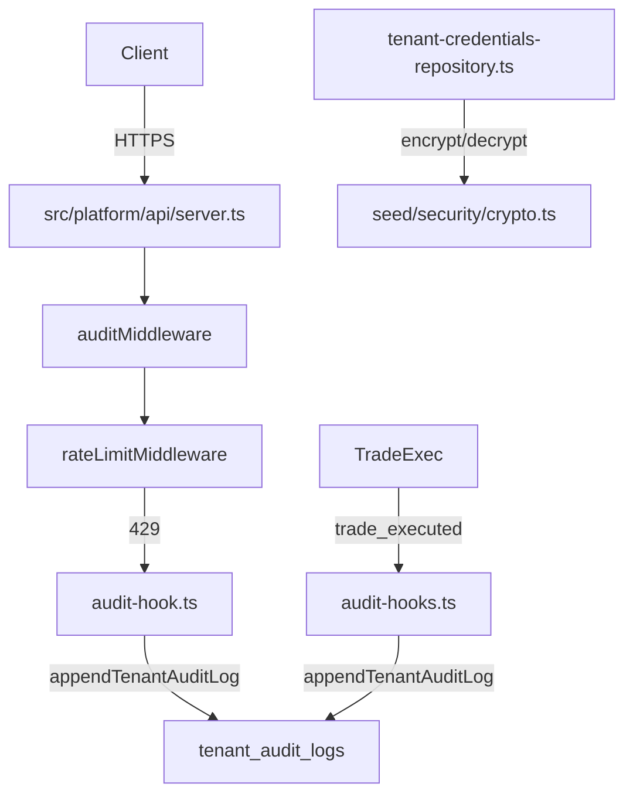

# Phase 35: Compliance & Security Hardening — Design

## Overview

Close three focused security gaps:
1. Trade/config events → existing PostgreSQL tenant audit chain
2. Redis 429 rejections → audit trail
3. AES-256-GCM encryption boundary documentation

No algorithm rewrites. No new dependencies.

## Architecture

## Files to Create
- src/platform/audit/audit-event-types.ts
- src/forest/rate-limit/audit-hook.ts

## Files to Modify
- src/forest/rate-limit/redis-rate-limiter.ts
- src/platform/config/env-schema.ts

## Interfaces
- TenantAuditEventType, TradeAuditMetadata, RateLimitAuditMetadata
- emitRateLimitAuditEvent(params: RateLimitAuditMetadata): Promise<void>

## Prometheus Metrics
- rate_limit_429_total: counter (tenant_id, endpoint, tier)

## Rollback
- Config change audit guarded to avoid breaking config parsing
- Rate-limit rejection audit is fire-and-forget

## Unresolved Questions
- Same as spec: key rotation, trade-path tenantId stability, backup encrypt strategy
